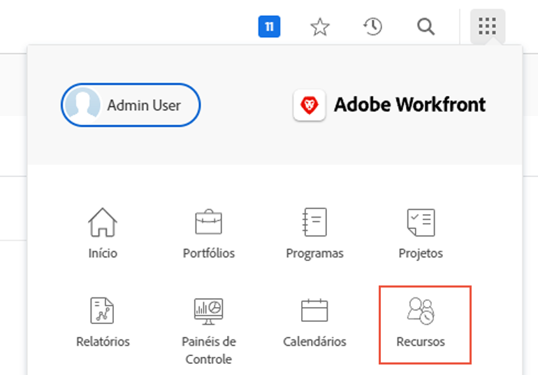
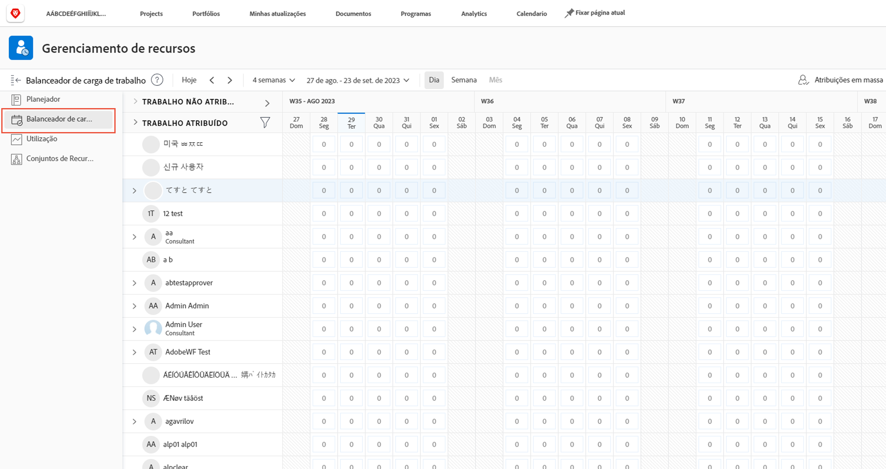
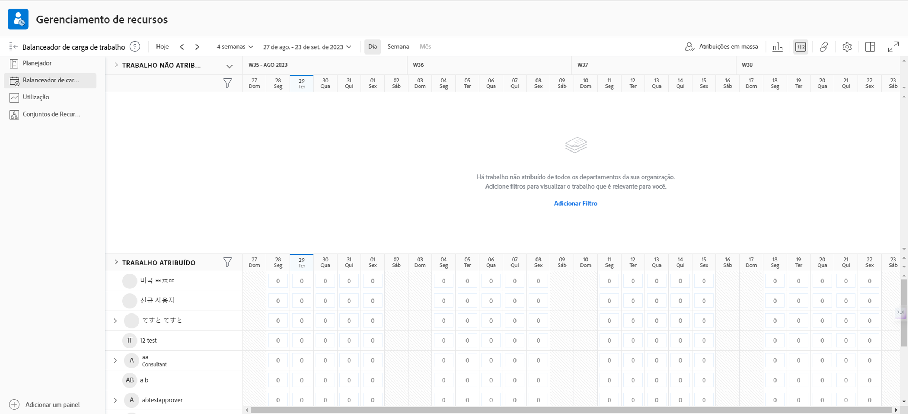
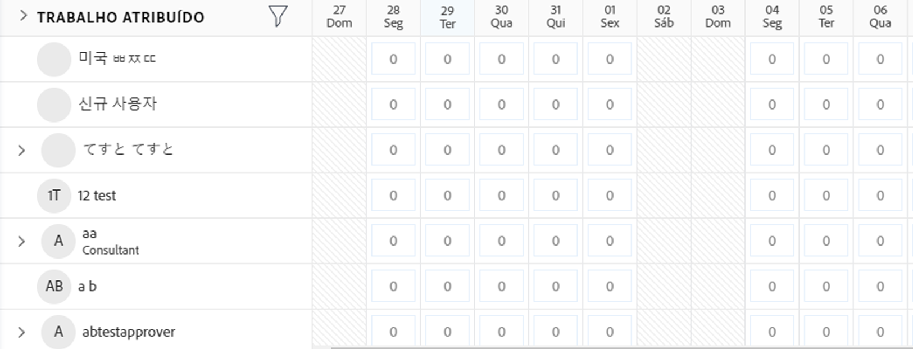
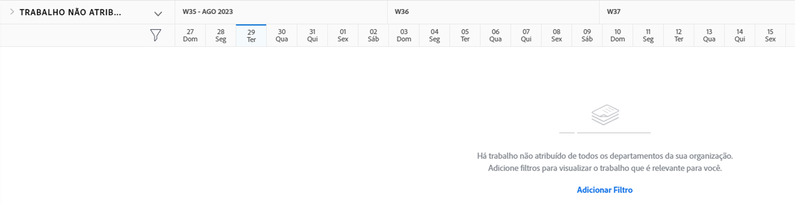

# Encontre o [!DNL Workload Balancer]

Saber quais recursos estão disponíveis e como distribuí-los pode ser uma tarefa desafiadora para qualquer pessoa. Por isso o Workfront criou o [!DNL Workload Balancer].

Seu objetivo é fornecer maior insight e gerenciamento das cargas de trabalho diárias e semanais das pessoas que você gerencia. Isso ajuda você a fazer atribuições melhores, com base na função e na disponibilidade, em vários projetos.

* Clique em [!UICONTROL Recursos] no [!UICONTROL Menu principal].
* Vá até a seção [!UICONTROL Agendamento] na área Gerenciamento de Recursos.
* Clique na seção [!UICONTROL “Balanceador de carga de trabalho”] que aparece.

## Áreas dentro do Balanceador de carga de trabalho

Duas seções aparecem no [!DNL Workload Balancer]: Trabalho atribuído e Trabalho não atribuído.

A área Trabalho atribuído mostra uma lista de usuários e o trabalho ao qual eles já foram atribuídos no Workfront. Por padrão, essa área é filtrada para usuários que fazem parte das equipes do Workfront às quais você pertence. Dessa forma, você pode ver quais membros da equipe foram atribuídos para trabalhar.

A área Trabalho não atribuído mostra o trabalho que ainda precisa ser atribuído, seja a uma pessoa, função ou equipe. No entanto, inicialmente, essa área não mostrará nada.

Ao começar com a área Trabalho não atribuído em branco, você tem a oportunidade de se concentrar primeiro nas cargas de trabalho atuais dos seus usuários, na área Trabalho atribuído, antes de fazer atribuições.
