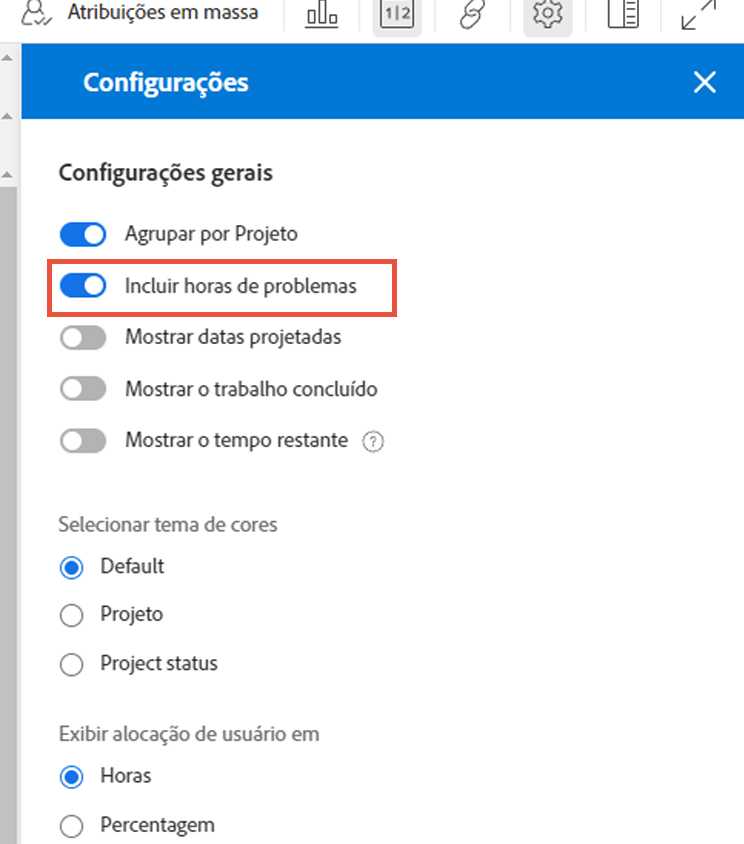
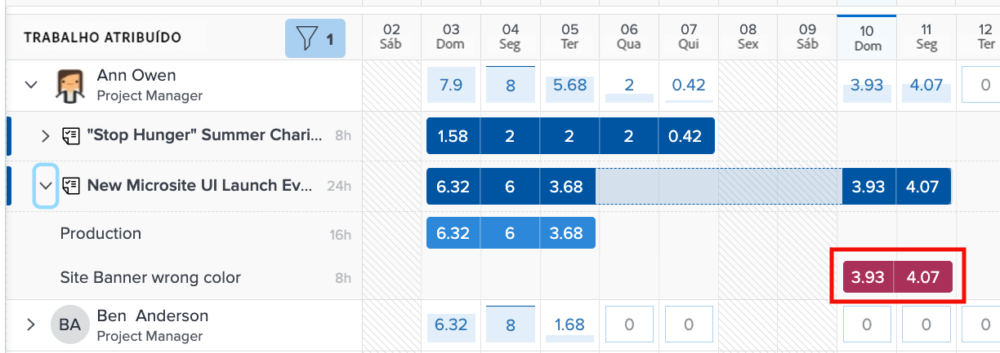
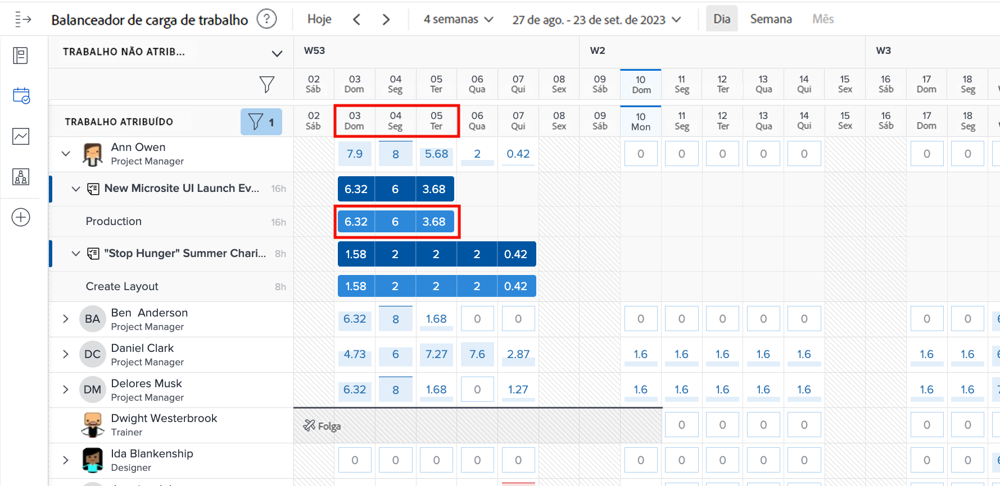
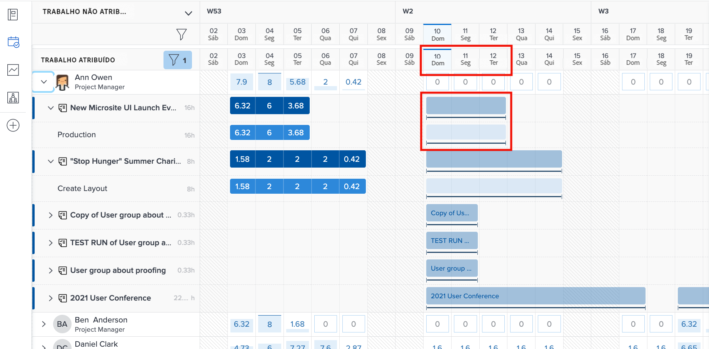
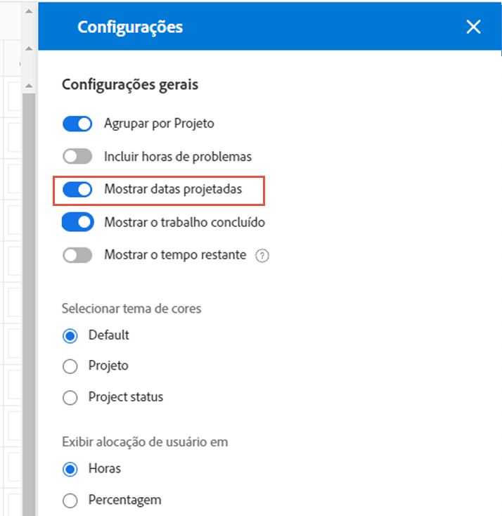

# Configurações a serem consideradas no Balanceador de carga de trabalho

Há algumas configurações do Balanceador de carga de trabalho a serem consideradas à medida que você se aprofunda nas cargas de trabalho individuais de seus usuários:

* Atribuições de problemas
* Datas Projetadas
* Trabalho concluído

Eles podem ser ativados ou desativados por meio do ícone Configurações do Balanceador de carga de trabalho.

## Incluir horas de problemas

Por padrão, o Balanceador de carga de trabalho mostra apenas tarefas. No entanto, os usuários podem ser atribuídos a solicitações e problemas que precisam ser atendidos ou resolvidos e que consomem tempo que eles podem gastar no trabalho do projeto.

Para entender melhor a carga de trabalho completa de um usuário, o Workfront recomenda que os problemas sejam incluídos na lista de trabalho do usuário atribuído.

Basta marcar a opção Incluir horas de problemas na área Configurações do Balanceador de carga de trabalho.

Na área Trabalho Atribuído, os problemas aparecem como barras marrons claras.

### Datas do projeto

Outra opção disponível nas configurações do Balanceador de carga de trabalho é mostrar cargas de trabalho com base em datas projetadas.

A configuração padrão mostra o trabalho atribuído com base nas datas planejadas inseridas no projeto.

Como as datas projetadas são baseadas no progresso e na conclusão de tarefas anteriores do projeto, você pode obter uma visão em “tempo real” de quando uma tarefa será iniciada ou concluída, o que é especialmente útil ao analisar cargas de trabalho.

Você pode alternar entre a exibição de datas planejadas e projetadas com a opção Mostrar datas projetadas nas configurações do Balanceador de carga de trabalho.

### Tarefas concluídas

As tarefas concluídas são mostradas no Balanceador de carga de trabalho junto àquelas em andamento ou prestes a começar. Para entender melhor o trabalho adicional que os usuários podem realizar, você pode excluir o trabalho concluído.

Desmarque a opção Mostrar trabalho concluído nas configurações do Balanceador de carga de trabalho.

