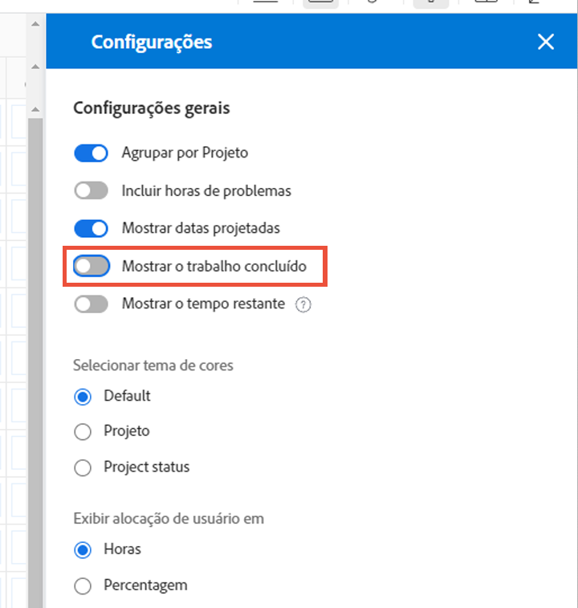

# Configurações a serem consideradas no Balanceador de carga de trabalho

Há algumas configurações do Balanceador de carga de trabalho que devem ser consideradas ao mergulhar nas cargas de trabalho individuais de seus usuários:

* Atribuições de problemas
* Datas Projetadas
* Trabalho concluído

Elas podem ser ativadas ou desativadas pelo ícone Configurações do balanceador de carga de trabalho.

## Incluir horas de problemas

Por padrão, o Balanceador de carga de trabalho mostra somente tarefas. No entanto, os usuários podem ser atribuídos a solicitações e problemas que precisam ser atendidos ou resolvidos e que consomem tempo que podem gastar no trabalho do projeto.

Para entender melhor a carga de trabalho completa de um usuário, a Workfront recomenda que os problemas sejam incluídos na lista de trabalho do usuário atribuído.

Marque a opção Incluir horas de problemas na área Configurações do balanceador de carga de trabalho.

Na área Trabalho atribuído, os problemas são exibidos como barras borboletas claras.

### Datas do projeto

Outra opção disponível nas configurações do Balanceador de carga de trabalho é mostrar cargas de trabalho com base em datas projetadas.

A configuração padrão mostra o trabalho atribuído com base nas datas planejadas inseridas no projeto.

Como as datas projetadas são baseadas no progresso e na conclusão de tarefas anteriores no projeto, você pode obter uma visualização em &quot;tempo real&quot; de quando uma tarefa será iniciada ou concluída, o que é especialmente útil ao observar cargas de trabalho.

Você pode alternar entre a exibição de datas planejadas e projetadas com a opção Mostrar datas projetadas nas configurações do Balanceador de carga de trabalho.

### Tarefas concluídas

As tarefas concluídas são mostradas no Balanceador de carga de trabalho juntamente com aquelas que estão em andamento ou prestes a começar. Para entender melhor o trabalho adicional que os usuários podem realizar, você pode excluir o trabalho concluído.

Desmarque a opção Mostrar trabalho concluído nas configurações do Balanceador de carga de trabalho.

