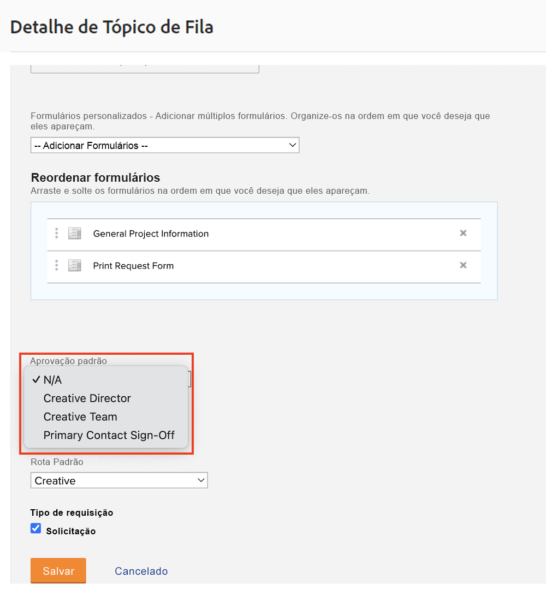
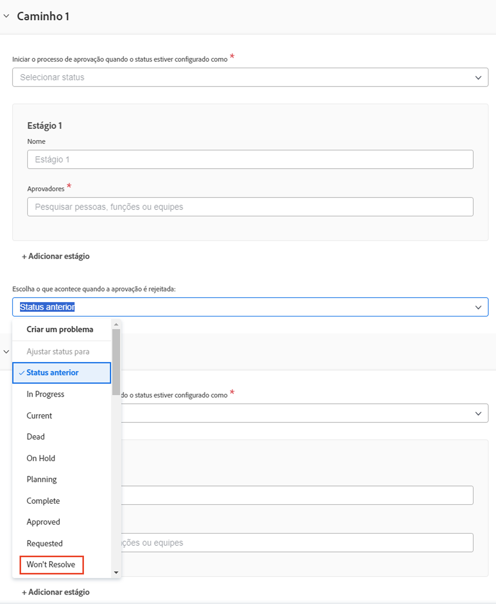

# Criar um processo de aprovação global e de uso único

Os processos de aprovação em projetos, tarefas e problemas permitem que um gerente de projeto obtenha a confirmação de um especialista de que o trabalho foi realizado corretamente antes de prosseguir. O gerente de projeto pode criar um processo de aprovação para cada situação (conhecido como processo de aprovação de uso único) ou escolher em uma lista de possivelmente muitos processos de aprovação que foram criados anteriormente para atender a necessidades comuns (conhecidos como processos de aprovação globais ou existentes).

Em ambos os casos, quando o status do objeto muda para um especificado no processo de aprovação, o aprovador é notificado de diversas maneiras para revisar o trabalho e aprová-lo ou rejeitá-lo. Considerando que todo o projeto pode ser pausado aguardando uma aprovação, os aprovadores devem estar cientes antecipadamente de que poderão ser chamados para uma aprovação. Se um aprovador estiver ausente por qualquer motivo, ele poderá delegar suas aprovações a um substituto qualificado. Consulte [Delegar tarefas, problemas e aprovações](/help/manage-work/approval-processes-and-milestone-paths/delegate-approvals.md) para obter detalhes.

Neste vídeo, você aprenderá a criar um processo de aprovação global e um processo de aprovação de uso único em um projeto, tarefa ou problema.

>[!VIDEO](https://video.tv.adobe.com/v/335225/?quality=12&learn=on&enablevpops)

>[!TIP]
>
>Você pode adicionar um processo de aprovação de uso único para um projeto ou tarefa a um modelo de projeto.

>[!NOTE]
>
>Você pode configurar uma aprovação de uso único em projetos e problemas da mesma forma descrita para tarefas no vídeo.

## Como aplicar aprovações automáticas de problemas em uma fila de solicitações

Se você quiser configurar aprovações automáticas de problemas em uma fila de solicitações, elas só poderão ser feitas usando um processo global de aprovação de problemas e serão aplicadas em um [!UICONTROL Tópico da fila].

Ao criar ou editar um [!UICONTROL Tópico da fila], selecione o processo de aprovação global no campo **[!UICONTROL Aprovação padrão]**.

Pode ser necessário editar o processo de aprovação do problema para garantir que o **[!UICONTROL Status anterior]** não seja o mesmo definido para o problema quando a aprovação for rejeitada. Isso ocorre porque o status anterior é **[!UICONTROL Novo]**, e também é o status que aciona o processo de aprovação, portanto, é o status para o qual será definido quando for aprovado. Para evitar confusão quando a aprovação do problema for rejeitada, é melhor definir o status para algo como **[!UICONTROL Não resolverá]** ou um status personalizado criado para essa finalidade.

## Tutoriais recomendados sobre este tópico

* [Delegar tarefas, problemas e aprovações](/help/manage-work/approval-processes-and-milestone-paths/delegate-approvals.md)
* [Entenda os processos de aprovação específicos do grupo](/help/administration-and-setup/approval-processes-and-milestone-paths/group-specific-approval-processes.md)
* [Criar um fluxo de solicitação](/help/manage-work/request-queues/create-a-request-flow.md)

