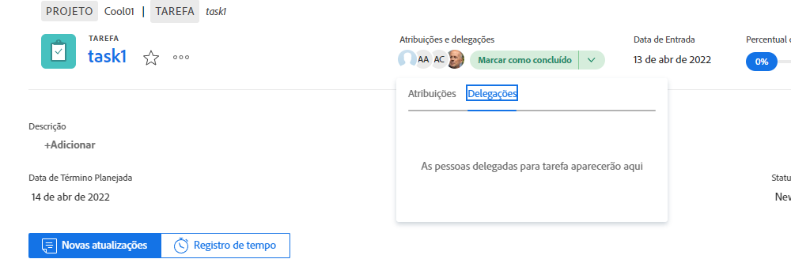
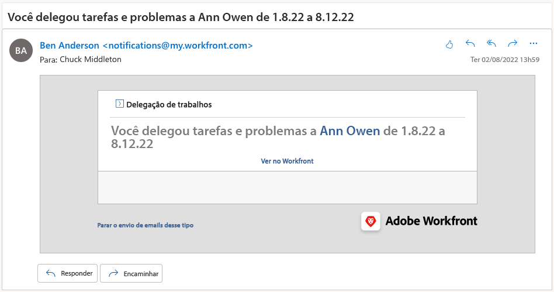

# Delegar tarefas, problemas e aprovações

Aprenda a delegar aprovações de projetos, tarefas, problemas e cartões de ponto para outro usuário do Workfront. Saiba também como delegar atribuições de tarefas e problemas.

## Delegar aprovações

Saiba como delegar aprovações de projetos, tarefas, problemas e cartões de ponto a outro usuário.

Neste vídeo, você aprenderá a:

* Atribuir aprovações a outra pessoa
* Encerrar o período de delegação
* Localizar aprovações delegadas

>[!VIDEO](https://video.tv.adobe.com/v/336094/?quality=12&learn=on)

<!---
learn more URLS
Delegate approval request
--->

## Delegar atribuições de tarefas e problemas

Você pode delegar as tarefas e problemas atribuídos a você a outros usuários para quando não estiver no trabalho.

### Como habilitar a delegação de tarefas e problemas

Antes de usar esse recurso, a delegação de tarefas e problemas deve ser habilitada por um(a) admin de grupo ou de sistema. Isto é feito em [!UICONTROL Configuração > Preferências do projeto > Tarefas e problemas > Delegação]. Habilitar essa opção permitirá que todos os usuários com uma licença de Revisão ou superior deleguem tarefas e problemas que estão sob sua responsabilidade.

![Captura de tela mostrando a [!UICONTROL configuração] de preferências para delegação](assets/delegation-1.png)

### Como delegar tarefas e problemas

Acesse a [!UICONTROL página inicial], clique em [!UICONTROL Delegar] e especifique o usuário ao qual você está delegando as tarefas que foram atribuídas a você, bem como o intervalo de datas. Você pode designar qualquer usuário com uma licença de revisão ou superior.

![Captura de tela mostrando a guia de delegação na [!UICONTROL página inicial]](assets/delegation-2.png)

### Como saber se uma tarefa ou problema foi delegado

Você pode ver quando tarefas ou problemas foram delegados na [!UICONTROL página inicial] ou na visualização da tarefa ou problema.

![Captura de tela mostrando as tarefas delegadas na [!UICONTROL página inicial]](assets/delegation-4.png)

### Notificações por email que se aplicam ao trabalho delegado

O(a) admin de grupo ou de sistema pode habilitar notificações por email que informarão quando você delegar suas tarefas e problemas e quando as tarefas e problemas de alguém forem delegadas a você.

![Captura de tela mostrando as opções de [!UICONTROL configuração] de notificação por email para delegação](assets/delegation-5.png)

