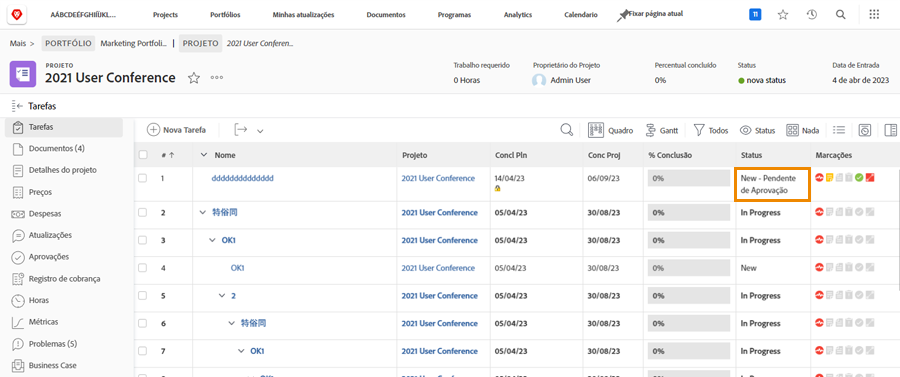

# Concluir aprovações

Aprovações de tarefa e emissão são parte de muitos fluxos de trabalho. Mas as aprovações não resolvidas podem impedir que você defina o status do projeto como Concluído.

No [!UICONTROL Tarefa] do projeto, selecione um [!UICONTROL Exibir] que inclui o [!UICONTROL Status] coluna. Uma rápida visualização dessa coluna mostrará se houver uma aprovação incompleta em uma tarefa com o &quot;[!UICONTROL -aprovação pendente]&quot; após o nome do status.

Você tem algumas opções sobre o que fazer:

* **Concluir a aprovação —** Isso pode significar lembrar outros da aprovação pendente. Faça isso com uma atualização de [!DNL Workfront]. Dependendo do [!DNL Workfront] , talvez seja possível concluir a aprovação por conta própria.
* **Remover a aprovação —** Se a aprovação não for necessária, pode ser mais fácil excluí-la. Sua capacidade de fazer isso depende do [!DNL Workfront] permissões.
* **Alterar o status —** Selecione um status que não tenha uma aprovação anexada. Certifique-se de que o status seja igual a Concluído.

Se sua organização usar problemas para rastrear problemas, alterar pedidos ou outros eventos durante os projetos, siga as mesmas etapas na [!UICONTROL Problemas] do seu projeto.
