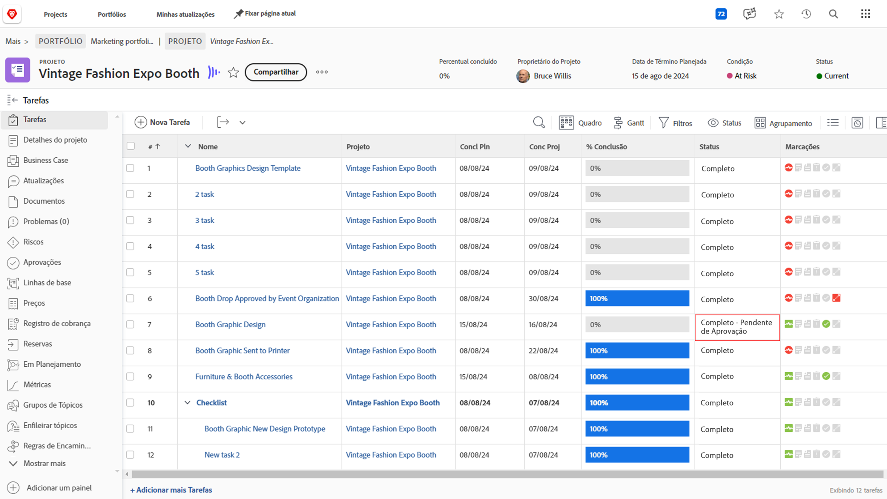
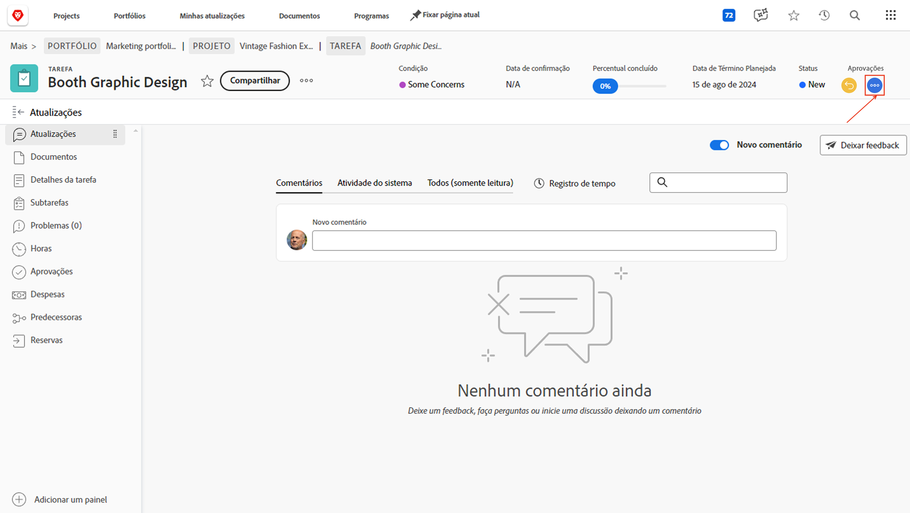
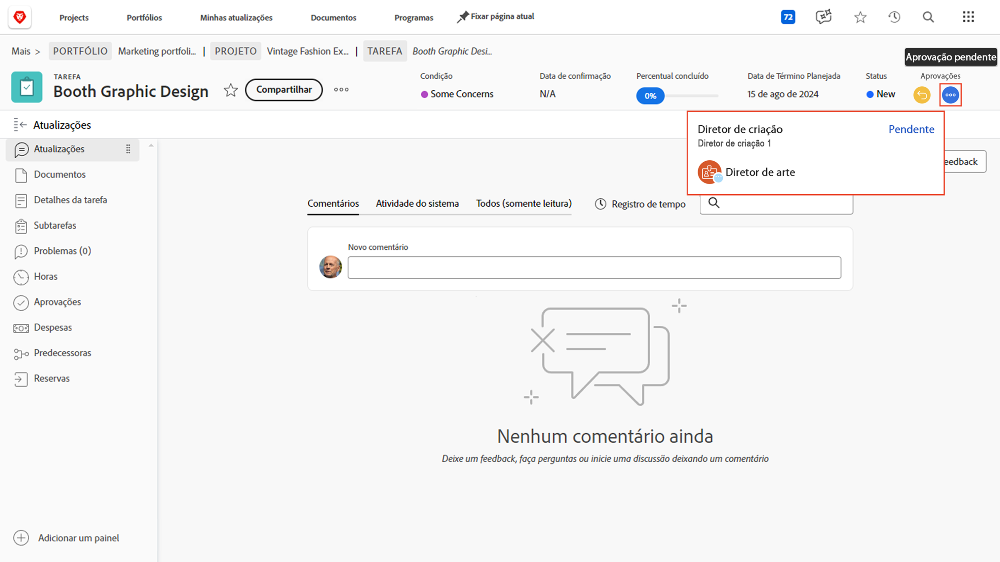
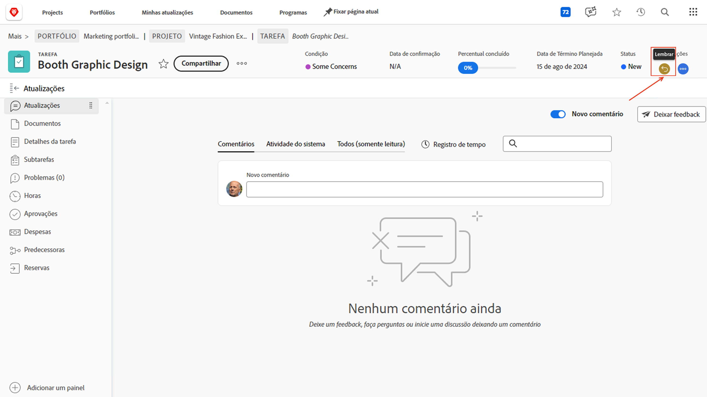
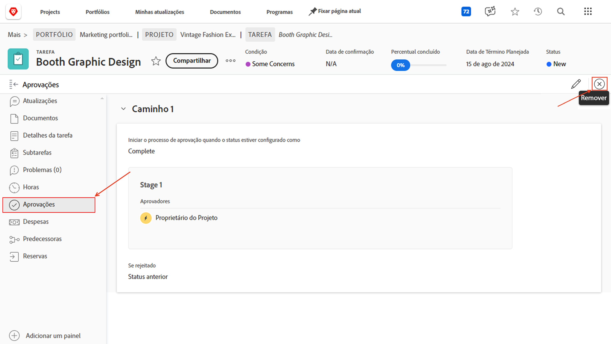

# Concluir aprovações

Aprovações de tarefas e problemas fazem parte de muitos projetos. Mas aprovações não resolvidas impedirão que você defina o status do projeto como Concluído.

Veja como encontrá-los e lidar com eles.

Na seção [!UICONTROL Tarefa] do seu projeto, selecione uma [!UICONTROL Exibição] que inclua a coluna [!UICONTROL Status], como a exibição [!UICONTROL Status]. Uma rápida olhada nessa coluna mostrará se há uma aprovação incompleta em uma tarefa com as palavras &quot;[!UICONTROL - Aprovação Pendente]&quot; após o nome do status.

Quando encontrar uma tarefa que ainda está aguardando aprovação, você tem duas opções sobre o que fazer:

## Concluir a aprovação

Isso pode significar lembrar a pessoa atribuída da aprovação pendente. Para ver quem está atribuído como aprovador, abra a tarefa e clique no menu de três pontos na área de aprovações.

Uma caixa será exibida mostrando o aprovador atribuído.

## Remover a aprovação

Se a aprovação não for necessária, talvez você queira removê-la. Você pode fazer isso lembrando primeiro a aprovação. Clique no botão [!UICONTROL Cancelar] na área de aprovações. Isso alterará o status de volta para seu status anterior e permitirá que você remova o processo de aprovação.

Agora clique na guia [!UICONTROL Aprovações] à esquerda e, em seguida, no botão [!UICONTROL Remover] no canto superior direito.

## Lidar com aprovações de problemas

Se sua organização usa poblemas para rastrear dificuldades, alterar pedidos ou outros eventos no decorrer dos projetos, siga as mesmas etapas da seção [!UICONTROL Problemas] do seu projeto.
