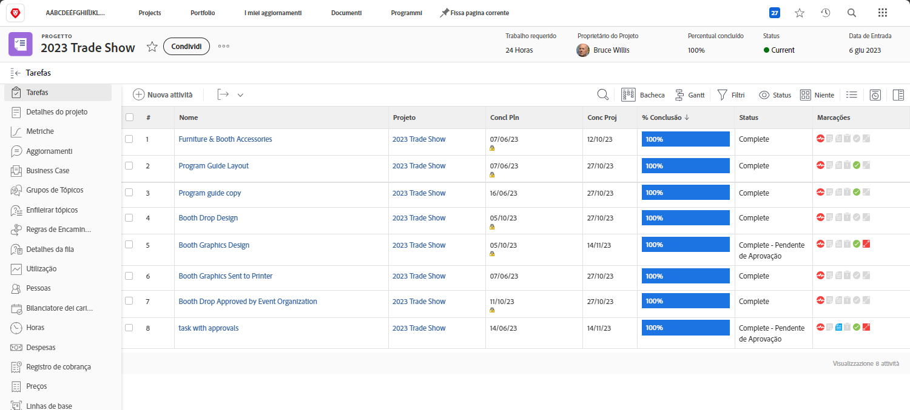

# Concluir aprovações

As aprovações de tarefas e problemas fazem parte de muitos workflows. Mas aprovações não resolvidas impedirão que você defina o status do projeto como Concluído.

Na seção [!UICONTROL Tarefa] do projeto, selecione uma [!UICONTROL Visualização] que inclua a coluna [!UICONTROL Status]. Basta uma olhada rápida nessa coluna para saber se há alguma aprovação incompleta em uma tarefa: estará escrito “[!UICONTROL - Aprovação pendente]” após o nome do status.

Você tem algumas opções sobre o que fazer:

* **Concluir aprovação:** Isto pode significar lembrar os outros sobre a aprovação pendente. Você pode ver quem foi atribuído como aprovador abrindo a tarefa e clicando na guia Aprovações.
* **Remover aprovação:** Se a aprovação não for necessária, pode ser mais fácil simplesmente excluí-la. Sua capacidade de fazer isso depende de suas permissões no [!DNL Workfront].
* **Alterar status:** Se a aprovação não for necessária, você poderá selecionar um status que não tenha uma aprovação anexada. Apenas certifique-se de que o status seja igual a Concluído.

Se sua organização usa poblemas para rastrear dificuldades, alterar pedidos ou outros eventos no decorrer dos projetos, siga as mesmas etapas da seção [!UICONTROL Problemas] do seu projeto.
