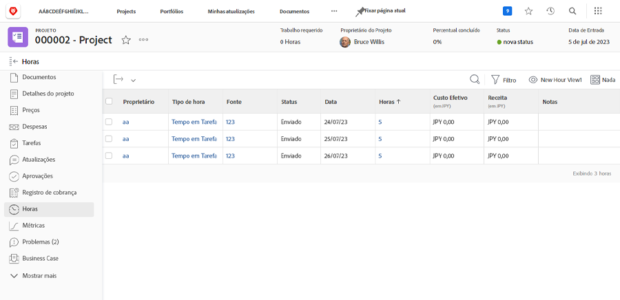

# Registrar e revisar horas

Se o registro das horas reais trabalhadas fizer parte do fluxo de trabalho de sua organização, você poderá revisar essas horas no [!UICONTROL Horas] (selecione-a no menu do painel esquerdo) no projeto. Isso mostra todas as horas registradas em tarefas individuais e o próprio projeto. Também é possível registrar horas a partir desta página.

>[!NOTE]
>
>Sua organização pode solicitar que você aprove horas até [!DNL Workfront] folhas de ponto. Verifique com seu [!DNL Workfront] para ver qual processo você deve usar.

<!---
learn more url
Log time
--->
