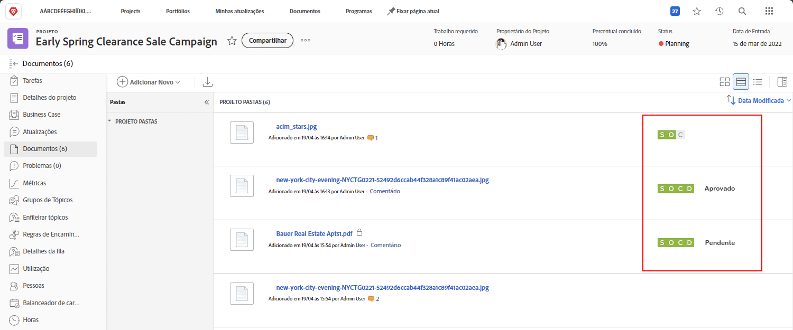
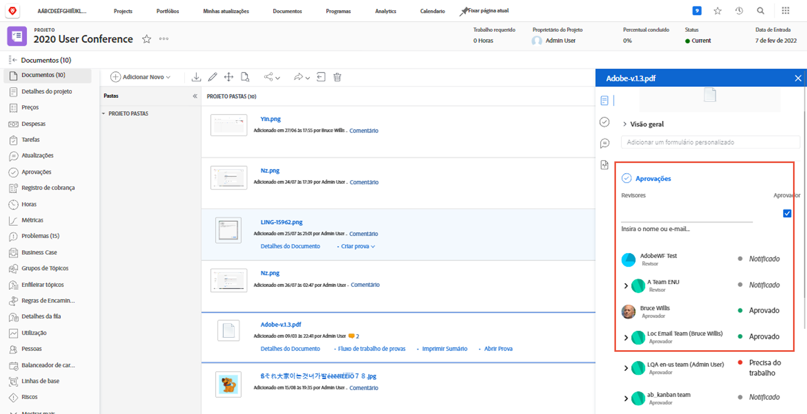

# Fazer upload de ativos

Antes de fechar um [!DNL Workfront] projeto, certifique-se de que todos os arquivos relevantes estejam anexados no [!UICONTROL Documentos] seção. Faça upload desses itens como um documento ou uma prova, conforme determinado pelas diretrizes da sua organização.

Talvez seja necessário carregar o documento ou a prova como uma versão de um arquivo existente.

Se sua organização usar aprovações de prova, verifique se todas elas foram concluídas rapidamente nos ícones de progresso.

E se sua organização usar aprovações de documentos, selecione cada item na lista e verifique os detalhes do documento para ver se as aprovações estão completas.

<!---
learn more urls
Create proofs
Add new documents to Workfront
--->
