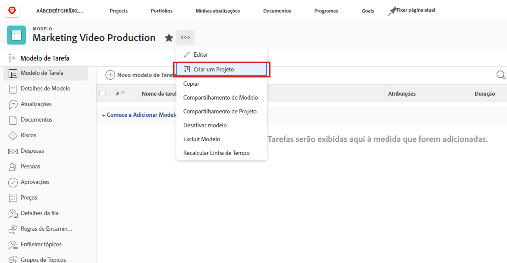
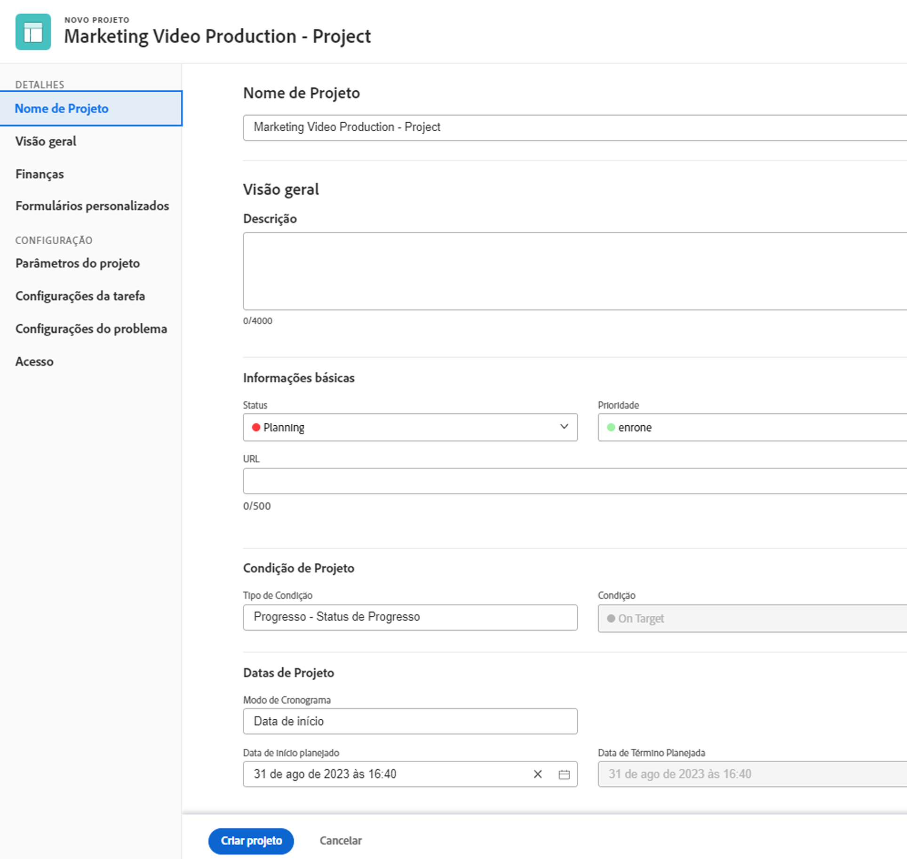
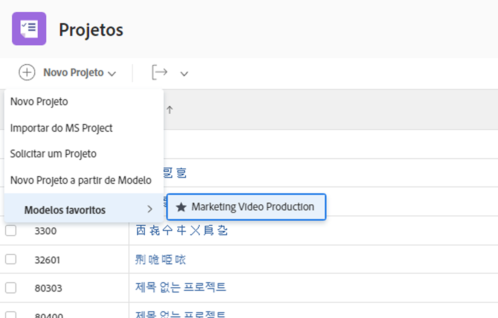

# Criar um projeto diretamente a partir de um modelo

Se você estiver trabalhando em um modelo e precisar criar um projeto usando esse modelo, clique no menu de três pontos próximo ao nome do modelo. Em seguida, selecione Criar projeto.

A janela de detalhes permite fazer alterações nas configurações do novo projeto.

>[!NOTE]
>
>Para criar um projeto utilizando este método, você precisa acessar a área de Modelos do Workfront. Se não conseguir acessar os modelos, você ainda poderá usar um modelo para criar um projeto na área Projetos ou ao converter um problema ou tarefa.

>[!TIP]
>
>Se você utiliza um modelo com frequência, adicione-o aos favoritos. Você verá o modelo listado no menu Novo projeto, bem como no menu Favoritos da barra de navegação.

## Tutoriais recomendados sobre este tópico

* [Crie um modelo de projeto e saiba mais sobre os blueprints](/help/manage-work/create-and-manage-project-templates/create-a-project-template.md)
* [Compartilhar um modelo de projeto](/help/manage-work/create-and-manage-project-templates/share-a-project-template.md)
* [Copiar um projeto existente](/help/manage-work/manage-projects/copy-an-existing-project.md)
* [Desativar um modelo de projeto](/help/manage-work/create-and-manage-project-templates/deactivate-a-project-template.md)
* [Editar a equipe do projeto em um modelo de projeto](/help/manage-work/create-and-manage-project-templates/edit-the-project-team-in-a-project-template.md)
