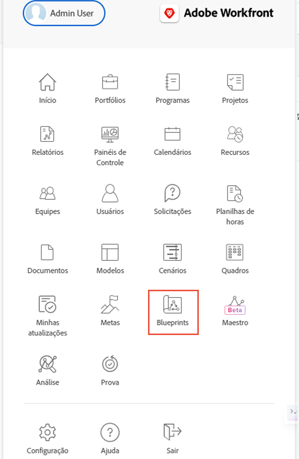
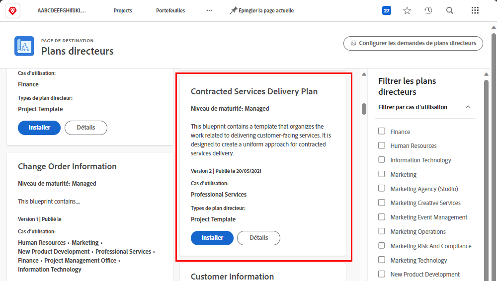
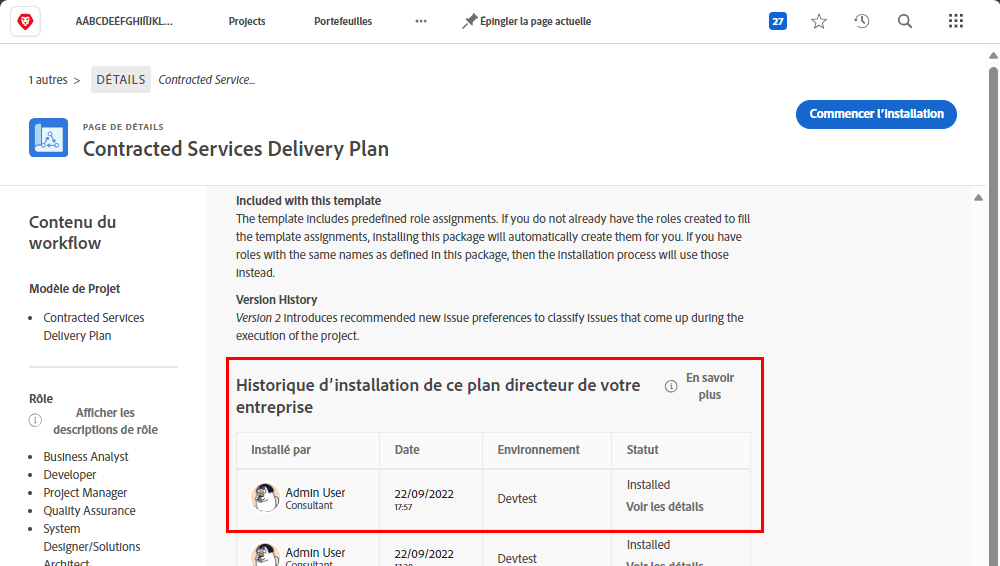
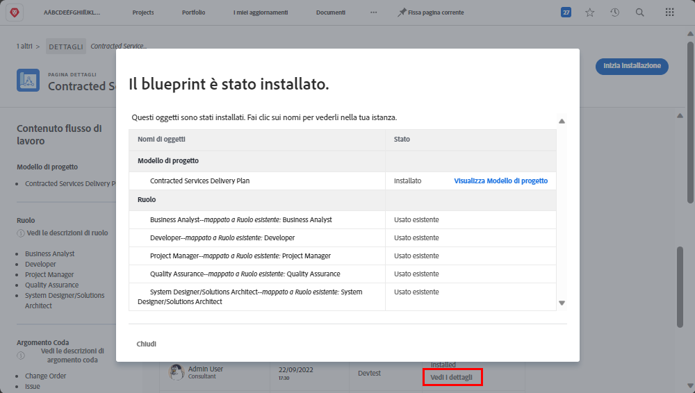

# Criar um modelo de projeto e explorar Blueprints

Aprenda a criar um modelo de projeto do zero ou utilize um projeto existente, e entenda como os [!UICONTROL blueprints] podem fornecer acesso a diversos modelos de projeto úteis criados por especialistas do Workfront.

## Criar um modelo de projeto

* O vídeo fornece um guia passo a passo sobre a criação e o uso de modelos para a produção de vídeos de marketing. Ele começa explicando como criar um novo modelo do zero, nomeando-o e salvando-o. &#x200B; O processo envolve três etapas principais: criar tarefas, configurar a linha do tempo usando durações e predecessores e fazer atribuições a funções de trabalho em vez de usuários individuais. &#x200B; O vídeo enfatiza a organização de tarefas usando relacionamentos entre pais e filhos para obter um melhor resumo e eficiência. &#x200B;
* Depois que o modelo é criado, ele pode ser usado para produzir novos projetos. O vídeo mostra como criar um novo projeto a partir do modelo, fazer os ajustes necessários e adicionar tarefas ou modificar a duração, conforme necessário. &#x200B; Também mostra como atribuir funções de trabalho a tarefas usando as funcionalidades de planejamento e agendamento de recursos. &#x200B;
* O vídeo explica como salvar um projeto existente como um novo modelo, permitindo atualizações e melhorias no fluxo de trabalho. &#x200B; Ele destaca a importância do gerenciamento de modelos para evitar confusão e garantir a execução simplificada do projeto. &#x200B;

>[!VIDEO](https://video.tv.adobe.com/v/335210/?quality=12&learn=on&enablevpops=0)

## Principais conclusões

* **Criação de um Modelo:** Saiba como criar um novo modelo do zero nomeando-o, configurando tarefas, linhas do tempo e fazendo atribuições a funções de trabalho. &#x200B;
* **Organização da Tarefa:** Use relações de tarefas pai-filho para organizar tarefas com eficiência, fornecendo um resumo e uma estrutura claros para o projeto. &#x200B;
* **Configuração da Linha do Tempo:** configure linhas do tempo da tarefa usando durações e predecessores para estimar com precisão o intervalo de tempo e a sequência de tarefas. &#x200B;
* **Atribuições com base em funções:** atribua tarefas a funções de trabalho, em vez de usuários individuais, para utilizar as funcionalidades de planejamento e agendamento de recursos de maneira eficaz. &#x200B;
* **Gerenciamento de modelos:** salve projetos existentes como novos modelos para incorporar melhorias e gerenciar modelos para evitar confusão e garantir uma execução eficiente do projeto. &#x200B;

## Modelos criados com [!UICONTROL blueprints]

Os usuários do Workfront podem usar [!UICONTROL blueprints] para ajudar a criar modelos de projeto. Este recurso, localizado no menu principal, permite acessar modelos pré-criados e prontos para uso, os quais são direcionados a um departamento e nível de maturidade específico. Esses modelos agilizam a criação de projetos repetíveis e ajudam a manter a consistência entre projetos com um escopo semelhante.

Qualquer usuário licenciado pode navegar pela lista de blueprints disponíveis no Workfront. Não é possível aplicar um blueprint diretamente ao criar um novo projeto (como ao converter uma tarefa ou solicitação em um projeto). Uma das principais diferenças entre um blueprint e um modelo de projeto é que o blueprint é usado para criar um modelo, enquanto o modelo é usado para criar um projeto. **O blueprint precisa ser instalado por um(a) admin de sistema para que o modelo correspondente seja criado.**

Se encontrar um projeto que pareça interessante, você pode clicar em **[!UICONTROL Detalhes]** para saber mais sobre ele.

A tela de [!UICONTROL Detalhes] explica mais sobre o blueprint e fornece o histórico de instalação se o blueprint tiver sido instalado.

Se o blueprint foi instalado, você pode clicar em **[!UICONTROL Ver detalhes]** para obter links para o modelo criado e quaisquer outros objetos que foram criados para auxiliar o modelo.

Se o blueprint ainda não tiver sido instalado, você pode solicitar isso a um(a) admin de sistema.

## Tutoriais recomendados sobre este tópico

* [Criar um projeto diretamente a partir de um modelo](/help/manage-work/create-and-manage-project-templates/create-a-project-directly-from-a-template.md)
* [Compartilhar um modelo de projeto](/help/manage-work/create-and-manage-project-templates/share-a-project-template.md)
* [Copiar um projeto existente](/help/manage-work/manage-projects/copy-an-existing-project.md)
* [Desativar um modelo de projeto](/help/manage-work/create-and-manage-project-templates/deactivate-a-project-template.md)
* [Editar a equipe do projeto em um modelo de projeto](/help/manage-work/create-and-manage-project-templates/edit-the-project-team-in-a-project-template.md)
