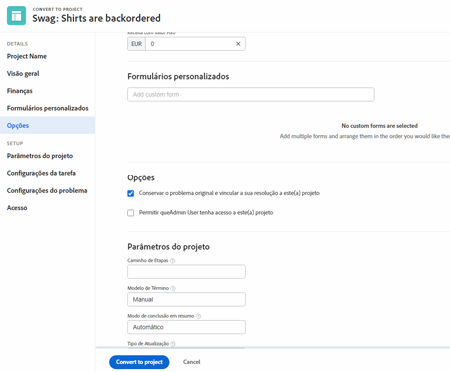

# Converter problemas em outros itens de trabalho

## Converter um problema em uma tarefa

Um problema pode ser suficientemente significativo para que o tempo e o esforço para resolvê-lo precisem ser contabilizados na linha do tempo do projeto e alocar os recursos apropriados. Nesse caso, o problema pode ser convertido em uma tarefa.

![Uma imagem do [!UICONTROL Converter em Tarefa] opção de um problema no [!UICONTROL Workfront].](assets/15-convert-issue-to-task-menu-option.png)

1. Navegue até a [!UICONTROL Problemas] seção do projeto ou tarefa na qual o problema está conectado. Ou encontre o problema em um relatório ao qual você tenha acesso.
1. Clique no nome do problema para abri-lo.
1. No menu de 3 pontos à direita do nome do problema, selecione **[!UICONTROL Converter em tarefa]**.
1. Preencha o [!UICONTROL Converter em tarefa] formulário. Comece dando um nome e uma descrição à nova tarefa.
1. Se a nova tarefa deve fazer parte de um projeto diferente, insira o nome do projeto.
1. No [!UICONTROL Opções] marque as caixas para manter o problema original, permitir acesso à nova tarefa e manter a data de conclusão. Siga o fluxo de trabalho da sua organização ao fazer essas seleções. Anexe um formulário personalizado se quiser transferir dados de formulário personalizados do problema para a tarefa. (Todos os campos existentes no formulário de problema e no formulário de tarefa serão transferidos automaticamente para o formulário de tarefa.)
1. Preencha o formulário personalizado, se houver um anexado.
1. Clique em **[!UICONTROL Converter em tarefa]** para terminar.

![Uma imagem do [!UICONTROL Converter em Tarefa] forma de um problema no [!UICONTROL Workfront].](assets/16-convert-to-task-options.png)

Dependendo do [!DNL Workfront] configurações do sistema, você pode ou não conseguir alterar as configurações na seção Opções quando estiver convertendo a tarefa. Essas opções afetam o problema original e a nova tarefa.

* **&quot;Conservar o problema original e vincular a sua resolução a esta tarefa&quot;** retém o problema original e informações relacionadas (horas, documentos, etc.). Com essa opção selecionada, quando a tarefa for concluída, o problema será marcado como resolvido. Se esta opção não estiver selecionada, o problema original será excluído na conclusão da tarefa. Isso pode afetar como sua organização rastreia e relata problemas.
* A variável **&quot;Permitir que (nome de usuário) tenha acesso a esta tarefa&quot;** Esta opção permitirá que a pessoa que criou o problema tenha acesso a esta nova tarefa.
* A variável **&quot;Manter a data de conclusão planejada do problema&quot;** permite manter a data de conclusão planejada já definida no problema. Isso define a restrição da tarefa como [!UICONTROL Não Terminar Depois De]. Se a caixa estiver desmarcada, as datas da tarefa serão definidas como se uma nova tarefa fosse criada dentro do projeto.

A nova tarefa é colocada na parte inferior da lista de tarefas do projeto. Mova a tarefa para o local desejado, atribua um usuário ou equipe ao trabalho, adicione horas e duração planejadas, etc.

>[!NOTE]
>
>Não é possível adicionar problemas à linha do tempo do projeto, pois eles representam &quot;trabalho não planejado&quot;. A linha do tempo do projeto é para &quot;trabalho planejado&quot;, o que significa tarefas.

## Converter um problema em um projeto

Às vezes, um problema não pode ser resolvido resolvendo-se o próprio problema ou convertendo-o em uma tarefa, pois o processo de resolução do problema precisa ser coordenado mais detalhadamente. Nesse caso, você pode converter o problema em um projeto.

1. Navegue até a seção Problemas do projeto ou tarefa em que o problema está conectado. Ou encontre o problema em um relatório ao qual você tenha acesso.
1. Clique no nome do problema para abri-lo.
1. Clique no menu de 3 pontos à direita do nome do problema para exibir o menu Mais.
1. Em seguida, selecione se deseja criar um novo projeto que esteja totalmente em branco ou usar um modelo de projeto, que preencherá previamente as informações da tarefa e da linha do tempo.
1. Preencha as informações na janela Converter em projeto, começando pelo nome do projeto.
1. Preencha outros detalhes do projeto, conforme exigido pela sua equipe ou organização.
1. Na seção Opções, marque as caixas para manter o problema original e permitir acesso ao novo projeto. Siga o fluxo de trabalho da sua organização ao fazer essas seleções.
1. Preencha o formulário personalizado, se houver um anexado. Anexe um formulário personalizado se desejar transferir dados de formulário personalizados do problema para o projeto. (Todos os campos existentes no formulário de problema e no formulário de projeto serão transferidos automaticamente para o formulário de projeto.)
1. Clique em **Converter em projeto** para terminar.

Os campos de detalhes do projeto exibidos na janela Converter em projeto dependem do método usado para criar o projeto. Você verá mais informações no menu esquerdo se tiver usado a opção Converter em projeto a partir de modelo.

>[!NOTE]
>
>Algumas seções, como a seção Opções, embora visíveis, podem estar inacessíveis, dependendo das configurações de sistema do Workfront de sua organização.

* Clique em &quot;**Conservar o problema original e vincular a sua resolução a este projeto**&quot;. Esta opção retém o problema original e informações relacionadas (horas, documentos, etc.). Quando o novo projeto for concluído, o problema será marcado como resolvido. Se esta opção não estiver selecionada, o problema original será excluído na conclusão do projeto. Isso pode afetar como sua organização rastreia e relata problemas.
* O &quot;**Permitir que (nome de usuário) tenha acesso a este projeto**&quot;permite que a pessoa que criou o problema tenha acesso ao projeto que está sendo criado.

## Manter informações durante o processo de conversão

<!-- Need link to wf one doc article below 

To learn about what information transfers when you convert an issue to a task or project, we recommend you read through the conversion considerations in the article, Convert issues. This lists what information is kept when converting issues and what isn’t. Workfront recommends you become familiar with these considerations so you don’t lose important information when converting issues to tasks or projects.

-->

A transferência dos dados de formulário personalizado requer:

* Várias cópias do mesmo formulário personalizado — uma para o problema e, em seguida, uma para a tarefa ou projeto. Os campos nesses formulários personalizados devem corresponder exatamente para que as informações possam ser transferidas de um formulário personalizado para outro.

* Ou um único formulário personalizado no qual os objetos de problema, tarefa e/ou projeto são selecionados. Usando esse método, você só precisa criar e manter seus campos personalizados em um único formulário personalizado. Esse é um aprimoramento recente e é muito mais fácil do que ter várias cópias do mesmo formulário, mas ambos os métodos funcionarão.

<!-- Need link to wf one doc article below

Learn more in the article, Transfer custom form data to a larger work item.

-->

<!-- Pro tips graphic -->

Se você incluir um formulário personalizado em um modelo de projeto, ele será atribuído automaticamente quando o modelo for selecionado no processo de conversão.

<!-- Learn more graphic and documentation article links 

* Convert issues
* Transfer custom form data to a larger work item
* Overview of resolving and resolvable objects
* Understanding resolving and resolvable objects
* Unlink issues from their resolvable objects

-->

## Converter um problema em uma tarefa ou projeto a partir de qualquer lista de problemas

Para aumentar a eficiência do seu trabalho e facilitar a conversão de problemas em um ambiente de ritmo rápido, você tem a capacidade de converter um problema em uma tarefa ou um projeto de qualquer lista de problemas em um projeto, relatório ou painel. Basta selecionar um problema e clicar no menu de 3 pontos exibido.

