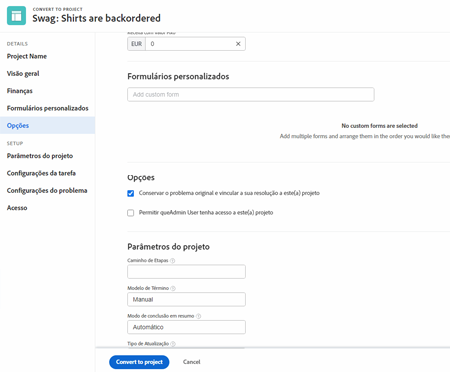
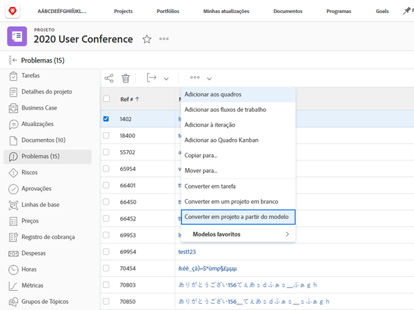

# Converter um problema/solicitação em um projeto

Neste vídeo, você aprenderá a:

* Revisar as informações enviadas com a solicitação
* Selecione o modelo de projeto apropriado
* Concluir a conversão da solicitação para o projeto

>[!VIDEO](https://video.tv.adobe.com/v/340343/?quality=12&learn=on)

## O que você precisa saber sobre o [!UICONTROL Opções] seção

A variável [!UICONTROL Opções] pode ser ocultada pelo administrador do sistema se ele quiser que você use os padrões definidos. Se a variável [!UICONTROL Opções] é exibida. Aqui, o que significam as opções:

**Conservar o problema original e vincular a sua resolução a este projeto**

Se esta opção estiver selecionada, o problema original será marcado como resolvido quando o projeto for concluído. Se essa opção for **não** selecionado, o problema original será excluído na criação do projeto.

**Permitir que (nome de usuário) tenha acesso a este projeto**

Se essa opção estiver selecionada, a pessoa que fez a solicitação (ou em nome de quem a solicitação foi feita) receberá direitos de acesso para o novo projeto assim que ele for criado. Se essa opção for **não** selecionado, eles não terão direitos automaticamente.

## Manter informações durante o processo de conversão

A transferência dos dados de formulário personalizado requer:

* Várias cópias do mesmo formulário personalizado — uma para o problema e, em seguida, uma para a tarefa ou projeto. Os campos nesses formulários personalizados devem corresponder exatamente para que as informações possam ser transferidas de um formulário personalizado para outro.

* Você pode usar um único formulário personalizado no qual os objetos de problema, tarefa e/ou projeto são todos selecionados. Usando esse método, você só precisa criar e manter seus campos personalizados em um único formulário personalizado. Isso é muito mais fácil do que ter várias cópias do mesmo formulário, mas ambos os métodos funcionarão.

Se você incluir um formulário personalizado em um modelo de projeto, ele será atribuído automaticamente quando o modelo for selecionado no processo de conversão.

## Converter um problema em uma tarefa ou projeto a partir de qualquer lista de problemas

Para aumentar a eficiência do seu trabalho e facilitar a conversão de problemas em um ambiente de ritmo rápido, você tem a capacidade de converter um problema em uma tarefa ou um projeto de qualquer lista de problemas em um projeto, relatório ou painel. Basta selecionar um problema e clicar no menu de 3 pontos exibido.

