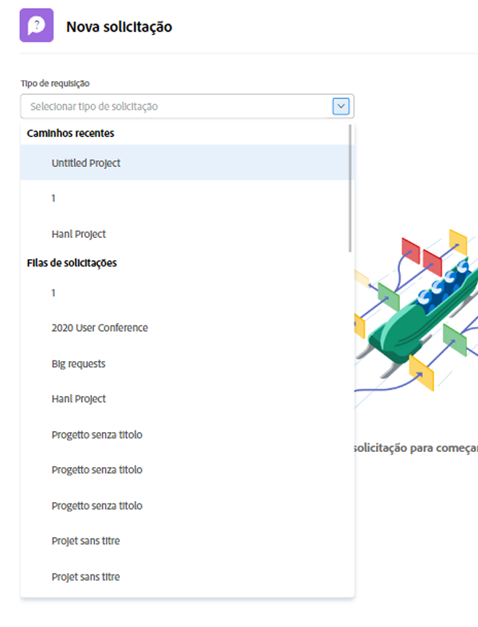
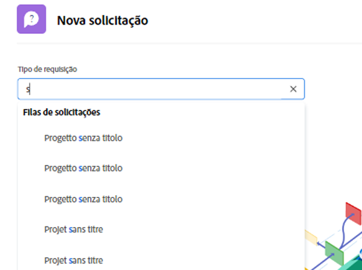
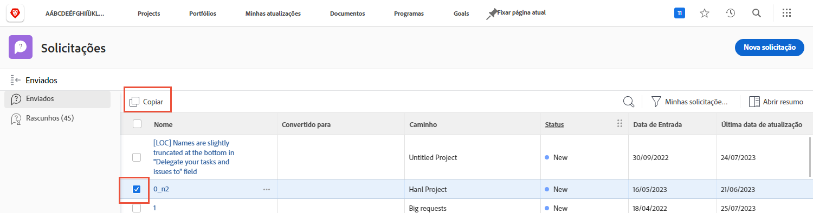
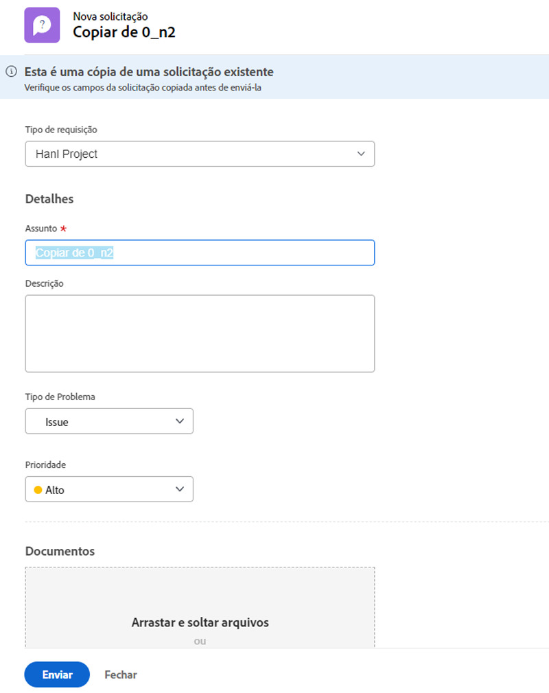

# Fazer uma solicitação

Em muitas organizações, a primeira etapa para iniciar um novo projeto, desenvolver um novo produto ou criar um produto é fazer uma solicitação no [!DNL Workfront]. Você pode acompanhar o progresso da solicitação e fornecer informações adicionais quando necessário.

Neste vídeo, você aprenderá a:

* Navegue até a área de solicitação
* Fazer uma solicitação
* Exibir solicitações enviadas
* Localizar um rascunho de uma solicitação

>[!VIDEO](https://video.tv.adobe.com/v/336092/?quality=12)

## Acesse os caminhos da fila de solicitações de maneira rápida e fácil

Ao clicar em na guia [!UICONTROL Tipo de solicitação] , os três últimos caminhos de solicitação enviados recentemente para o serão exibidos automaticamente na parte superior da lista. Selecione uma opção para arquivar outra solicitação nessa mesma fila.

Na parte inferior da lista estão todas as filas de solicitações às quais você tem acesso. Se não tiver certeza de qual fila usar para sua solicitação, use a pesquisa por palavra-chave para localizar de maneira rápida e fácil a fila necessária.

À medida que você digita palavras-chave, [!DNL Workfront] O traz correspondências para que você possa encontrar o caminho da fila de solicitações adequado às suas necessidades. Por exemplo, para fazer uma solicitação para uma publicação de mídia social, comece digitando &quot;redes sociais&quot; na [!UICONTROL Tipo de solicitação] e a lista é atualizada dinamicamente para mostrar qualquer correspondência.

Selecione a opção desejada, preencha o formulário de solicitação e envie a solicitação.

## Copiar uma solicitação enviada para fazer uma nova solicitação

Quando você envia o mesmo tipo de solicitação frequentemente, é demorado criar cada nova solicitação e preencher as mesmas informações várias vezes. Acelere o processo copiando uma solicitação existente, alterando apenas as informações que precisam ser atualizadas e enviando-a como uma nova solicitação.

1. Clique em Solicitações no menu principal.
1. Verifique se você está na seção Enviado, marcando o menu do painel esquerdo.
1. Localize e selecione a solicitação que deseja copiar. Você pode copiar apenas uma solicitação por vez.
1. Clique no ícone Copiar e enviar como novo na parte superior esquerda da lista de solicitações.
1. A janela Nova solicitação é aberta, com o campo Assunto realçado para que você possa nomear a nova solicitação.
1. Atualize outras informações na solicitação, conforme necessário.
1. Clique em Enviar para concluir.
1. A solicitação copiada é enviada como uma nova solicitação e aparece na Lista enviada.

Você pode copiar uma solicitação submetida anteriormente, mas não pode copiar um rascunho de uma solicitação. Você pode copiar uma solicitação submetida por outra pessoa desde que tenha acesso de Visualização à solicitação.

<!---
Learn more
Requests area overview
Create and submit Workfront requests
Guides
Make a work request
--->
