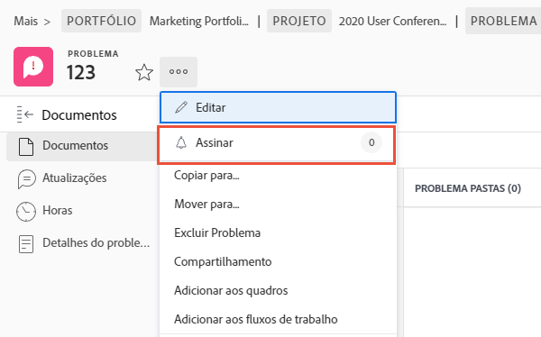

# Gerenciar atribuições de emissão

## Atribuir um problema

Registro do problema em [!DNL Workfront] É o primeiro passo para resolver os problemas que surgem. A próxima etapa é atribuir o problema a um usuário individual, vários usuários ou uma equipe, para que qualquer trabalho associado possa ser concluído e o problema resolvido.

A atribuição de um problema é como a atribuição de uma tarefa; preencha o [!UICONTROL Atribuições] campo. O problema aparece no [!UICONTROL Lista de Trabalho] em [!DNL Workfront] [!UICONTROL Início]. Se for atribuído a uma equipe, será exibido no [!UICONTROL Solicitações de equipe] da seção [!UICONTROL Equipe] página.

Todos os problemas logados nas tarefas e o próprio projeto podem ser acessados no [!UICONTROL Problemas] na página do projeto. Isso permite que gerentes de projeto, planejadores e outros tenham uma forma rápida de atribuir problemas relacionados ao projeto.

Há várias maneiras de atribuir problemas no [!DNL Workfront].

* Vá para o [!UICONTROL Problema] no projeto ou tarefa. Clique no botão [!UICONTROL Atribuições] para ativar a edição em linha e, em seguida, insira o nome do usuário, usuário ou equipe que deve concluir o trabalho.
Você também pode usar a edição em linha ao exibir problemas em um [!DNL Workfront] relatório.

* Clique no nome do problema, em um relatório ou na função **[!UICONTROL Problemas]** do projeto ou tarefa. Em seguida, clique em **[!UICONTROL Atribuições]** no cabeçalho, na parte superior direita da janela. Não se esqueça de clicar no botão **[!UICONTROL Salvar]** depois de inserir um nome de usuário ou de equipe.

![Uma imagem da opção de edição em linha ao clicar na [!UICONTROL Atribuições] campo de um problema](assets/04-issue-assign-issue-list-assignments-field.png)

<!--
Learn more graphic and documentation article links
Assign issues
Edit user assignments for multiple issues
-->

## Recebendo uma atribuição de emissão

Você encontrará problemas atribuídos a você no [!UICONTROL Lista de Trabalho] em [!UICONTROL Início].

![Uma imagem de uma atribuição de ocorrência na [!UICONTROL Lista de Trabalho] em [!UICONTROL Início]](assets/05-workfront-home-work-list.png)

Use o [!UICONTROL Filtro] para restringir a lista, de modo que você esteja visualizando somente os problemas, se desejar.

![Uma imagem da [!UICONTROL Filtro] no menu [!UICONTROL Lista de Trabalho] em [!UICONTROL Início]](assets/06-workfront-home-issue-filter.png)

Quando um problema é atribuído a um grupo, ele é exibido na [!UICONTROL Solicitações de equipe] da seção [!UICONTROL Equipe] página. Um membro da equipe pode clicar no botão [!UICONTROL Trabalhe Com Ele] botão para aceitar a atribuição ou um lead para a equipe pode clicar no botão [!UICONTROL Reatribuir] ícone para dar a solicitação a uma pessoa específica.

![Uma imagem da [!UICONTROL Solicitações de equipe] da seção [!UICONTROL Equipe] página](assets/07-team-page-work-on-it.png)

Os problemas atribuídos à equipe também aparecem no [!UICONTROL Agendar] seção. Isso permite que os leads da equipe e outros vejam em que membros da equipe estão trabalhando antes de atribuírem o trabalho. Arraste e solte a barra de edição do [!UICONTROL Não atribuído] para o calendário de um membro da equipe para atribuí-lo.

![Uma imagem das atribuições de equipe no [!UICONTROL Agendar] seção.](assets/08-issue-assignment-team-schedule.png)

Dependendo de como sua organização tem [!DNL Workfront] configurar, você também poderá ver problemas atribuídos a você ou à sua equipe em um relatório que faz parte de um painel.

<!-- Learn more graphic and documentation article links

* Display items in the [!UICONTROL Work List] in the [!UICONTROL Home] area
* Manage work and team requests in the [!UICONTROL Home] area

-->

## Atualizar o progresso em problemas

Você e os membros da equipe podem publicar atualizações e registrar horas em problemas para fornecer visibilidade sobre o trabalho que está sendo feito e manter todos envolvidos atualizados sobre o progresso do trabalho.

Porque há várias maneiras de publicar atualizações no [!DNL Workfront], siga as instruções específicas de sua equipe em relação à maneira recomendada que funciona com as configurações e workflows do sistema.

Atualizações e horas podem ser postadas no problema a partir de [!UICONTROL Início]. Clique em **[!UICONTROL Novas atualizações]** para postar um comentário.

![Uma imagem da publicação de uma atualização em um problema de [!UICONTROL Início].](assets/09-workfront-home-update.png)

Ao comentar um problema, você pode direcionar a mensagem para outros usuários ou equipes usando o recurso @name, da mesma forma que pode nas redes sociais.

Clique no botão **[!UICONTROL Hora de registro]** para gravar as horas em que você trabalhou no problema.

![Uma imagem do registro de horas em um problema de [!UICONTROL Início].](assets/10-workfront-home-log-hours.png)

Ou você pode abrir o problema (clique no nome) e registrar suas informações lá.

## Assinar um problema

Qualquer pessoa com acesso ao problema pode [!UICONTROL Assinar] para ele, que envia uma notificação sempre que uma atualização/comentário é feito sobre o problema. Você não recebe notificações quando as horas são registradas, o status muda ou outras edições são feitas.

A assinatura é uma ótima maneira de outros membros da equipe ou gerentes de projeto rastrearem o trabalho em que estão interessados, mas não atribuídos a ou trabalhando ativamente.

<!-- Learn more graphic and link to documentation article

* Update or edit a work item in the Home area

-->

## Atualizar o status do problema

Além de postar comentários ou horas de registro, não se esqueça de alterar o status do problema para indicar que você está trabalhando nisso. E então mude de novo para indicar que o trabalho está concluído.

Altere o status no cabeçalho de [!UICONTROL Início] ou quando tiver aberto a página de edição.

### Problemas não resolvidos

Um problema é considerado &quot;não resolvido&quot; quando o status não foi atualizado para concluir ou equivalente.

Problemas não resolvidos impedem que a tarefa à qual está associada seja marcada como concluída, bem como o status do projeto seja definido como concluído.

<!-- Learn more graphic and documentation article link

* Mark a work item as done in the Home area

-->

## Recursos adicionais sobre problemas

A página de edição fornece acesso a informações e recursos adicionais que os membros da equipe e os gerentes de projeto podem precisar registrar e gerenciar corretamente o problema para resolução.

Além de [!UICONTROL Atualizações] e [!UICONTROL Horas], outras informações podem ser acessadas no menu do painel esquerdo depois de abrir o problema.

* **[!UICONTROL Documentos]**—Faça upload e revisão de documentos relacionados ao problema.
* **[!UICONTROL Detalhes do problema]**—Altere as informações do problema, como descrição, prioridade, gravidade e data de conclusão planejada.
* **[!UICONTROL Aprovações]**—Configure um processo de aprovação de uso único para a emissão ou aplique um processo de aprovação global. Também é possível rastrear o progresso da aprovação nesta seção.

Localize as opções para copiar, excluir ou compartilhar um problema no menu de três pontos à direita do nome do problema.

<!-- Learn more graphic and documentation article links

* Edit issues
* Copy issues
* Share an issue
* Move issues
* Grant access to an issue

-->
