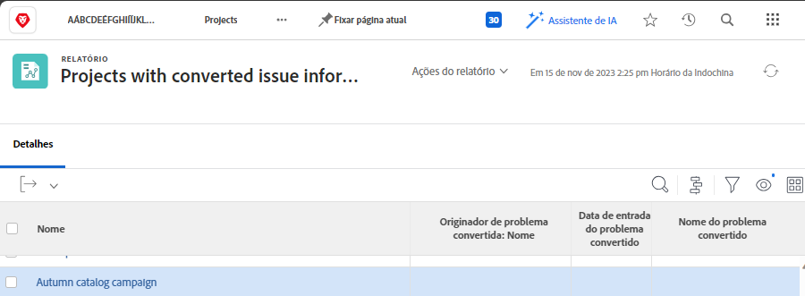

# Relatório sobre problemas

## Centralizar problemas criando um relatório

Muitos gerentes de tráfego e projeto criam uma [!UICONTROL Workfront] relatório personalizado para centralizar todos os problemas recebidos. Isso facilita o rastreamento das novidades e requer atenção.

O relatório pode então ser adicionado a um painel, colocando tudo o que você precisa para fazer seu trabalho em um [!UICONTROL Workfront] janela.

![Uma imagem da [!UICONTROL Resolvendo objeto] de um relatório de emissão.](assets/18-resolving-object-report.png)

Para exibir o nome da tarefa ou do projeto para o qual o problema foi convertido, inclua o &quot;[!UICONTROL Resolvendo objeto]&quot; na exibição. Um &quot;[!UICONTROL Resolvendo objeto]&quot; é a tarefa ou projeto criado ao converter um problema. Se um problema não tiver sido convertido, a variável [!UICONTROL Resolvendo objeto] estará em branco. Esse relatório permite que você veja rapidamente quais problemas já foram convertidos, de modo que não acabe com duplicatas. Basta clicar no nome do objeto de resolução para abri-lo para que você possa acompanhar o progresso do trabalho que está sendo feito.

## Mostrar informações do problema original em relatórios

Às vezes, um problema é convertido em uma tarefa ou projeto para que o trabalho necessário para resolvê-lo possa ser rastreado e monitorado de acordo com os fluxos de trabalho de sua organização.

Um relatório de projeto ou tarefa pode exibir informações úteis sobre o problema original. Essas colunas podem ser adicionadas a uma exibição personalizada com relatórios do modo de texto:

* [!UICONTROL Data de Entrada da Emissão Original]
* [!UICONTROL Nome da Emissão Original]
* [!UICONTROL Nome do Originador da Emissão Original]

<!-- Need wf one documentation article link below

For the text mode used to create this report, see the article titled View: Display original issue information on task and project list.

-->

<!--  Learn more graphic and documentation article links

* Create and customize views
* Overview of resolving and resolvable objects
* Understanding resolving and resolvable objects

-->
