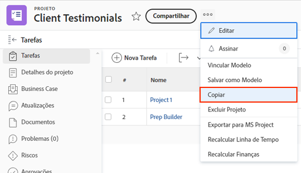

# Copiar um projeto existente

Às vezes, em vez de usar um modelo para criar um projeto, você só precisa copiar um projeto para outro uso único. Para fazer isso, é necessário ter uma licença Standard, com acesso para Editar e Criar aos projetos.

Navegue até o projeto que deseja copiar e clique no menu de três pontos ao lado do nome do projeto. Em seguida, selecione “Copiar”.

A janela “Copiar projeto” permite alterar o título e o status, bem como limpar uma variedade de dados associados ao projeto; opções como tarefas, documentos e dados personalizados.

Selecionar “Limpar atribuições” ou definir o status como “Em planejamento” evita que o projeto copiado envie notificações de atribuição de tarefas logo após a cópia.

## Tutoriais recomendados sobre este tópico

* [Criar um projeto diretamente a partir de um modelo](/help/manage-work/create-and-manage-project-templates/create-a-project-directly-from-a-template.md)
* [Trabalhar com tarefas](/help/manage-work/tasks/work-with-tasks.md)
* [Atribua tarefas do plano do projeto](/help/manage-work/tasks/assign-tasks-from-the-project-plan.md)
