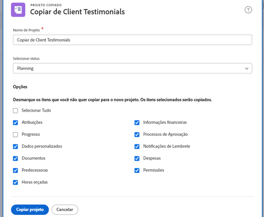

# Copiar um projeto existente

Às vezes, em vez de usar um modelo para criar um projeto, você só precisa copiar um projeto para outro uso único. Para fazer isso, é necessário ter uma licença de Plano, com acesso para Editar e Criar aos projetos.

Navegue até o projeto que deseja copiar e clique no menu de três pontos ao lado do nome do projeto. Em seguida, selecione Copiar.

A janela Copiar projeto permite alterar o título e o status, bem como limpar vários dados associados ao projeto — opções como atribuições, documentos e dados personalizados.

Selecionar Limpar Atribuições ou definir o status como Planejamento impede que o projeto copiado envie notificações de atribuição de tarefa logo após a cópia.
