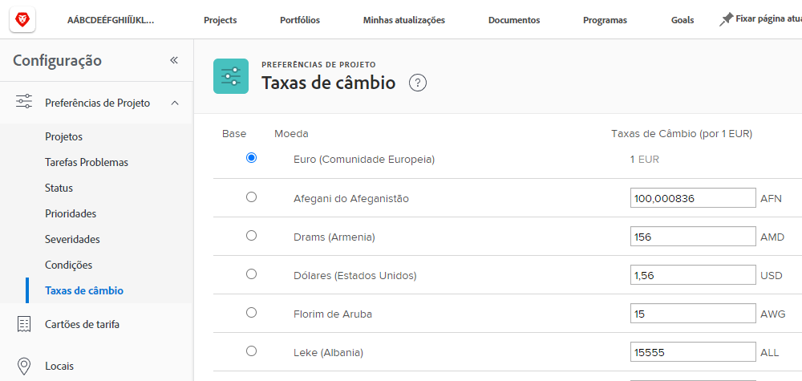
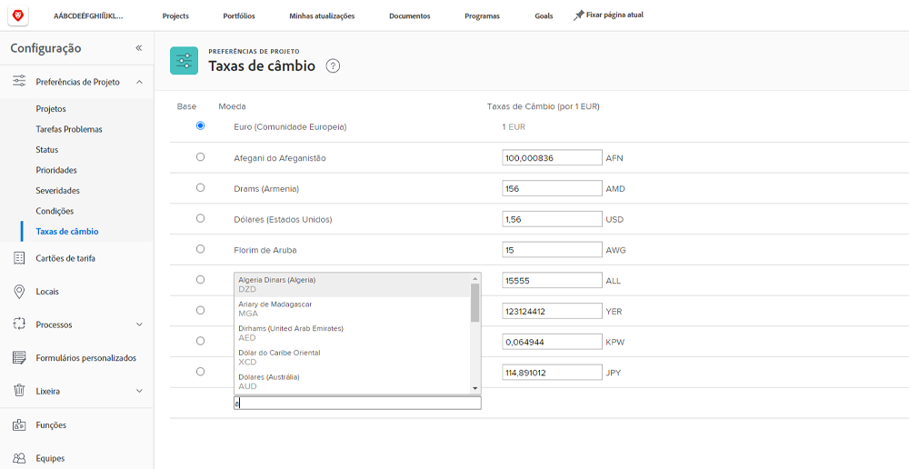

# Configurar taxas de câmbio

[!DNL Workfront] O suporta moedas diferentes para organizações de clientes que sejam empresas multinacionais. As taxas de câmbio podem ser utilizadas em projetos e relatórios para refletir informações financeiras em diferentes moedas de todo o mundo.

As taxas de câmbio são gerenciadas pelos administradores do sistema. Moedas adicionais podem ser configuradas conforme necessário para sua organização.

[!DNL Workfront]A moeda base (padrão) dos Estados Unidos é o dólar. Essa é a moeda em que as informações financeiras serão calculadas por padrão, a menos que uma moeda diferente seja especificada em um projeto individual.

## Configurar moedas e taxas de câmbio

**Selecionar [!UICONTROL Configuração] no menu principal.**

1. Expandir **[!UICONTROL Preferências do projeto]** no painel do menu esquerdo.
1. Clique em **[!UICONTROL Taxas de Câmbio]**.
1. Clique no botão **[!UICONTROL Adicionar Moeda]** botão.
1. Selecione a moeda do país na lista suspensa.
1. Informe a taxa de câmbio desejada para a moeda.
1. Se uma moeda diferente do dólar americano deve ser a [!DNL Workfront] moeda base (padrão) do sistema, clique no botão ao lado do nome da moeda.
1. Clique em **[!UICONTROL Salvar]** quando todas as moedas tiverem sido adicionadas.

>[!NOTE]
>
>A Workfront não atualiza ou rastreia os valores atuais de mercado para as taxas de câmbio. As atualizações, se necessário, devem ser feitas manualmente.
