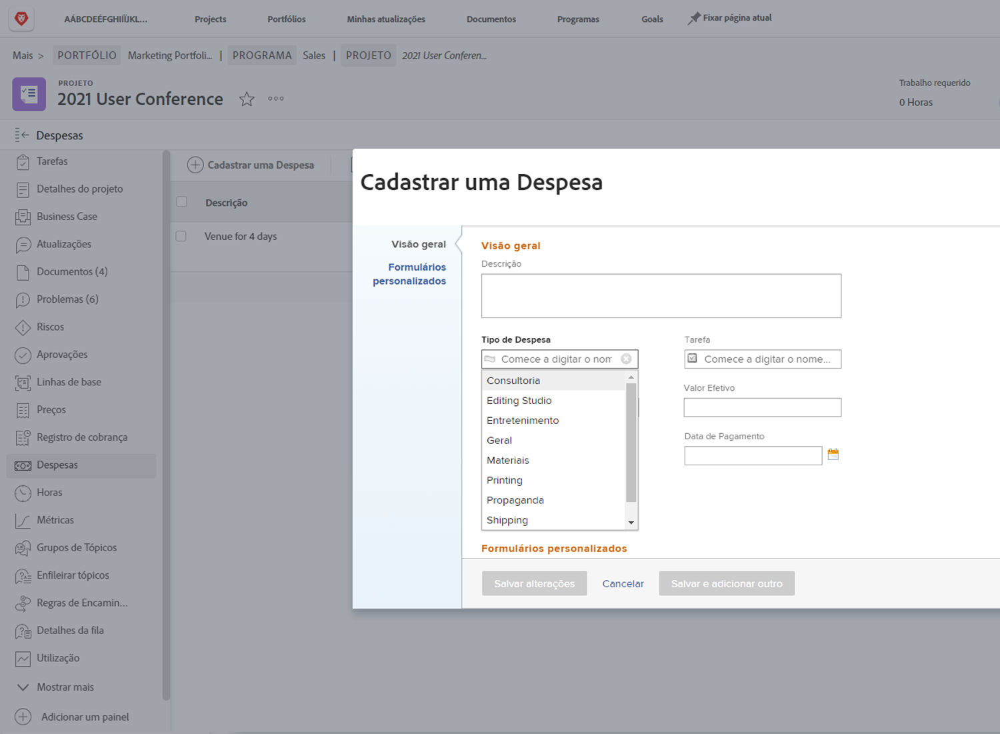

# Configurar tipos de despesas

Despesas em [!DNL Workfront] representam custos não mão de obra associados a projetos e outros trabalhos. As despesas podem ser, por exemplo, despesas de viagem ao visitar um cliente ou a compra de suprimentos necessários para concluir uma sessão fotográfica. Essas despesas devem ser registradas no projeto para que os custos planejados e os custos reais possam ser calculados e relatados para qualquer projeto.

[!DNL Workfront] O tem tipos de despesas pré-criados que podem ser usados ao inserir despesas. Os padrões não podem ser excluídos ou modificados, mas novos podem ser adicionados.

* Propaganda
* Consultoria
* Entretenimento
* Geral
* Materiais
* Impressão
* Envio
* Viagens

Um administrador do sistema pode adicionar os tipos de despesas necessários para sua organização. Esses tipos de despesas adicionais podem ser modificados, ocultos ou excluídos para dar suporte aos relatórios financeiros necessários em sua organização.

Gerentes de projeto, executivos e outros podem gerar relatórios de despesas — agrupando as despesas individuais por tipo, se desejado — para tarefas, projetos, programas ou portfólios dentro do [!DNL Workfront]. As finanças do projeto tornam-se muito mais gerenciáveis usando tipos de despesas.

## Criar um tipo de despesa

**Selecionar [!UICONTROL Configuração] no menu principal**

1. Clique em **[!UICONTROL Tipos de Despesas]** no menu do painel esquerdo.
1. Clique em **[!UICONTROL Novo Tipo de Despesa]** botão.
1. Nomeie o tipo de despesa.
1. Adicione uma descrição, se necessário.
1. Clique em **[!UICONTROL Salvar]** botão.

![Uma imagem da criação de um novo [!UICONTROL Tipo de Despesa]](assets/setting-up-finances-6.png)

## Uso de tipos de despesas

As opções de despesa são exibidas na caixa **[!UICONTROL Tipo de Despesa]** lista suspensa quando os usuários criam uma despesa em um projeto ou tarefa no [!DNL Workfront].

