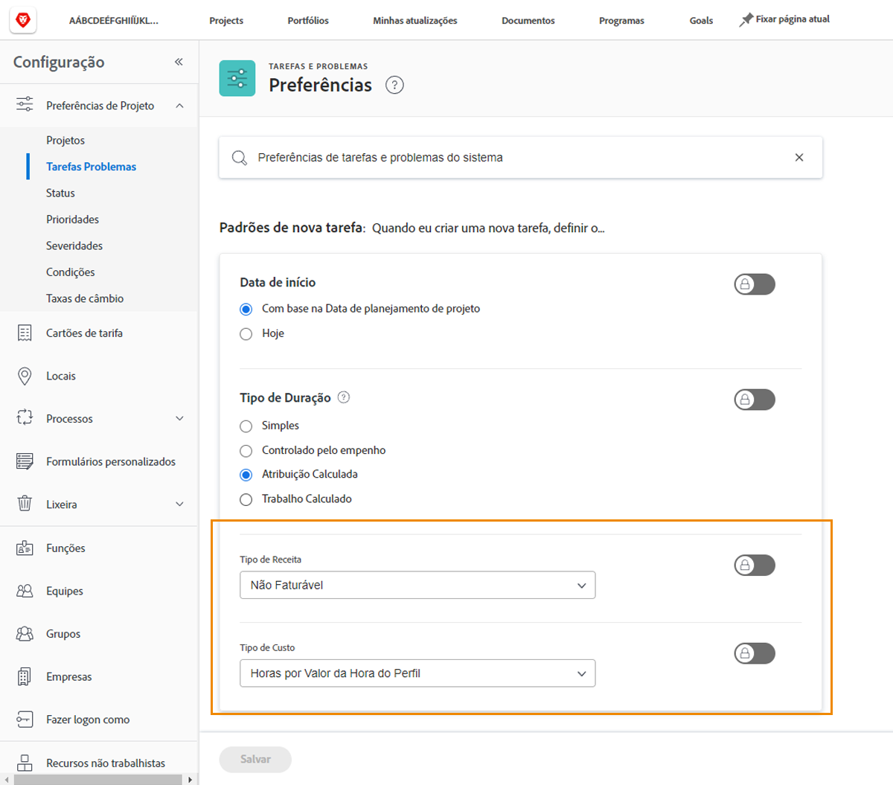

# Configurar a receita da tarefa e os padrões de custo

O tipo de receita e o tipo de custo são usados para calcular as informações financeiras planejadas e reais de uma tarefa. As informações padrão para cada uma delas podem ser definidas em todo o sistema, de modo que se aplicam a cada nova tarefa criada. As informações podem ser alteradas em projetos individuais ou definidas em modelos de projeto.

**Cinco tipos de receita padrão estão disponíveis:**

* Não Faturável
* Horas por Valor da Hora do Recurso
* Horas por Valor da Hora do Perfil
* Horas por Valor de Hora Fixo
* Receita com Valor Fixo

**E quatro tipos de custo padrão estão disponíveis:**

* Sem Custo
* Horas por Valor de Hora Fixo
* Horas por Valor da Hora do Recurso
* Horas por Valor da Hora do Perfil

>[!NOTE]
>
>Quando os tipos de receita ou custo são definidos como Não faturável ou Sem custo, as estimativas de receita e custo não são geradas para a tarefa. Portanto, o trabalho na tarefa não contribui para receitas ou custos a nível do projeto.

## Definir padrões de receita e custo

Selecionar **[!UICONTROL Configuração]** no menu principal.

1. Clique em **[!UICONTROL Preferências do projeto]** no menu do painel esquerdo.
1. Em seguida, clique em **[!UICONTROL Tarefas e problemas]**.
1. No [!UICONTROL Novo padrão de tarefa] selecione a [!UICONTROL Tipo de receita] e [!UICONTROL Tipo de custo].
1. Clique em Salvar ao concluir.

