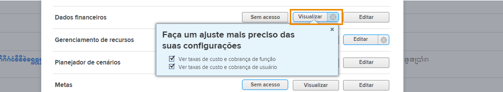

# Entender o acesso financeiro

Se sua organização estiver capturando dados financeiros com [!DNL Workfront], como administrador do sistema, é sua responsabilidade proteger e gerenciar quem tem acesso para visualizar e editar essas informações.

São necessárias duas coisas para que um usuário visualize ou edite informações financeiras:

1. Os direitos de acesso devem ser ativados no [!UICONTROL Nível de acesso].
2. A permissão para usar esses direitos de acesso deve ser concedida por objeto.

Por exemplo, um usuário pode receber direitos para exibir dados financeiros em seu nível de acesso, mas só poderá exibir dados financeiros em uma tarefa que esteja compartilhada com ele e a exibição financeira esteja habilitada no compartilhamento dessa tarefa.

Portanto, é possível para um usuário com [!UICONTROL Nível de acesso] direitos de visualização de finanças para poder visualizar as finanças de alguns objetos e não de outros, dependendo das opções individuais de compartilhamento desses objetos. No entanto, nenhum usuário pode visualizar dados financeiros sobre qualquer objeto, a menos que tenha o direito concedido a ele em suas [!UICONTROL Nível de acesso].

## [!UICONTROL Nível de acesso] configurações

O acesso geral aos dados financeiros é concedido em primeiro lugar [!DNL Workfront] tipo de licença.

**[!UICONTROL Plano] as licenças podem:**

* Gerenciar registros de cobrança
* Gerenciar e exibir taxas de custo e cobrança de função
* Gerenciar e exibir taxas de custo e cobrança de usuário
* Gerenciar despesas
* Exibir e editar finanças

**[!UICONTROL Trabalho] as licenças podem:**

* Gerenciar despesas
* Exibir finanças

**[!UICONTROL Revisão] as licenças podem:**

* Exibir finanças

**As permissões podem ser modificadas pelo [!UICONTROL Nível de acesso]. As três opções para acesso a dados financeiros são:**

* [!UICONTROL Sem acesso] — O usuário não poderá ver as informações financeiras.
* [!UICONTROL Exibir] — o usuário pode revisar e compartilhar as informações.
* [!UICONTROL Editar] — o usuário pode criar, editar, excluir e compartilhar as informações. (Disponível somente para uma licença de Plano.)

É importante observar que a variável [!UICONTROL Exibir] e [!UICONTROL Editar] opções têm configurações adicionais para uma [!UICONTROL Plano] licença. Clique na engrenagem no [!UICONTROL Exibir] botão para estas opções:

**[!UICONTROL Exibir]**

* Ver taxas de custo e cobrança de função
* Ver taxas de custo e cobrança de usuário

**[!UICONTROL Editar]**

Essas duas opções estão disponíveis no [!UICONTROL Editar] juntamente com:

* Editar taxas de custo e cobrança de função
* Editar taxas de custo e cobrança de usuário

>[!NOTE]
>
>Um usuário com acesso para adicionar despesas também pode visualizar as despesas adicionadas, bem como as despesas adicionadas por seus subordinados diretos.
