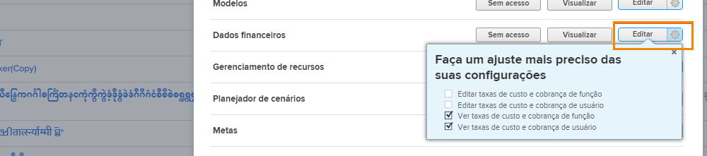

# Compreender o acesso financeiro

Se sua organização estiver capturando dados financeiros com [!DNL Workfront], como administrador do sistema, é sua responsabilidade proteger e gerenciar quem tem acesso para visualizar e editar essas informações.

Duas coisas são necessárias para que um usuário visualize ou edite informações financeiras:

1. Os direitos de acesso devem ser ativados no [!UICONTROL Nível de acesso].
2. A permissão para usar esses direitos de acesso deve ser concedida em uma base de objeto.

Por exemplo, um usuário pode receber direitos para exibir dados financeiros em seu nível de acesso, mas só pode visualizar dados financeiros em uma tarefa que é compartilhada com ele e a visualização financeira é ativada no compartilhamento dessa tarefa.

Portanto, é possível para um usuário com [!UICONTROL Nível de acesso] direitos de visualização de recursos financeiros para poder visualizar as finanças em alguns objetos e não em outros, dependendo das opções de compartilhamento individuais desses objetos. No entanto, nenhum usuário pode visualizar as finanças em qualquer objeto, a menos que tenha o direito concedido a elas em suas [!UICONTROL Nível de acesso].

## [!UICONTROL Nível de acesso] configurações

O acesso geral aos dados financeiros é concedido em primeiro lugar por [!DNL Workfront] tipo de licença.

**[!UICONTROL Plano] as licenças podem:**

* Gerenciar registros de faturamento
* Gerenciar e visualizar taxas de faturamento e custo de função
* Gerenciar e exibir taxas de faturamento e custo do usuário
* Gerenciar despesas
* Exibir e editar finanças

**[!UICONTROL Trabalho] as licenças podem:**

* Gerenciar despesas
* Exibir finanças

**[!UICONTROL Revisão] as licenças podem:**

* Exibir finanças

**As permissões podem ser modificadas pelo [!UICONTROL Nível de acesso]. As três opções para acesso a dados financeiros são:**

* [!UICONTROL Sem acesso] — O usuário não poderá ver informações financeiras.
* [!UICONTROL Exibir] — O usuário pode revisar e compartilhar as informações.
* [!UICONTROL Editar] — O usuário pode criar, editar, excluir e compartilhar as informações. (Disponível somente para uma licença do Plano.)

É importante observar que a variável [!UICONTROL Exibir] e [!UICONTROL Editar] têm configurações adicionais para um [!UICONTROL Plano] licença. Clique na engrenagem na [!UICONTROL Exibir] para essas opções:

**[!UICONTROL Exibir]**

* Ver taxas de custo e cobrança de função
* Ver taxas de custo e cobrança de usuário

**[!UICONTROL Editar]**

Essas duas opções estão disponíveis no [!UICONTROL Editar] , juntamente com:

* Editar taxas de custo e cobrança de função
* Editar taxas de custo e cobrança de usuário

>[!NOTE]
>
>Um usuário com acesso para adicionar despesas também pode visualizar as despesas adicionadas, bem como as despesas adicionadas pelos relatórios diretos.
