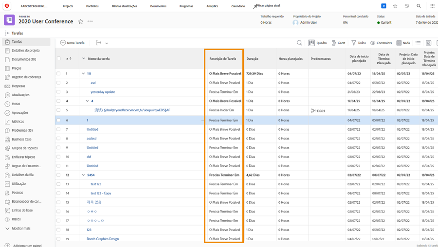

# Acompanhar o progresso a partir da linha do tempo do projeto

Verifique se as tarefas estão progredindo da maneira que deveriam para atingir os prazos do projeto. À medida que você digitaliza pelo [!UICONTROL Tarefa] há vários recursos na [!DNL  Workfront] que ajudam a monitorar o progresso e o status do trabalho.

## Percentual completo

O percentual concluído em cada tarefa de trabalho é usado às vezes para medir o progresso do trabalho. É importante observar que... esse campo deve ser ajustado manualmente, pois é a estimativa do destinatário de quanto tempo eles estão.

>[!TIP]
>
>Embora o percentual de conclusão das tarefas de trabalho precise ser atualizado manualmente, o percentual de conclusão de uma tarefa pai é calculado pela Workfront com base no percentual de conclusão e na duração ou nas horas planejadas de cada tarefa filho. Isso significa que você obterá uma precisão percentual concluída melhor se dividir tarefas grandes em subtarefas menores.

![Lista de tarefas do projeto em exibição [!UICONTROL Percentual Completo] coluna](assets/planner-fund-task-percent-complete.png)

Há três vezes quando a porcentagem concluída muda automaticamente:

* Quando a tarefa [!UICONTROL Status] estiver definido como Concluído, a porcentagem concluída será alterada para 100.
* Se a tarefa [!UICONTROL Status] reverte para Novo, a porcentagem concluída é redefinida para 0.
* Em uma tarefa pai quando o percentual concluído de uma tarefa filho é alterado.

## Status

Inclua o [!UICONTROL Status] coluna em uma [!UICONTROL Exibir] para ver rapidamente quais tarefas foram iniciadas, quais estão em andamento e quais estão concluídas. Você pode até mesmo configurar a formatação condicional em um [!UICONTROL Exibir] para codificar cada status, tornando as informações mais fáceis de decifrar.

## Atribuições de tarefas

À medida que você revisa o projeto, revise as atribuições da tarefa. Talvez o trabalho tenha ficado para trás porque ninguém foi designado para a tarefa. Ou talvez a pessoa atribuída não tenha o conjunto correto de habilidades para concluir o trabalho. Adicione mais pessoas a uma tarefa ou reatribua tarefas para garantir que o trabalho seja concluído.

## Restrição de tarefa

Às vezes, as restrições de tarefas são alteradas e você não percebe. As restrições podem afetar como sua linha do tempo se comporta, portanto, verifique se elas estão definidas como você deseja.

Crie uma exibição personalizada que inclua o [!UICONTROL Restrição de Tarefa] para ver essas informações na lista de tarefas. Se você planejou o projeto a partir de uma data de início, deseja que suas tarefas tenham a [!UICONTROL O Mais Breve Possível] ([!UICONTROL ASAP]).

Para obter mais detalhes sobre restrições de tarefa, consulte [Entender e gerenciar tipos de duração e restrições de tarefa](https://experienceleague.adobe.com/docs/workfront-learn/tutorials-workfront/manage-work/intermediate-projects/understand-and-manage-duration-types-and-task-constraints.html).
