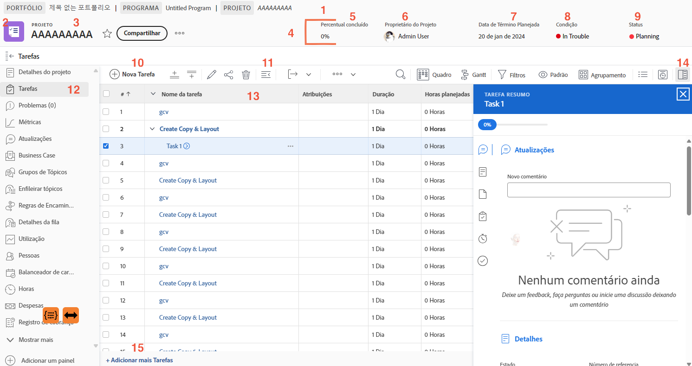

# Navegar na página do projeto

Neste vídeo, você aprenderá:

* Como ver os detalhes do projeto
* Quais informações são mostradas na lista de tarefas
* Onde fazer upload de documentos
* Como ver o histórico de atualizações

>[!VIDEO](https://video.tv.adobe.com/v/335085/?quality=12&learn=on&enablevpops)

## Principais elementos da página do projeto

[Clique aqui](/help/assets/key-parts-of-the-project-page.pdf) para baixar um PDF desta página.

A página do projeto está repleta de recursos para ajudar a gerenciar seu trabalho. Consulte o(a) admin de sistema se precisar de uma opção que não está disponível na sua instância do [!DNL Workfront]. Veja alguns recursos importantes da página principal do projeto.

1. **Caminho da navegação estrutural:** navegue pelo programa e pela hierarquia de portfólio por trás do projeto.
2. **Tipo de objeto:** mostrar o tipo de objeto na página de destino ajuda a identificar o que você está vendo no [!DNL Workfront]. O termo “projeto” pode ser personalizado pelo administrador do sistema do [!DNL Workfront].
3. **Nome do projeto:** o nome do projeto que você está visualizando. Clique no nome para editá-lo.
4. **Cabeçalho do projeto:** informações padrão disponíveis em todas as páginas do projeto.
5. **[!UICONTROL Percentual concluído]:** isso é atualizado automaticamente, com base nas tarefas concluídas no projeto.
6. **[!UICONTROL Proprietário do projeto]:** na maioria das organizações, esse é o(a) gerente do projeto. É a pessoa responsável pelo gerenciamento do projeto no [!DNL Workfront] e por garantir que ele seja concluído.
7. **[!UICONTROL Data de conclusão planejada]:** a data de conclusão planejada do projeto é definida pelo(a) gerente de projeto através da linha do tempo do projeto.
8. **[!UICONTROL Condição]:** a [!UICONTROL condição] é uma representação visual de como o projeto está progredindo. O [!DNL Workfront] pode configurar automaticamente a [!UICONTROL condição] com base no status de progresso das tarefas no projeto. A [!UICONTROL condição] também pode ser definida manualmente pelos detalhes do projeto.
9. **[!UICONTROL Status]:** o [!UICONTROL Status] indica onde o projeto está no processo: o projeto ainda está em planejamento, o projeto está em andamento ou o projeto está concluído.
10. **[!UICONTROL Nova tarefa]:** clique para criar uma tarefa no projeto. A tarefa é gerada na parte inferior da lista.
11. **[!UICONTROL Exportar]:** exporte tarefas selecionadas ou em uma lista para um arquivo PDF, de planilha ou delimitado por guias.
12. **Menu do painel esquerdo:** navegue por diferentes informações sobre o projeto utilizando o painel esquerdo. Clique no ícone de Tarefa na parte superior para recolher o painel se precisar de um pouco mais de espaço na tela. Arraste e solte os ícones para organizá-los, de maneira que possa trabalhar com eficiência. As opções exibidas são definidas pelo(a) admin de sistema do [!DNL Workfront].
13. **Lista de tarefas:** a lista de tarefas mostra todas as tarefas que compõem o plano do seu projeto. As informações visíveis sobre cada tarefa são determinadas pela exibição selecionada.
14. **Painel de resumo:** o painel de resumo fornece uma visão rápida das informações sobre a tarefa selecionada. Clique no ícone do painel Resumo para abri-lo ou fechá-lo.
15. **Adicionar mais tarefas** Clique aqui para adicionar outra tarefa à parte inferior da lista de tarefas, usando a edição em linha.

## Tutoriais recomendados sobre este tópico

* [Noções básicas sobre a criação de projetos](/help/manage-work/projects/understand-basic-project-creation.md)
* [Aprenda quatro maneiras de criar um projeto](/help/manage-work/projects/understand-other-ways-to-create-projects.md)
* [Preencha os detalhes do projeto](/help/manage-work/projects/fill-in-the-project-details.md)

