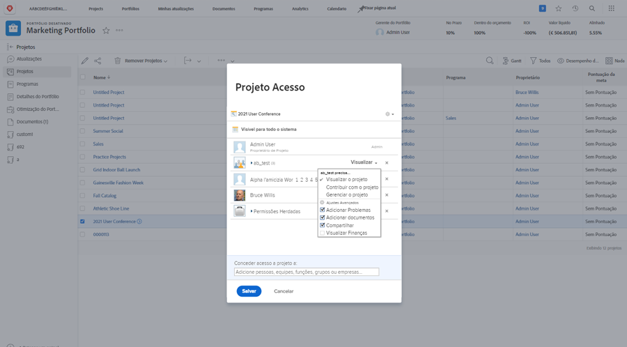

# Compartilhar um projeto

Fornecer visibilidade às partes interessadas e aos colaboradores no projeto é uma parte importante da gestão de um projeto.

Certifique-se de que todos possam ver as informações necessárias compartilhando o projeto. No Workfront, isso é feito com o [!UICONTROL Compartilhar] opção. Você pode fazer isso a partir do projeto individual, da variável [!UICONTROL Mais] no cabeçalho.

Ou você pode compartilhar vários projetos simultaneamente a partir da lista de projetos na [!UICONTROL Projetos] selecionando os projetos e clicando na guia [!UICONTROL Compartilhar] botão.

O compartilhamento do projeto permite que todos envolvidos vejam as informações do projeto quando precisarem.

<!---
Learn More Icon
Share permissions on objects
Share a project
--->
