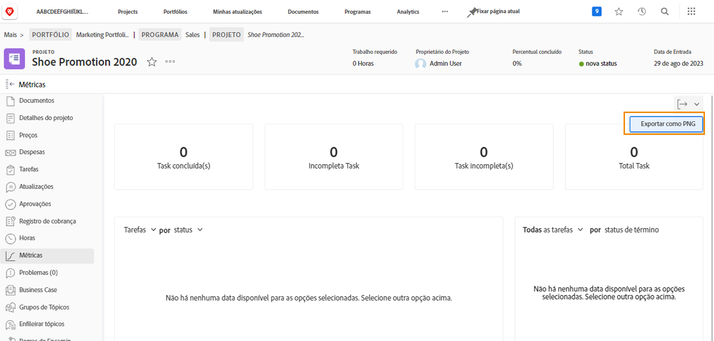

# Acompanhar o progresso do trabalho com métricas do projeto

Neste vídeo, você aprenderá a:

* Acesse os gráficos de métricas do projeto
* Personalize as informações nos gráficos

>[!VIDEO](https://video.tv.adobe.com/v/336667/?quality=12&learn=on)

Você pode exportar todo o painel de métricas do projeto como um arquivo .png usando o botão [!UICONTROL Exportar]. Isso facilita o compartilhamento de dados com outras pessoas por meio de emails ou apresentações.

## Tutoriais recomendados sobre este tópico

* [Introdução ao gerenciamento de um projeto](https://experienceleague.adobe.com/en/docs/workfront-learn/tutorials-workfront/manage-work/projects/getting-started-manage-a-project.md)
* [Acompanhar o progresso geral do projeto](https://experienceleague.adobe.com/en/docs/workfront-learn/tutorials-workfront/manage-work/projects/track-overall-project-progress.md)
* [Acompanhar o progresso do trabalho com métricas de projeto](https://experienceleague.adobe.com/en/docs/workfront-learn/tutorials-workfront/manage-work/projects/track-work-progress-with-project-metrics.md)
* [Compreender o [!UICONTROL Gantt] exibir](https://experienceleague.adobe.com/en/docs/workfront-learn/tutorials-workfront/manage-work/projects/understand-the-gantt-view.md)
* [Compreender o [!UICONTROL Quadro] exibir](https://experienceleague.adobe.com/en/docs/workfront-learn/tutorials-workfront/manage-work/projects/understand-the-board-view.md)
