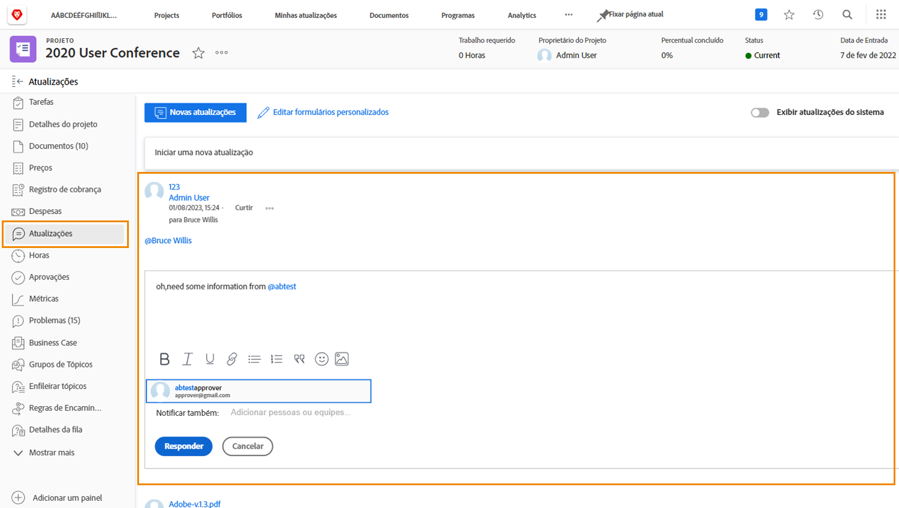

# Entender a comunicação do projeto

Como diz o provérbio, 90% da gestão de um projeto é comunicação. Comunicação com a equipe do projeto, seus gerentes e participantes do projeto.

Mas quando as equipes de projeto usam emails, mensagens instantâneas, reuniões e notas adesivas para a comunicação do projeto, as informações são espalhadas ... ou pior, esquecidas. Mantenha a comunicação sobre o trabalho do projeto no próprio projeto em [!DNL Workfront] usando atualizações.

Como os membros da equipe do projeto estão trabalhando em atribuições, eles podem fazer atualizações de [!DNL Workfront] [!UICONTROL Início] nas tarefas que lhes foram atribuídas.

Atualizações de tarefas, problemas e documentos são acumulados no nível do projeto [!UICONTROL Atualizações] , facilitando a visualização das informações.

Em seguida, é possível responder às atualizações clicando no botão . Isso mantém toda a conversa em um único lugar, permitindo que você consulte novamente mais tarde.

<!---
learn more urls
Communicate about work in Home
Subscribe to items in Workfront
Update work
--->
