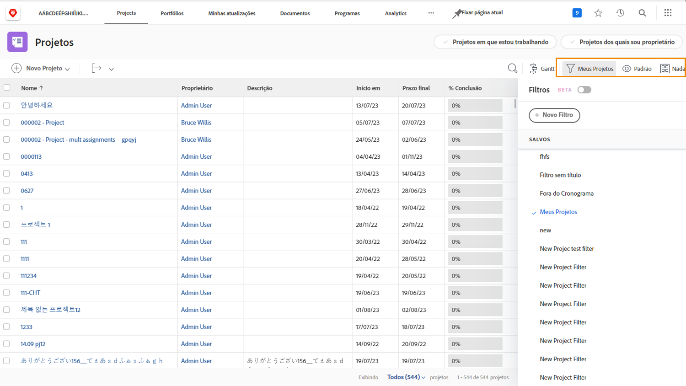

# Exibir informações do projeto

Não importa se está visualizando a página principal de [!UICONTROL Projetos] ou um projeto individual, você pode ajustar a lista para ver as informações necessárias com [!UICONTROL filtros], [!UICONTROL visualizações] e [!UICONTROL agrupamentos].

Você pode ter uma visão geral de como todos os projetos estão progredindo na página [!UICONTROL Projetos].

Use os [!UICONTROL filtros] para restringir a lista com base em determinados critérios. Em seguida, selecione uma [!UICONTROL visualização] para exibir as colunas de informações relevantes para os projetos. Por fim, selecione um [!UICONTROL agrupamento] para organizar os projetos de uma forma que faça sentido para você.

Quando estiver na seção [!UICONTROL Tarefas] de um projeto, utilize novamente os [!UICONTROL filtros], [!UICONTROL visualizações] e [!UICONTROL agrupamentos] para ajudar a monitorar o trabalho que está sendo realizado. Visto que você está analisando tarefas em vez de projetos, há um conjunto totalmente diferente de opções disponível.

Muitos clientes do [!DNL Workfront] criam visualizações personalizadas que expõem informações de formulários personalizados e outros campos relevantes para o trabalho que está sendo realizado.

## Aprenda como criar filtros, visualizações e agrupamentos personalizados

[Criar um filtro básico](https://experienceleague.adobe.com/docs/workfront-learn/tutorials-workfront/reporting/basic-reporting/create-a-basic-filter.html?lang=pt-BR)

[Criar uma visualização básica](https://experienceleague.adobe.com/docs/workfront-learn/tutorials-workfront/reporting/basic-reporting/create-a-basic-view.html?lang=pt-BR)

[Criar um agrupamento básico](https://experienceleague.adobe.com/docs/workfront-learn/tutorials-workfront/reporting/basic-reporting/create-a-basic-grouping.html?lang=pt-BR)
