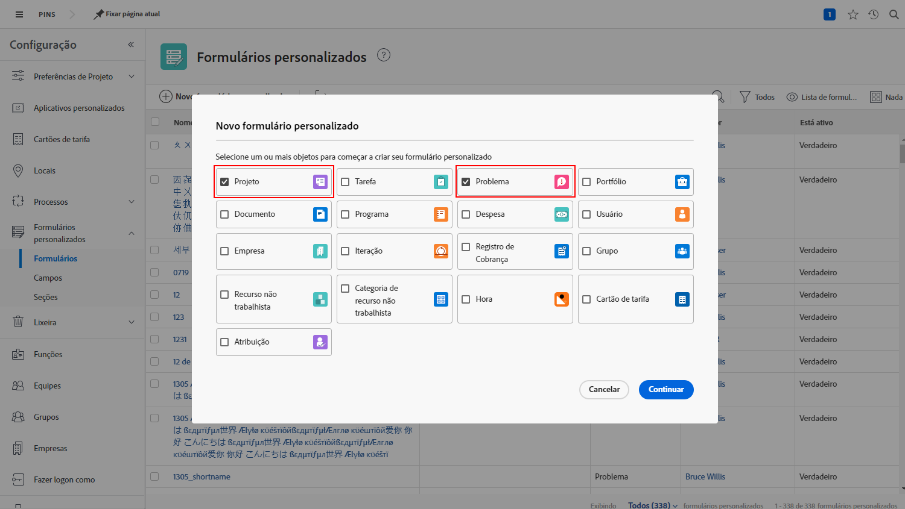
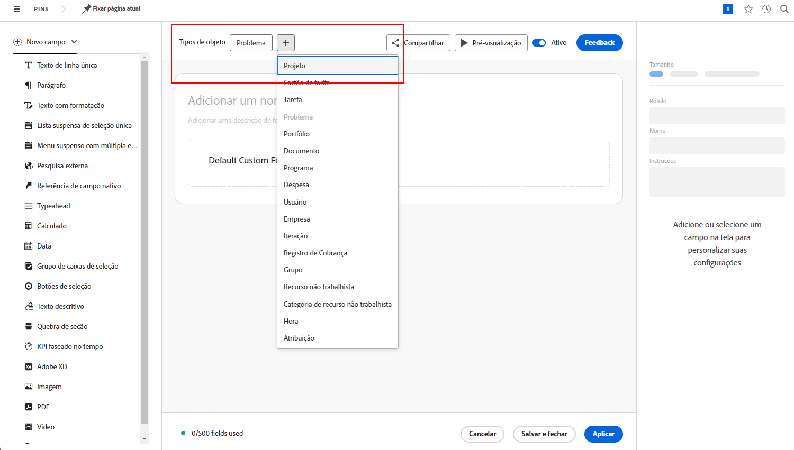

# Respostas a perguntas comuns sobre filas de solicitações

**Por que posso ver uma fila de solicitações, mas meu usuário não?**

Na guia de [!UICONTROL Detalhes da fila] de solicitações ou projeto, certifique-se de que o usuário atenda aos critérios do campo “Quem pode adicionar solicitações a esta fila?”

Assista a este vídeo para mais detalhes:

>[!VIDEO](https://video.tv.adobe.com/v/3434156/?quality=12&learn=on)

**Forneci acesso à fila aos usuários, mas eles também podem ver o projeto da fila de solicitações. Porquê?**

Na lista “Quem pode adicionar solicitações a esta fila?” , se você escolher &quot;Pessoas com acesso de visualização a este projeto&quot;, qualquer pessoa a quem você conceder direitos de visualização para usar a fila de solicitações também poderá exibi-la em uma lista de projetos. Para evitar isso, use a opção &quot;Pessoas na empresa deste projeto&quot; ou &quot;Pessoas no grupo deste projeto&quot;.

**Posso transformar uma solicitação em um projeto?**

Sim. Você pode converter problemas em tarefas ou projetos, dependendo do que for necessário.

Estes tutoriais mostrarão como:

* [Converter um problema ou solicitação em um projeto](/help/manage-work/issues-requests/create-a-project-from-a-request.md)

* [Converter um problema ou solicitação em uma tarefa](/help/manage-work/issues-requests/convert-issues-to-other-work-items.md)

**Onde encontro uma fila de solicitações para fazer edições?**

Você pode usar o campo [!UICONTROL Pesquisar] na barra de navegação ou encontrá-la na área [!UICONTROL Projetos].

Se você abrir uma solicitação da fila de solicitações, poderá clicar no nome do projeto na área de navegação estrutural.

**Posso transferir as informações de um formulário de solicitação personalizado para um formulário de projeto personalizado?**

Sim. Ao criar um formulário personalizado, selecione ambos o [!UICONTROL Projeto] e o [!UICONTROL Problema] como tipos de objeto. Você também pode editar um formulário personalizado de projeto para incluir o tipo de objeto do problema e vice-versa.

Anexe o formulário personalizado à solicitação. Ao converter a solicitação em um projeto, o formulário personalizado será anexado automaticamente ao novo projeto e os valores de todos os campos aparecerão nos formulários da solicitação e do projeto.

**Estou vendo um relatório de projeto ou tarefa. Como posso descobrir de qual solicitação esse objeto se originou?**

Você pode acessar os campos nas origens de campo **[!UICONTROL Problema convertido]** e **[!UICONTROL Originador do problema convertido]** para adicionar essas informações aos seus relatórios de projetos e tarefas.

Assista a este vídeo para mais detalhes:

>[!VIDEO](https://video.tv.adobe.com/v/3434176/?quality=12&learn=on)

**Qual é a melhor maneira de filtrar filas de solicitações em um relatório?**

Se o filtro do projeto incluir **Fila>>É pública>>Igual>>Nenhum**, o relatório mostrará apenas projetos que **NÃO** são filas de solicitações.

Se o filtro do projeto incluir **Fila>>É pública>>Não é igual>>Nenhum**, o relatório mostrará apenas projetos que **SÃO** filas de solicitações.

Assista a este vídeo para mais detalhes:

>[!VIDEO](https://video.tv.adobe.com/v/3434329/?quality=12&learn=on)

**Criar um status personalizado da fila de solicitações é uma boa ideia?**

Alguns clientes criam um status personalizado da fila de solicitações que equivale a Atual. A partir daí, podem gerar um relatório que mostra todas as filas de solicitações ou excluir facilmente filas de solicitações de um relatório. Embora isso tenha a vantagem de ser mais amigável do que usar **Fila>>É público>>Não é igual>>Nenhum**, existe a desvantagem de que as pessoas que criam filas de solicitações podem esquecer de usar esta opção, já que o status Atual funciona muito bem e é o que verão na maior parte do material de treinamento. Por esse motivo, vários clientes optam por não usar um status personalizado da fila de solicitações.

No entanto, se você já estiver usando o status da fila de solicitações em sua organização e quiser apenas ter certeza de que está sendo usado corretamente (ou corrigir casos em que não está), poderá criar o relatório **Filas de solicitações ativas** descrito no vídeo acima e alterar o filtro de **Projeto>>Status Igual a>>Igual>>Atual** para **Projeto>>Status>>Igual>>Atual**. Isso mostrará todas as filas de solicitações ativas que estão usando o status Atual em vez do status da fila de solicitações que você deseja que elas usem. Selecione todos os projetos exibidos e faça uma edição em massa para alterar os status para a fila de solicitações.

## Tutoriais recomendados sobre este tópico

* [Entenda as filas de solicitações](/help/manage-work/request-queues/understand-request-queues.md)
* [Crie uma fila de solicitações](/help/manage-work/request-queues/create-a-request-queue.md)
* [Noções básicas das configurações de um fluxo de solicitação](/help/manage-work/request-queues/understand-settings-for-a-flow-request.md)
* [Criar um fluxo de solicitação](/help/manage-work/request-queues/create-a-request-flow.md)
* [Criar uma fila de solicitações de feedback para admins de sistema](/help/manage-work/request-queues/create-a-system-admin-feedback-request-queue.md)
