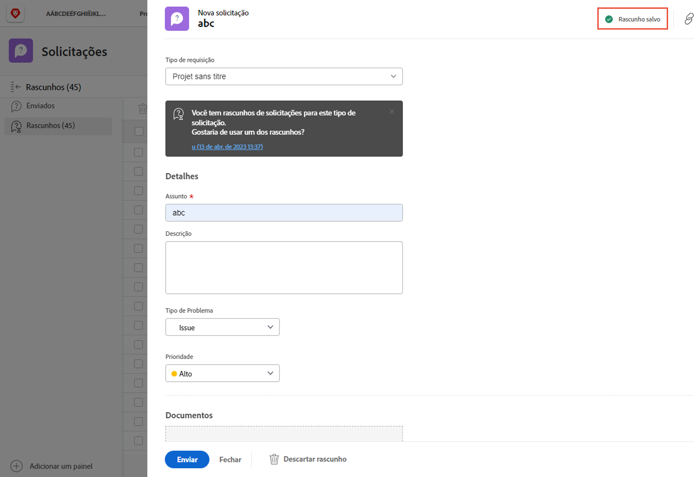
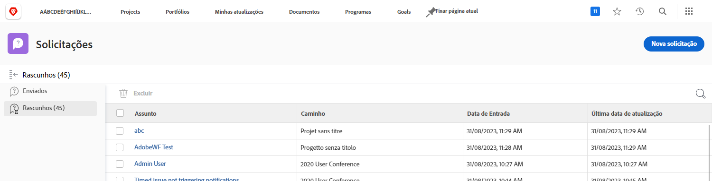

# Entender as filas de solicitação

Neste vídeo, você aprenderá:

* Como enviar uma solicitação por meio de um [!DNL  Workfront] fila de solicitações
* Como as filas de solicitações são estruturadas

>[!VIDEO](https://video.tv.adobe.com/v/335220/?quality=12&learn=on)

## Solicitar rascunhos salvos automaticamente

Ao começar a preencher um formulário de solicitação, [!DNL Workfront] salva um rascunho automaticamente depois de preencher o [!UICONTROL Assunto] campo. Isso significa que você não perderá dados se precisar sair do [!UICONTROL Solicitações] para fazer outra coisa ou se precisar pausar no meio da solicitação para coletar mais informações.

Você verá uma indicação de que o rascunho foi salvo na parte superior da janela. [!DNL Workfront] O salvará um rascunho de sua solicitação, mesmo se os campos obrigatórios ainda não estiverem preenchidos.

Quando estiver pronto para enviar a solicitação, encontre-a no [!UICONTROL Rascunhos] guia . Clique no nome para abri-lo e finalizar o preenchimento do formulário. Em seguida, clique em [!UICONTROL Enviar solicitação] quando terminar.

## Sua vez

Vamos levar um minuto para revisar as informações que você acabou de apresentar.

**Pergunta:** Como você faz uma solicitação no Workfront? Liste as etapas em ordem.

* Escolha o tipo de solicitação que você precisa fazer
* Clique em Enviar solicitação
* Preencha as informações no formulário
* Clique em &quot;Nova solicitação&quot;
* Navegar até a área de solicitação

**Resposta:** Navegue até a área de solicitação > Clique em Nova Solicitação > Escolha o tipo de solicitação que você precisa fazer > Preencha as informações no formulário > Clique em Enviar solicitação

**Pergunta:** Um pedido é realmente um ...

**Resposta:** Problema

<!---
You can also access request drafts from the [!UICONTROL Select a Request Type] menu at the top of the window. Select an option from the [!UICONTROL Recent Drafts] section, or start a new request by picking a queue from the [!UICONTROL New Requests] section. Fill everything out like normal, then submit the request.

<!---
image
--->

<!---
Let's take a minute to review the information you were just presented.

How do you make a request in Workfront? List the steps in order.
Choose the request type you need to make
Click Submit request
Fill out the information on the form
Click "New Request"
Navigate to the request area

Answer: Navigate to the request area>Click New Request>Choose the request type you need to make>Fill out the information on the form>Click Submit request

A request is really an......

Answer: Issue
--->
