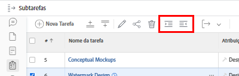
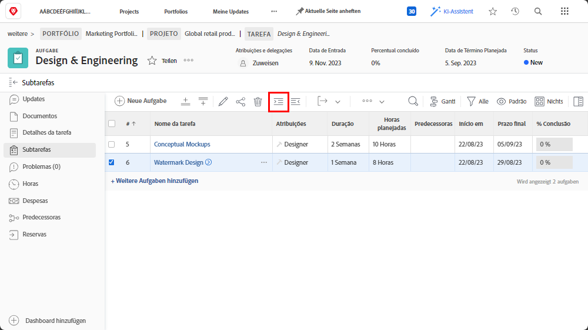
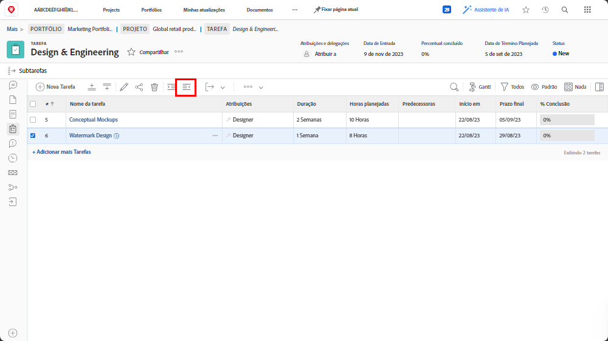

# Entender as tarefas pai-filho

Neste vídeo, você aprenderá:

* Como as tarefas são estruturadas em uma [!DNL Workfront] projeto

>[!VIDEO](https://video.tv.adobe.com/v/335087/?quality=12&learn=on)

## Alterar uma tarefa para uma subtarefa e voltar novamente

A variável **recuar** e **recuar para a esquerda** os botões são usados para alterar uma tarefa para uma subtarefa ou de uma subtarefa para uma não-subtarefa.

Selecionar &quot;[!UICONTROL Design de marca d&#39;água]&quot; e clique no link **recuar** botão. &quot;[!UICONTROL Design de marca d&#39;água]&quot; se tornará uma subtarefa em &quot;[!UICONTROL Modelos conceituais]&quot;, que se tornará uma tarefa pai.

Selecionar &quot;[!UICONTROL Design de marca d&#39;água]&quot; quando for uma subtarefa e clique no link **recuar para a esquerda** botão. &quot;[!UICONTROL Design de marca d&#39;água]&quot; se tornará uma tarefa regular no mesmo nível que &quot;[!UICONTROL Modelos conceituais]&quot;.

