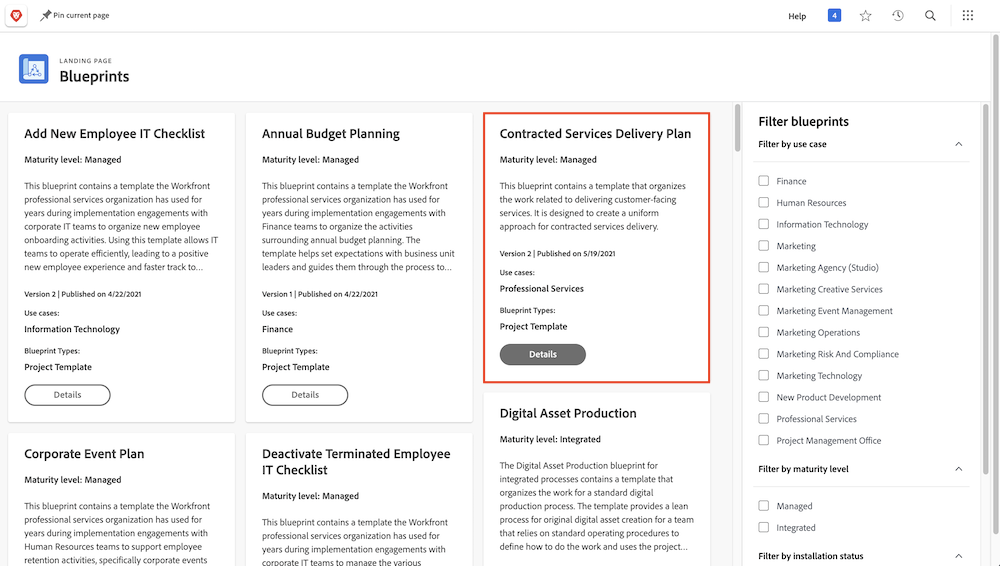

# Crie um modelo de projeto e saiba mais sobre [!UICONTROL blueprints]

Aprenda a criar um modelo de projeto do zero ou utilize um projeto existente, e entenda como os [!UICONTROL blueprints] podem fornecer acesso a diversos modelos de projeto úteis criados por especialistas do Workfront.

## Criar um modelo de projeto

Neste vídeo, você aprenderá a:

* Criar um modelo do zero
* Criar um modelo a partir de um projeto existente

>[!VIDEO](https://video.tv.adobe.com/v/335210/?quality=12&learn=on)

## Modelos criados com [!UICONTROL blueprints]

Os usuários do Workfront podem usar [!UICONTROL blueprints] para ajudar a criar modelos de projeto. Este recurso, localizado no menu principal, permite acessar modelos pré-criados e prontos para uso, os quais são direcionados a um departamento e nível de maturidade específico. Esses modelos agilizam a criação de projetos repetíveis e ajudam a manter a consistência entre projetos com um escopo semelhante.

Qualquer usuário licenciado pode navegar pela lista de blueprints disponíveis no Workfront. Não é possível aplicar um blueprint diretamente ao criar um novo projeto (como ao converter uma tarefa ou solicitação em um projeto). Uma das principais diferenças entre um blueprint e um modelo de projeto é que o blueprint é usado para criar um modelo, enquanto o modelo é usado para criar um projeto. **O blueprint precisa ser instalado por um(a) admin de sistema para que o modelo correspondente seja criado.**

Se encontrar um projeto que pareça interessante, você pode clicar em **[!UICONTROL Detalhes]** para saber mais sobre ele.

A tela de [!UICONTROL Detalhes] explica mais sobre o blueprint e fornece o histórico de instalação se o blueprint tiver sido instalado.

Se o blueprint foi instalado, você pode clicar em **[!UICONTROL Ver detalhes]** para obter links para o modelo criado e quaisquer outros objetos que foram criados para auxiliar o modelo.

Se o blueprint ainda não tiver sido instalado, você pode solicitar isso a um(a) admin de sistema.

## Tutoriais recomendados sobre este tópico

* [Criar um projeto diretamente a partir de um modelo](/help/manage-work/create-and-manage-project-templates/create-a-project-directly-from-a-template.md)
* [Compartilhar um modelo de projeto](/help/manage-work/create-and-manage-project-templates/share-a-project-template.md)
* [Copiar um projeto existente](/help/manage-work/manage-projects/copy-an-existing-project.md)
* [Desativar um modelo de projeto](/help/manage-work/create-and-manage-project-templates/deactivate-a-project-template.md)
* [Editar a equipe do projeto em um modelo de projeto](/help/manage-work/create-and-manage-project-templates/edit-the-project-team-in-a-project-template.md)
