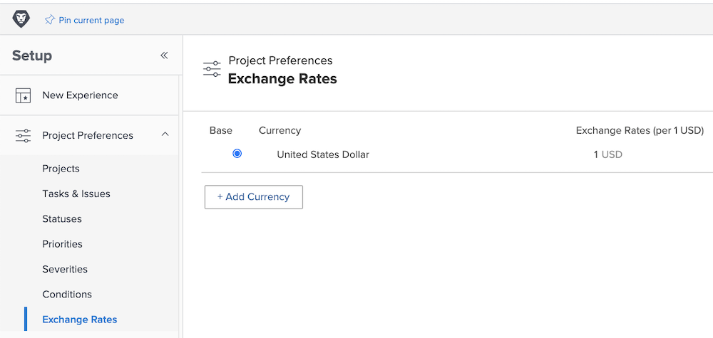

# Configurar taxas de câmbio

O [!DNL Workfront] é compatível com diferentes moedas para organizações de clientes que são empresas multinacionais. As taxas de câmbio podem ser usadas em projetos e relatórios para refletir informações financeiras em diferentes moedas do mundo todo.

As taxas de câmbio são gerenciadas pelos administradores do sistema. Moedas adicionais podem ser configuradas, conforme necessário, para a sua organização.

A moeda base padrão do Workfront é o dólar dos Estados Unidos. Essa é a moeda na qual as informações financeiras serão calculadas por padrão. Esse padrão pode ser alterado globalmente e em projetos individuais.

## Configurar moedas e taxas de câmbio

**Selecione [!UICONTROL Configuração] no menu principal.**

1. Expandir **[!UICONTROL Preferências do projeto]** no painel do menu esquerdo.
1. Clique em **[!UICONTROL Taxas de câmbio]**.
1. Clique no botão **[!UICONTROL Adicionar moeda]**.
1. Selecione a moeda do país na lista suspensa.
1. Insira a taxa de câmbio desejada da moeda.
1. Se uma moeda diferente do dólar americano precisar ser a moeda base (padrão) do sistema do [!DNL Workfront], clique no botão ao lado do nome da moeda.
1. Clique em **[!UICONTROL Salvar]** quando todas as moedas tiverem sido adicionadas.

>[!NOTE]
>
>O Workfront não atualiza nem rastreia os valores de mercado atuais das taxas de câmbio. As atualizações, se necessárias, precisam ser feitas manualmente.
