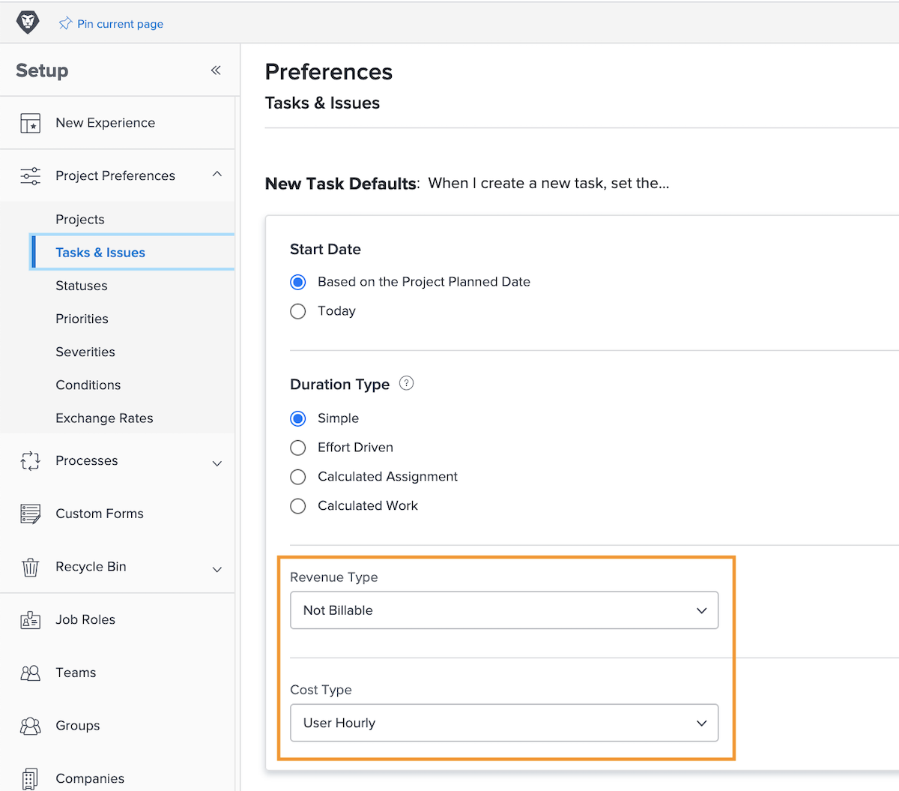

# Configurar padrões de receita e custo da tarefa

O tipo de receita e o tipo de custo são usados para calcular as informações financeiras planejadas e reais de uma tarefa. As informações padrão para cada uma delas podem ser definidas em todo o sistema, para que se apliquem a cada nova tarefa criada. As informações podem ser alteradas em projetos individuais ou registradas em modelos de projeto.

**Há cinco tipos de receita padrão disponíveis:**

* Não Faturável
* Horas por Valor da Hora do Recurso
* Horas por Valor da Hora do Perfil
* Horas por Valor de Hora Fixo
* Receita com Valor Fixo

**E há quatro tipos de custo padrão disponíveis:**

* Sem Custo
* Horas por Valor de Hora Fixo
* Horas por Valor da Hora do Recurso
* Horas por Valor da Hora do Perfil

>[!NOTE]
>
>Quando os tipos de receita ou custo são definidos como Não faturável ou Sem custo, as estimativas de receita e custo não são geradas para a tarefa. Portanto, o trabalho na tarefa não contribui para a receita ou os custos do projeto.

## Definir padrões de receita e custo

Selecione **[!UICONTROL Configurar]** no menu principal.

1. Clique em **[!UICONTROL Preferências do projeto]** no menu do painel esquerdo.
1. Em seguida, clique em **[!UICONTROL Tarefas e problemas]**.
1. Na seção [!UICONTROL Novo padrão de tarefa], selecione o [!UICONTROL Tipo de receita] e [!UICONTROL Tipo de custo] desejado.
1. Clique em Salvar ao concluir.

