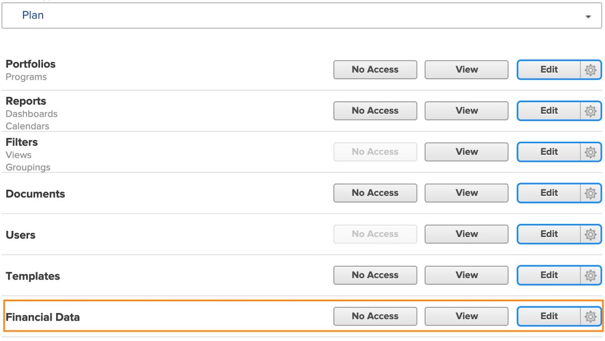

# Entenda o acesso financeiro

Se sua organização estiver capturando dados financeiros com o [!DNL Workfront], como admin de sistema, é sua responsabilidade proteger o acesso a essas informações, definindo quem pode visualizá-las e editá-las.

São necessárias duas coisas para que um usuário visualize ou edite informações financeiras:

1. Os direitos de acesso devem ser habilitados no [!UICONTROL Nível de acesso].
2. A permissão para usar esses direitos de acesso deve ser concedida em cada objeto.

Por exemplo, um usuário pode receber direitos para visualizar dados financeiros em seu nível de acesso, mas só poderá visualizar dados financeiros de uma tarefa que seja compartilhada com ele e na qual a visualização de dados financeiros foi habilitada durante o compartilhamento dessa tarefa.

Portanto, é possível que um usuário que recebeu direitos de [!UICONTROL nível de acesso] para visualizar informações financeiras veja informações financeiras de alguns objetos e não de outros, pois isso dependerá das opções individuais de compartilhamento desses objetos. No entanto, nenhum usuário pode visualizar as informações financeiras de um objeto a menos que tenha recebido o direito para isso em seu [!UICONTROL Nível de acesso].

## Configurações de [!UICONTROL Nível de acesso]

O acesso geral aos dados financeiros é concedido primeiro pelo tipo de licença do [!DNL Workfront].

As licenças de **[!UICONTROL Plano] podem:**

* Gerenciar registros de faturamento
* Gerenciar e visualizar o faturamento de funções e as taxas de custo
* Gerenciar e visualizar o faturamento de usuários e as taxas de custo
* Gerenciar despesas
* Visualizar e editar informações financeiras

As licenças de **[!UICONTROL Trabalho] podem:**

* Gerenciar despesas
* Visualizar informações financeiras

As licenças de **[!UICONTROL Revisão] podem:**

* Visualizar informações financeiras

**As permissões podem ser modificadas pelo [!UICONTROL Nível de acesso]. As três opções de acesso a dados financeiros são:**

* [!UICONTROL Sem acesso] - O usuário não poderá ver informações financeiras.
* [!UICONTROL Visualizar] - O usuário pode analisar e compartilhar as informações.
* [!UICONTROL Editar] - O usuário pode criar, editar, excluir e compartilhar as informações. (Disponível somente para licenças de Plano.)

É importante observar que as opções [!UICONTROL Exibir] e [!UICONTROL Editar] têm configurações adicionais para uma licença do [!UICONTROL Plano]. Clique no ícone de engrenagem do botão [!UICONTROL Visualizar] destas opções:

**[!UICONTROL Exibir]**

* Ver taxas de custo e cobrança de função
* Ver taxas de custo e cobrança de usuário

**[!UICONTROL Editar]**

Essas duas opções estão disponíveis para a opção [!UICONTROL Editar], além de:

* Editar taxas de custo e cobrança de função
* Editar taxas de custo e cobrança de usuário

>[!NOTE]
>
>Usuário que têm permissão para adicionar despesas também podem visualizar as despesas adicionadas, bem como as despesas adicionadas por seus subordinados diretos.
