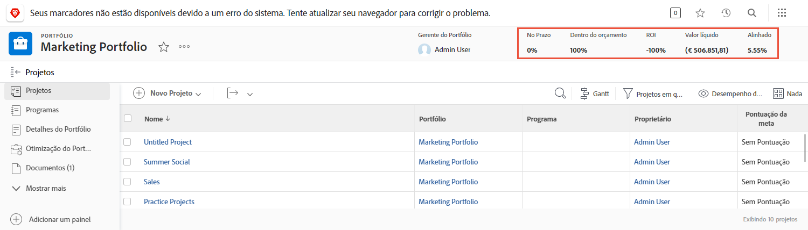
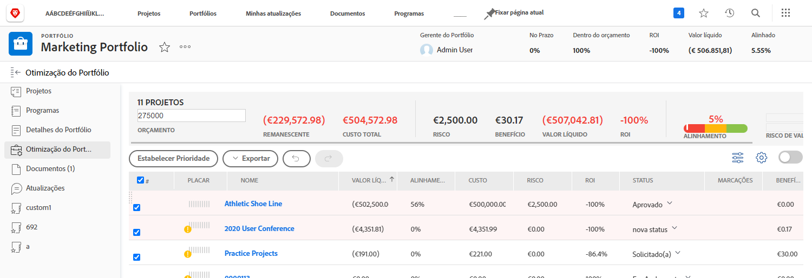
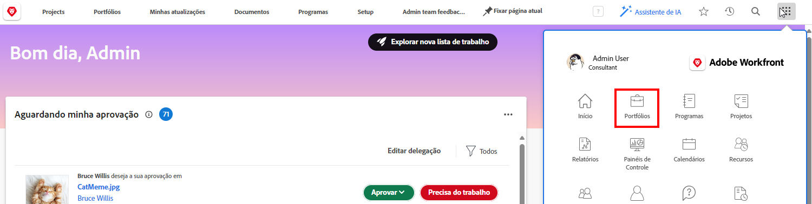
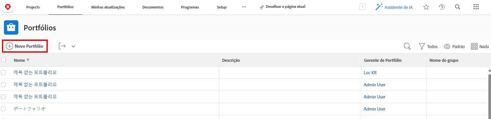
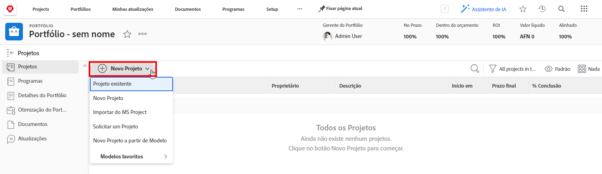
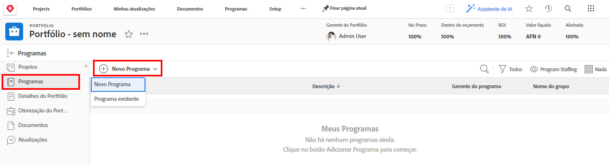

# Entender portfólios

Gerentes muitas vezes têm a difícil tarefa de descobrir quais projetos mais ajudariam a empresa a atingir suas metas e objetivos. Isso envolve julgar um projeto atual ou potencial com base em critérios importantes para esses objetivos. Esses critérios podem incluir pontos como a quantidade de recursos necessários, a relação “custo-benefício” desse projeto e a compreensão dos riscos envolvidos. Com essas informações, gerentes podem decidir quais projetos precisam ser realizados e quando.

Conceber e planejar projetos não é uma tarefa muito difícil, pois é um processo com o qual a maioria dos(as) gerentes está acostumada. A verdadeira dificuldade surge na comparação de projetos entre si. Examinar uma lista longa e detalhada de projetos consome tempo. É nesse momento que os portfólios do Workfront podem ajudar.

## O que é um portfólio?

Um portfólio é uma coleção de projetos que compartilham os mesmos recursos, orçamento, cronograma e prioridade. Por exemplo, uma agência de marketing pode usar um portfólio para agrupar todos os projetos de um cliente específico.

Navegue até a seção **[!UICONTROL Portfólios]** do [!UICONTROL Menu principal] e clique no nome de um portfólio para abri-lo.

Você pode usar o botão **[!UICONTROL Novo projeto]** para adicionar um projeto existente ao portfólio com facilidade. Ou você pode criar um novo projeto diretamente no portfólio.

![Uma imagem do menu suspenso do botão [!UICONTROL Novo projeto]](assets/01-portfolio-management3.png)

Depois que os projetos forem adicionados ao portfólio, você poderá usar as informações de resumo no cabeçalho da página para obter uma visão geral de como esse conjunto de projetos contribui, de forma positiva ou negativa, para as metas gerais do portfólio.

Você pode usar a ferramenta de otimização de portfólios (também conhecida como [!UICONTROL Otimizador de portfólios]) para priorizar projetos com base no seu valor líquido, alinhamento, custo, risco e ROI.

## Acessar portfólios

Para trabalhar com portfólios, você precisa receber uma licença de plano no Workfront e possuir um nível de acesso que conceda permissões para trabalhar com portfólios.

Quando um portfólio é criado, apenas o(a) criador(a) ou gerente do portfólio tem acesso a ele. Você pode conceder acesso ao portfólio a outras pessoas por compartilhá-lo. Isso também concede acesso a todos os programas e projetos contidos no portfólio.

Abra o portfólio, clique no menu de três pontos e selecione **[!UICONTROL Compartilhamento]**. Adicione os indivíduos, equipes, funções de trabalho, grupos ou empresas que precisam ter acesso. Em seguida, determine o tipo de acesso que cada usuário deve ter: gerenciar ou visualizar.

![Uma imagem da opção [!UICONTROL Compartilhamento] em um [!DNL Workfront]portfólio](assets/04-portfolio-management11.png)

## Criar um portfólio

Para criar um portfólio, clique em **[!UICONTROL Portfolio]** no menu principal.

Na área Portfolio, clique em **[!UICONTROL Novo Portfolio]**.

Nomeie o portfólio e clique em **[!UICONTROL Novo projeto]** para adicionar um projeto ao portfólio. Você pode criar um novo projeto de várias maneiras, da mesma forma que pode **[!UICONTROL Projetos]** área. Qualquer novo projeto criado aqui pertencerá a esse portfólio. Você também pode clicar em **[!UICONTROL Projeto existente]** para selecionar projeto(s) existente(s) em uma lista.

## Criar um programa em um portfólio

Selecione o **[!UICONTROL Programas]** e clique em **[!UICONTROL Novo programa]** para criar um novo programa dentro deste portfólio, ou clique em **[!UICONTROL Programa existente]** para roubar programas existentes de outros portfólios.

<!--
Pro-tips graphic
If a user can't access a specific portfolio, make sure it's shared with them. The Workfront access level determines that a user can access portfolios in general, but sharing makes sure they can see specific portfolios. 
-->

<!--
Learn more graphic and links to documentation articles
* Portfolio overview   
* Create a portfolio 
* Create and manage portfolios 
* Navigate within a portfolio 
* Share a portfolio   
-->
