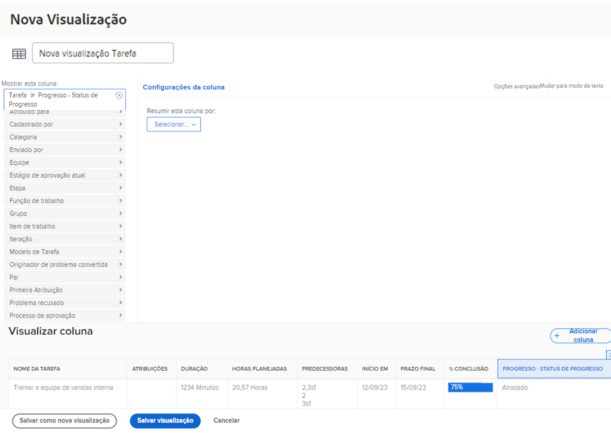

# Adicionar formatação condicional básica a uma visualização

A formatação condicional é feita criando regras de coluna. As regras de coluna permitem formatar uma coluna de uma maneira específica com base nos critérios definidos.

Neste vídeo, você aprenderá:

* Que formatação condicional está em uma visualização
* Como criar e modificar a formatação condicional

>[!VIDEO](https://video.tv.adobe.com/v/3445446/?quality=12&learn=on&captions=por_br)

## Resumo de formatação condicional

Para criar formatação condicional:

1. Escolha a coluna em que deseja que a formatação seja exibida
1. Decida quais condições você deseja que a formatação altere
1. Decida que tipo de alteração de formatação funcionará melhor

   * cor do fundo
   * cor do texto
   * texto de substituição
   * mostrar um ícone

## Atividades “Adicionar formatação condicional básica a uma exibição”

### Atividade 1: adicionar formatação condicional a uma visualização

Crie uma visualização de tarefa chamada “Padrão + Progresso” usando a visualização Padrão existente e adicionando esta formatação condicional na coluna [!UICONTROL Nome].

1. Adicione uma regra de coluna que tornará o fundo do campo vermelho quando o status do progresso da tarefa estiver Atrasado.
1. Adicione uma regra de coluna que tornará o fundo do campo amarelo quando o status do progresso estiver Atrasado ou Em risco.

Isso ajudará você a detectar tarefas com problemas sem incluir a coluna de status do progresso como parte da visualização.

### Resposta 1

1. Em um relatório de lista de tarefas, acesse o menu suspenso **[!UICONTROL Visualizar]** e selecione **[!UICONTROL Nova visualização]**.
1. Nomeie sua visualização como “Padrão + Progresso”.
1. Use as colunas padrão fornecidas.
1. Selecione a coluna [!UICONTROL Nome da tarefa]. Esta é a coluna à qual você deseja aplicar a formatação condicional, portanto ela aparecerá em vermelho ou amarelo se o status do progresso da tarefa não for Dentro do prazo.
1. Clique em **[!UICONTROL Opções avançadas]** no canto superior direito da janela do Report Builder.
1. Clique em **[!UICONTROL Adicionar uma regra para esta coluna]**.
1. Inicie a regra da coluna alterando [!UICONTROL Tarefa] > [!UICONTROL Nome] na parte superior da janela para[!UICONTROL &#x200B; Tarefa] > [!UICONTROL Status do progresso]. Basta clicar no ícone **[!UICONTROL X]** ao lado de [!UICONTROL Tarefa] > [!UICONTROL Nome] para excluí-la do campo.
1. Digite “progresso” no campo e selecione [!UICONTROL Status do progresso] na origem do campo [!UICONTROL Tarefa].
1. Selecione **[!UICONTROL Atrasado]** no campo à direita do qualificador [!UICONTROL Igual].
1. Escolha um fundo vermelho na linha [!UICONTROL Cor do texto].
1. Clique em **[!UICONTROL Adicionar regra]** para salvar a regra de coluna.
1. Agora clique em **[!UICONTROL Adicionar regra de coluna]** novamente para adicionar outra regra.
1. Assim como antes, exclua [!UICONTROL Tarefa] > [!UICONTROL Nome] do campo de critérios. Substitua-o por [!UICONTROL Status do progresso] na origem do campo [!UICONTROL Tarefa].
1. Selecione [!UICONTROL Em risco] e [!UICONTROL Atrasado] no campo à direita do qualificador Igual.
1. Escolha um fundo amarelo na linha [!UICONTROL Cor do texto].
1. Clique em **[!UICONTROL Adicionar regra]** para salvar a regra de coluna.
1. Clique em **[!UICONTROL Salvar visualização]** para salvar a visualização.
