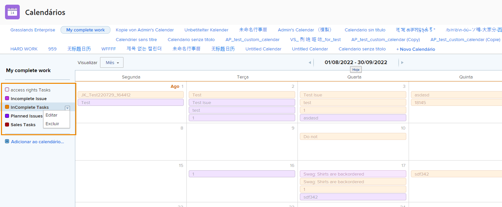

# Entender as opções adicionais de calendário

Nesta seção, você aprenderá a:

* Editar um agrupamento de calendário
* Excluir um agrupamento de calendário
* Compartilhar um calendário

## Editar um agrupamento de calendário

Para editar um agrupamento, passe o mouse sobre o nome no calendário. Clique na seta para baixo exibida à direita e selecione **[!UICONTROL Editar]**.

## Excluir um agrupamento de calendário

Para excluir um agrupamento, passe o mouse sobre o nome no calendário. Clique na seta para baixo exibida à direita e selecione **[!UICONTROL Excluir]**.

## Compartilhamento de um calendário

Como gerente de projeto, você pode criar um calendário que deseja compartilhar com outras pessoas, como gerentes de projeto, membros da equipe etc.

1. No **[!UICONTROL Menu principal]**, selecione um **[!UICONTROL Calendários]** área.
1. Selecione o calendário que deseja compartilhar.
1. Selecionar **[!UICONTROL Compartilhamento]** do **[!UICONTROL Ações do calendário]** menu suspenso.
1. Insira os nomes dos usuários, funções, equipes, grupos ou empresas com os quais deseja compartilhar o calendário.
1. Selecione se os usuários obtiverem [!UICONTROL Exibir] ou [!UICONTROL Gerenciar] acesso ao relatório de calendário.
1. Clique em **[!UICONTROL Salvar]**.

Como você está compartilhando calendários, aqui estão algumas coisas para observar:

* Clique no botão **[!UICONTROL ícone de engrenagem]** no canto superior direito da janela Compartilhamento para tornar o calendário visível em todo o sistema ou para torná-lo público a usuários externos.
* [!UICONTROL Exibir] permite que os usuários vejam o calendário, mas não alteram os filtros que controlam os agrupamentos.
* [!UICONTROL Gerenciar] permite que os usuários vejam o calendário e alterem os filtros que controlam os agrupamentos.

## Link compartilhável

Você pode compartilhar um calendário com outros [!DNL Workfront] por meio de um link privado. Isso os leva diretamente ao calendário em [!DNL Workfront].

Você pode fazer isso com o **[!UICONTROL Ações do calendário]** , selecionando **[!UICONTROL Obter link compartilhável]**. A partir daí, clique no botão **[!UICONTROL Copiar link]** e cole o URL em um email ou mensagem instantânea com outra pessoa.

![Uma imagem de um [!UICONTROL Obter link compartilhável] tela](assets/calendar-3-1.png)
