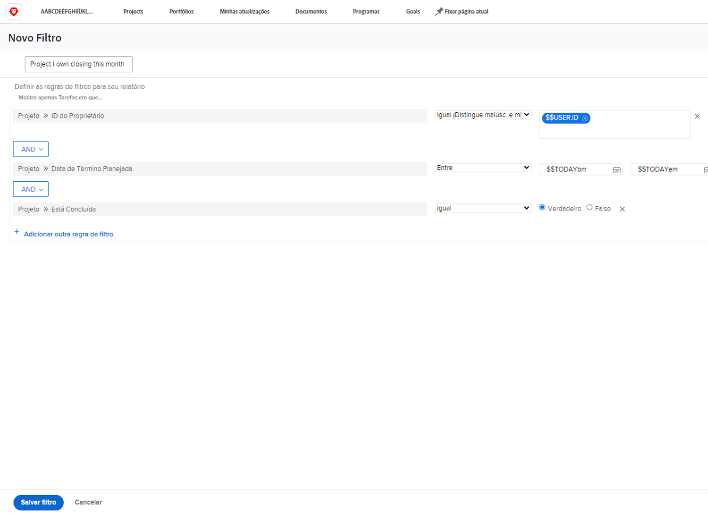

# Criar uma atividade de filtro básica

Neste vídeo, você criará um filtro de projeto chamado &quot;Projetos possuo fechando este mês&quot;. Se você estiver acompanhando muitos projetos, esse filtro poderá ajudá-lo a ampliar os que estão planejados para fechar em breve.

As instruções passo a passo estão incluídas abaixo.

>[!VIDEO](https://video.tv.adobe.com/v/336807/?quality=12)

## Resposta

1. Navegue até o [!UICONTROL Projetos] da [!UICONTROL Menu principal]. Isso mostra uma lista de projetos.
1. Clique no botão **[!UICONTROL Filtro]** e selecione **[!UICONTROL Novo filtro]**.
1. Nomeie seu filtro como &quot;Projetos possuo fechando este mês&quot;.
1. Clique em **[!UICONTROL Adicionar regra de filtro]**.
1. No [!UICONTROL Iniciar a digitação do nome do campo] , digite &quot;proprietário&quot;. Em seguida, selecione [!UICONTROL ID do proprietário] nos termos do [!UICONTROL Projeto] fonte do campo.
1. Deixe o [!UICONTROL Igual] como está.
1. Digite &quot;$$&quot; no campo Start typing name .
1. Selecionar [!UICONTROL $$USER.ID]. Este é o curinga do usuário conectado.
1. Clique em [!UICONTROL Adicionar regra de filtro] novamente.
1. No [!UICONTROL Iniciar a digitação do nome do campo] , comece digitando &quot;Está concluído&quot;. Em seguida, selecione [!UICONTROL Está concluído] na origem do campo Project.
1. Deixe o [!UICONTROL Igual] como está.
1. Selecione &quot;Falso&quot;.
1. Clique em [!UICONTROL Adicionar regra de filtro] novamente.
1. No [!UICONTROL Iniciar a digitação do nome do campo] tipo de campo &quot;planejado&quot; e selecione [!UICONTROL Data de Conclusão Planejada] nos termos do [!UICONTROL Projeto] fonte do campo.
1. Altere o [!UICONTROL Igual] para [!UICONTROL Este mês].
1. Clique em **[!UICONTROL Salvar filtro]**
