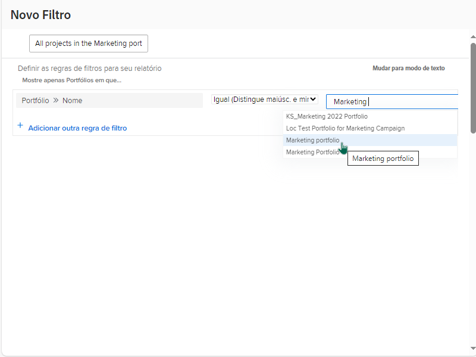

# Criar atividades básicas de filtro

## Atividade 1: todos os projetos no portfólio de marketing

Nesta atividade, você criará um filtro de projeto chamado “Todos os projetos no portfólio de marketing” utilizando a experiência de [!UICONTROL filtro herdada]. Isso mostrará todos os projetos no “Portfólio de marketing”, independentemente do status deles.

O passo a passo é apresentado abaixo.

## Resposta à atividade 1

1. Navegue até a área [!UICONTROL Projetos] do [!UICONTROL Menu principal]. Você verá uma lista de projetos.
1. Clique no menu **[!UICONTROL Filtro]** e selecione [!UICONTROL Filtros herdados] se ainda não estiver selecionado.
1. Selecione **[!UICONTROL Novo filtro]**.
1. Nomeie seu filtro como “Todos os projetos no portfólio de marketing”.
1. Clique em **[!UICONTROL Adicionar regra de filtro]**.
1. Clique no campo **Selecione um campo** e comece a digitar as palavras &quot;[!UICONTROL nome do portfólio]&quot;. Em seguida, selecione [!UICONTROL Nome] no campo de origem [!UICONTROL Portfólio].
1. Deixe o operador [!UICONTROL Igual] como está.
1. Digite &quot;[!UICONTROL marketing]&quot; no campo de pesquisa.
1. Selecione [!UICONTROL Portfólio de marketing] se possuir um portfólio com esse nome que deseja filtrar. Caso contrário, utilize o recurso de previsão de texto para encontrar o portfólio desejado.
1. Clique em **[!UICONTROL Salvar filtro]**.

## Atividade 2: meus projetos que se encerram este mês

Neste vídeo, você criará um filtro de projeto chamado “Meus projetos que se encerram este mês” na experiência de [!UICONTROL filtro herdada]. Se estiver monitorando muitos projetos, esse filtro pode ajudar a focar nos que estão planejados para se encerrar em breve.

O passo a passo é apresentado abaixo.

>[!VIDEO](https://video.tv.adobe.com/v/336807/?quality=12&learn=on&enablevpops)

## Resposta à atividade 2

1. Navegue até a área [!UICONTROL Projetos] do [!UICONTROL Menu principal]. Você verá uma lista de projetos.
1. Clique no menu **[!UICONTROL Filtro]** e selecione [!UICONTROL Filtros herdados] se ainda não estiver selecionado.
1. Selecione **[!UICONTROL Novo filtro]**.
1. Nomeie o filtro como “Meus projetos que se encerram este mês”.
1. Clique em **[!UICONTROL Adicionar regra de filtro]**.
1. Clique no campo **Selecionar um campo** e comece a digitar a palavra &quot;Proprietário&quot;. Agora clique na ID do proprietário na fonte do campo [!UICONTROL Projeto].
1. Deixe o operador [!UICONTROL Igual] como está.
1. Digite &quot;$$&quot; no campo de pesquisa.
1. Selecione [!UICONTROL $$USER.ID].  Esse é o curinga do usuário conectado.
1. Clique em adicionar outra regra de filtro.
1. Clique no campo **Selecionar um campo** e comece a digitar a palavra &quot;Está Concluído&quot;. Agora clique em &quot;Está Concluído&quot; na fonte de campo [!UICONTROL Projeto].
1. Deixe o operador [!UICONTROL Igual] como está.
1. Selecione “Falso”.
1. Clique em adicionar outra regra de filtro novamente.
1. Clique no campo **Selecione um campo** e comece a digitar a palavra &quot;Planejado&quot;. Agora clique em &quot;Data de conclusão planejada&quot; na fonte do campo [!UICONTROL Projeto].
1. Altere o operador [!UICONTROL Igual] para [!UICONTROL Este mês].
1. Clique em **[!UICONTROL Salvar filtro]**.
