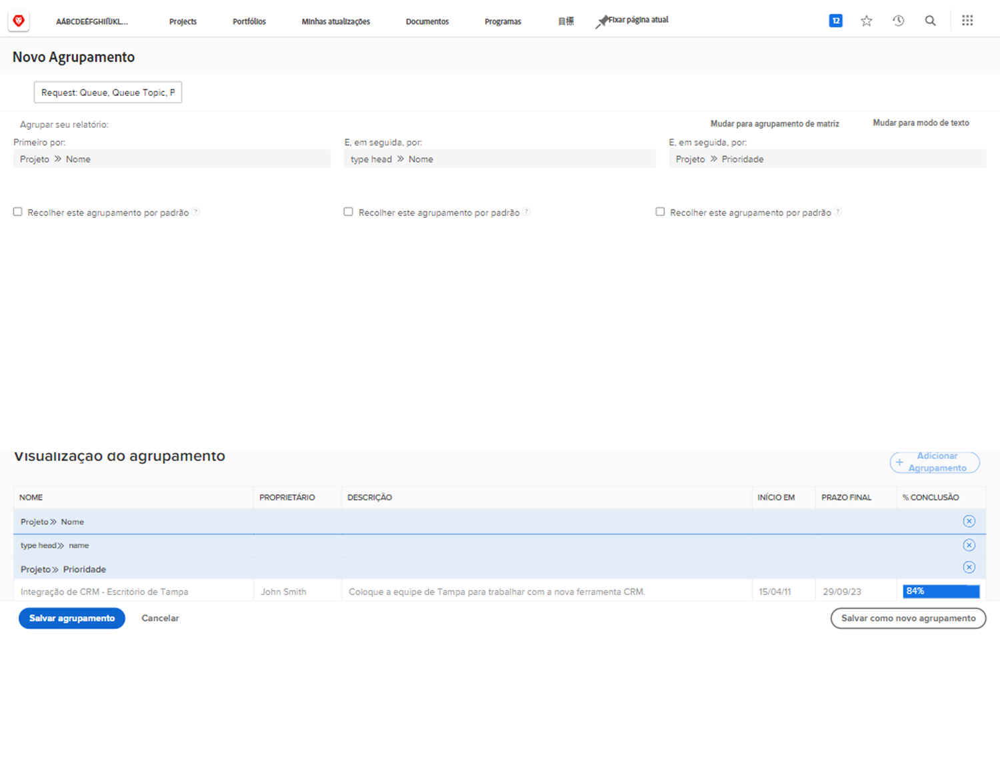

# Criar um agrupamento básico

Este vídeo explica como criar e gerenciar agrupamentos no Workfront para organizar listas de projetos de maneira eficaz. &#x200B; Os agrupamentos são um dos três principais elementos de relatórios, juntamente com filtros e visualizações, e ajudam a organizar resultados com base em informações compartilhadas. &#x200B;
Este tutorial fornece etapas práticas para organizar listas de projetos para simplificar o trabalho e a colaboração diários. &#x200B;

>[!VIDEO]&#x200B;(https://video.tv.adobe.com/v/335147/?quality=12&amp;learn=on&amp;enablevpops=0)

## Principais conclusões

* **Finalidade dos Agrupamentos**: os agrupamentos são um elemento chave de relatório no Workfront, que organiza listas de projetos com base em informações compartilhadas, como datas de conclusão, portfólios ou programas. &#x200B;
* **Criação de Agrupamentos:** você pode criar agrupamentos personalizados com até três níveis de critérios. &#x200B; Por exemplo, os projetos podem ser agrupados primeiro por portfólio e, em seguida, por programa para uma melhor organização. &#x200B;
* **Editar e Salvar Agrupamentos:** Agrupamentos internos não podem ser substituídos, mas você pode salvar edições como um novo agrupamento. &#x200B; Os agrupamentos personalizados devem ter nomes claros e descritivos para facilitar a identificação. &#x200B;
* **Agrupamentos de Compartilhamento:** os agrupamentos podem ser compartilhados com outros usuários, com permissões de &quot;visualização&quot; padrão que permitem que eles usem e compartilhem o agrupamento, mas não o editem. As permissões &quot;&#x200B;Gerenciar&quot; permitem editar e excluir. &#x200B;
* **Removendo Agrupamentos:** Excluir um agrupamento criado também o removerá das listas de usuários com os quais você o compartilhou. &#x200B; Os agrupamentos compartilhados aparecem na seção &quot;Compartilhado comigo&quot; para outros usuários. &#x200B;

## Atividades “Criar um agrupamento básico”

### Atividade 1: criar um agrupamento básico

Crie um agrupamento de problemas que será usado em um relatório para rastrear solicitações que passam por uma fila de solicitações. Esse agrupamento facilitará a visualização de tipos semelhantes de problemas/solicitações agrupados por prioridade. Nomeie o agrupamento como “Fila de solicitações, Tópico da fila, Prioridade”.

Agrupe o relatório de problemas com base em:

1. O nome da fila de solicitações (este será o nome do projeto)
1. O tópico da fila
1. A prioridade da solicitação

### Resposta 1

1. Em um relatório de lista de problemas, vá para o menu **[!UICONTROL Agrupamento]** e selecione **[!UICONTROL Novo agrupamento]**.
1. Nomeie seu agrupamento como “Fila de solicitações, Tópico da fila, Prioridade”.
1. Clique em **[!UICONTROL Adicionar agrupamento]**.
1. No campo [!UICONTROL Agrupar por]. digite “nome do projeto” e selecione **[!UICONTROL Nome]** na origem do campo Projeto.
1. Clique em **[!UICONTROL Adicionar outro agrupamento]**, digite &quot;fila&quot; e selecione **[!UICONTROL Nome]** na origem do campo [!UICONTROL Tópico da fila].
1. Clique em **[!UICONTROL Adicionar outro agrupamento]**, digite &quot;prioridade&quot; e selecione **[!UICONTROL Prioridade]** na origem do campo [!UICONTROL Problema].
1. Clique em **[!UICONTROL Salvar agrupamento]**
