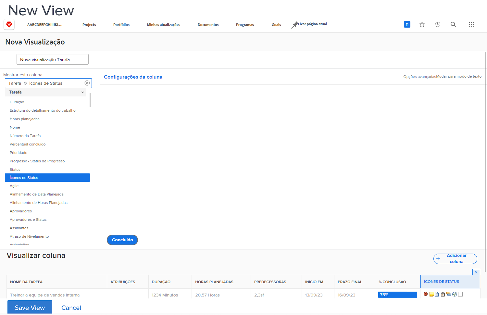

# Criar uma exibição básica

Neste vídeo, você aprenderá:

* O que é uma exibição no Workfront
* Como criar e modificar uma exibição
* Como compartilhar uma exibição com outros usuários do Workfront

>[!VIDEO](https://video.tv.adobe.com/v/335148/?quality=12)

## Atividade: Criar uma exibição básica

Como gerente de projeto, gerente de equipe ou gerente de recursos, você deseja acompanhar o andamento do trabalho da tarefa. Com essa visualização, você obtém vários indicadores de status de uma tarefa, todos em uma linha da lista ou relatório.

Crie uma exibição de tarefa chamada &quot;Exibição de status da tarefa&quot; com as seguintes colunas:

* [!UICONTROL Nome da tarefa]
* [!UICONTROL Atribuições]
* [!UICONTROL Duração]
* [!UICONTROL Percentual concluído]
* [!UICONTROL Status]
* [!UICONTROL Progresso - Status de Progresso]
* [!UICONTROL Ícones de Status]

## Resposta

1. Em um relatório de lista de tarefas, acesse **[!UICONTROL Exibir]** e selecione **[!UICONTROL Nova exibição]**.
1. Nomeie a exibição &quot;Exibição do status da tarefa&quot;.
1. Remova estas colunas: [!UICONTROL Hrs Pln], [!UICONTROL Predecessores], [!UICONTROL Iniciar em]e [!UICONTROL Devido a].
1. Clique em **[!UICONTROL Adicionar coluna]**.
1. No [!UICONTROL Mostrar nesta coluna] , digite &quot;status&quot; e selecione &quot;Status&quot; na [!UICONTROL Tarefa] fonte do campo.
1. Clique em **[!UICONTROL Adicionar coluna]** novamente.
1. No [!UICONTROL Mostrar nesta coluna] , digite &quot;status&quot; e selecione &quot;Status do progresso&quot; sob [!UICONTROL Tarefa] fonte do campo.
1. Clique em **[!UICONTROL Adicionar coluna]** novamente.
1. No [!UICONTROL Mostrar nesta coluna] digite &quot;status&quot; e selecione &quot;Ícones de status&quot; na origem do campo Tarefa.
1. Clique em **[!UICONTROL Salvar]**.

Passe o mouse sobre cada um dos ícones na [!UICONTROL Ícones de status] para ver o que eles representam. Se estiverem esmaecidos, significa que a tarefa não tem notas, documentos, processos de aprovação etc. Se um ícone aparecer na cor, há pelo menos um desse item associado à tarefa. Você pode clicar nos ícones da nota ou do documento para ir para esse item.
