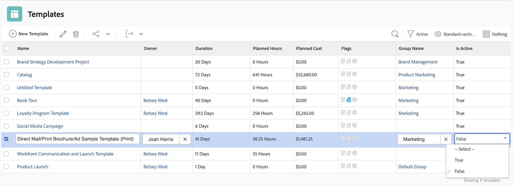

# Criar uma visualização básica

Neste vídeo, você aprenderá:

* O que é uma visualização no Workfront
* Como criar e modificar uma visualização
* Como compartilhar uma visualização com outros usuários do Workfront

>[!VIDEO](https://video.tv.adobe.com/v/335148/?quality=12&learn=on)

## Atividades &quot;Criar uma exibição básica&quot;

### Atividade 1: criar uma visualização do status da tarefa

Como gerente de projeto, líder de equipe ou gerente de recursos, você deseja acompanhar o andamento das tarefas que estão sendo realizadas. Com essa visualização, você pode observar vários indicadores de status de uma tarefa em uma linha da lista ou do relatório.

Crie uma visualização de tarefas chamada “Visualização de status da tarefa” com as seguintes colunas:

* [!UICONTROL Nome da tarefa]
* [!UICONTROL Atribuições]
* [!UICONTROL Duração]
* [!UICONTROL Percentual concluído]
* [!UICONTROL Status]
* [!UICONTROL Status do Progresso]
* [!UICONTROL Ícones de Status]

### Resposta 1

1. Em um relatório de lista de tarefas, acesse o menu suspenso **[!UICONTROL Visualização]** e selecione **[!UICONTROL Nova visualização]**.
1. Nomeie sua visualização como “Visualização do status da tarefa”.
1. Remova estas colunas: [!UICONTROL Horas planejadas], [!UICONTROL Predecessores], [!UICONTROL Data de início] e [!UICONTROL Data de expiração]. 
1. Clique em **[!UICONTROL Adicionar coluna]**.
1. No campo [!UICONTROL Exibir nesta coluna], digite “status” e selecione a opção “Status” na origem do campo [!UICONTROL Tarefa].
1. Clique em **[!UICONTROL Adicionar coluna]** novamente.
1. No campo [!UICONTROL Exibir nesta coluna], digite “status” e selecione a opção “Status do progresso” na origem do campo [!UICONTROL Tarefa].
1. Clique em **[!UICONTROL Adicionar coluna]** novamente.
1. No campo [!UICONTROL Exibir nesta coluna], digite “status” e selecione “Ícones de status” na origem do campo Tarefa.
1. Clique em **[!UICONTROL Salvar]**.

Passe o mouse sobre cada um dos ícones na coluna [!UICONTROL Ícones de status] para ver o que eles representam. Se estiverem esmaecidos, significa que a tarefa não tem notas, documentos, processos de aprovação etc. Se um ícone aparecer em cores, há pelo menos um desse item associado à tarefa. Você pode clicar nos ícones da nota ou do documento para acessá-los.

### Atividade 2: criar uma visualização de marcos

Se você usa marcos, essa visualização é a maneira mais fácil de encontrá-los por nome e adicioná-los ou editá-los usando a edição em linha.

Crie uma visualização de tarefas chamada “Visualização de marcos” com as seguintes colunas:

* [!UICONTROL Nome da tarefa]
* [!UICONTROL Atribuições]
* [!UICONTROL Duração]
* [!UICONTROL Horas planejadas]
* [!UICONTROL Marco: nome]
* [!UICONTROL Início em]
* [!UICONTROL Concluir em]
* [!UICONTROL Percentual concluído]

### Resposta 2

1. Em uma lista de tarefas do projeto, acesse o menu suspenso **[!UICONTROL Visualização]** e selecione **[!UICONTROL Nova visualização]**.
1. Nomeie sua visualização como “Visualização de marco”.
1. Clique na coluna [!UICONTROL Predecessores] para selecioná-la.
1. No campo [!UICONTROL Exibir nesta coluna], clique no ícone de X no campo [!UICONTROL Tarefa >> Predecessores] e digite o “[!UICONTROL nome do marco]” e clique no “[!UICONTROL  Nome]” na lista.
1. Clique em **[!UICONTROL Salvar]**.

### Atividade 3: criar uma visualização de tipos de duração e restrições de tarefas

Essa visualização permitirá examinar e editar todos os tipos de duração e restrições de tarefa no projeto.

Crie uma visualização de tarefas chamada “Visualização de tipos de duração e restrições de tarefas” com as seguintes colunas:

* [!UICONTROL Nome da tarefa]
* [!UICONTROL Atribuições]
* [!UICONTROL Duração]
* [!UICONTROL Duração Planejada]
* [!UICONTROL Horas planejadas]
* [!UICONTROL Predecessoras]
* [!UICONTROL Início em]
* [!UICONTROL Concluir em]
* [!UICONTROL Tipo de Duração]
* [!UICONTROL Restrição de Tarefa]
* [!UICONTROL Data de Restrição]

Mude o [!UICONTROL Formato do campo] nas colunas [!UICONTROL Data de início] e [!UICONTROL Data de expiração] para exibir a data e a hora.

### Resposta 3

1. Em uma lista de tarefas do projeto, acesse o menu suspenso **[!UICONTROL Visualização]** e selecione **[!UICONTROL Nova visualização]**.
1. Nomeie sua visualização como “Visualização de tipos de duração e restrições de tarefa”.
1. Remova a coluna [!UICONTROL % concluído].
1. Clique em **[!UICONTROL Adicionar coluna]**.
1. No campo [!UICONTROL Exibir nesta coluna], digite [!UICONTROL “duração”] e selecione [!UICONTROL “Duração planejada”] na origem do campo [!UICONTROL Tarefa].
1. Mova esta coluna entre as colunas [!UICONTROL Duração] e [!UICONTROL Horas planejadas].
1. Clique em **[!UICONTROL Adicionar coluna]** novamente.
1. No campo [!UICONTROL Exibir nesta coluna], digite [!UICONTROL “tipo de duração”] e selecione [!UICONTROL “Tipo de duração”] na origem do campo [!UICONTROL Tarefa].
1. Clique em **[!UICONTROL Adicionar coluna]** novamente.
1. No campo [!UICONTROL Exibir nesta coluna], digite [!UICONTROL “restrição”] e selecione [!UICONTROL “Restrição de tarefa”] na origem do campo Tarefa.
1. Clique em **[!UICONTROL Adicionar coluna]** novamente.
1. No campo [!UICONTROL Exibir nesta coluna], digite [!UICONTROL “restrição”] e selecione [!UICONTROL “Data da restrição”] na origem do campo Tarefa.
1. Selecione a coluna [!UICONTROL Data de início] e clique em [!UICONTROL Opções avançadas].
1. No menu suspenso [!UICONTROL Formato do campo], selecione [!UICONTROL “17/10/60 3h00”].
1. Selecione a coluna [!UICONTROL Data de expiração] e clique em [!UICONTROL Opções avançadas].
1. No menu suspenso [!UICONTROL Formato do campo], selecione [!UICONTROL “17/10/60 3h00”].
1. Clique em **[!UICONTROL Salvar]**.

### Atividade 4: criar uma exibição do status ativo do modelo de projeto

Qualquer pessoa que gerencia modelos de projeto aprecia a possibilidade de ver o status ativo (verdadeiro ou falso) de cada modelo em uma lista. E algo ainda melhor é poder editar os campos em linha.

Crie uma exibição de modelo de projeto chamada “Padrão + status ativo” com as seguintes colunas:

* [!UICONTROL Nome]
* [!UICONTROL Proprietário]
* [!UICONTROL Duração]
* [!UICONTROL Horas planejadas]
* [!UICONTROL Custo planejado]
* [!UICONTROL Sinalizadores]
* [!UICONTROL Nome do grupo]
* [!UICONTROL Está ativo]

### Resposta 4

1. Em uma lista de modelos de projeto, acesse o menu suspenso **[!UICONTROL Visualização]** e selecione **[!UICONTROL Nova visualização]**.
1. Nomeie sua visualização como “Padrão + status ativo”.
1. Clique em **[!UICONTROL Adicionar coluna]**.
1. No campo [!UICONTROL Exibir nesta coluna], digite “está” e selecione “Está ativo” na origem do campo [!UICONTROL Modelo].
1. Clique em **[!UICONTROL Salvar visualização]**.
