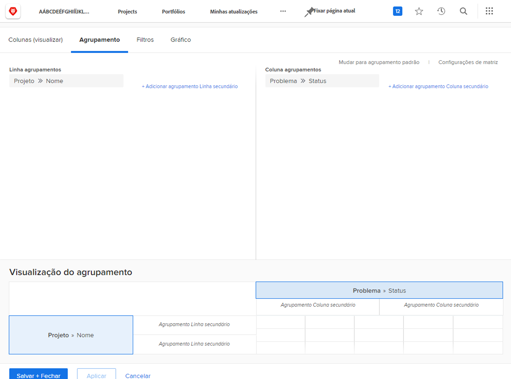
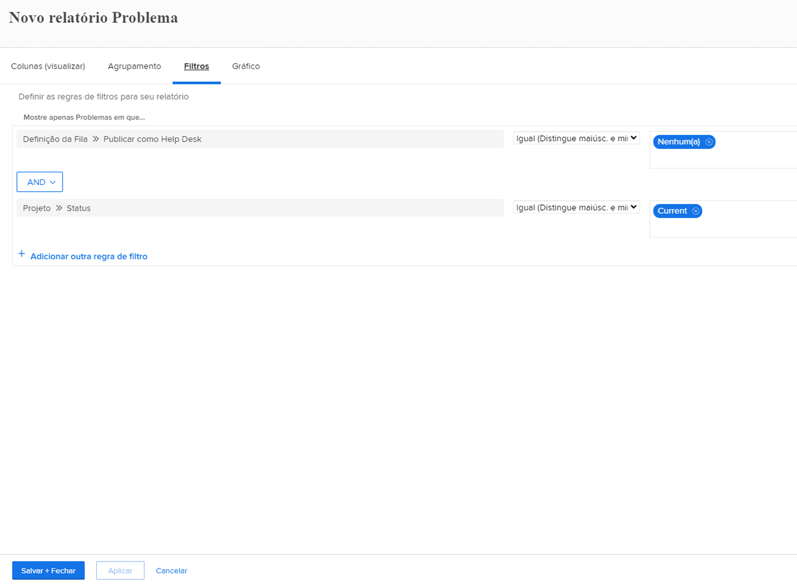

# Criar um relatório matriz

Neste vídeo, você aprenderá:

* Quando um relatório matriz pode ser útil
* E como criar um relatório matriz

>[!VIDEO](https://video.tv.adobe.com/v/3448188/?captions=por_br&quality=12&learn=on&enablevpops=0)

## Principais conclusões

* **Estrutura do Relatório de Matriz:** os relatórios de matriz organizam dados em linhas e colunas, com totais automáticos de linhas e colunas. &#x200B; Eles são ideais para rastrear métricas como horas trabalhadas, custos e receita. &#x200B;
* **Configuração de Filtros**: use filtros para se concentrar em dados específicos, como horas trabalhadas durante o último trimestre por usuários de uma equipe doméstica específica. &#x200B; A &quot;fonte de campo do proprietário&quot; ajuda a identificar membros relevantes da equipe. &#x200B;
* **Opções de Agrupamento:** Em nosso exemplo, as linhas são agrupadas por &quot;nome do proprietário&quot; (pessoa que trabalhou as horas), enquanto as colunas são agrupadas por &quot;data de entrada de hora&quot; (por mês e semana). &#x200B;
* **Dados Resumidos:** colunas como horas, custo real e receita são resumidas por padrão, garantindo que os totais sejam exibidos na matriz. Esses padrões podem ser desativados, se desejado. &#x200B;
* **Integração de Gráfico:** Relatórios de matriz podem ser complementados com gráficos para visualização alternativa de dados, usando as mesmas informações de agrupamento. É possível definir a guia da matriz ou a guia do gráfico como a exibição padrão. &#x200B;

## Atividades “Criar um relatório de matriz”

### Atividade 1: criar um relatório de matriz

Crie um relatório matriz que mostre quantas solicitações existem em cada status, classificadas pela fila de solicitações. Isso oferece uma visão rápida da quantidade de trabalho que está chegando e de como você está lidando com ele.

As filas de solicitações devem aparecer nos agrupamentos de linhas. O status aparece nos agrupamentos de colunas. Nomeie seu relatório como “Solicitações por status e por fila de solicitações”.

### Resposta 1

1. Selecione **[!UICONTROL Relatórios]** no **[!UICONTROL Menu principal]**.
1. Clique na opção **[!UICONTROL Novo relatório]** e selecione **[!UICONTROL Problema]**.
1. Acesse a guia **[!UICONTROL Agrupamentos]** e clique em **[!UICONTROL Alternar para o agrupamento matriz]**.
1. Em [!UICONTROL Agrupamentos de linhas], selecione **[!UICONTROL Projeto]** > **[!UICONTROL Nome]**.
1. Em [!UICONTROL Agrupamento de colunas], selecione **[!UICONTROL Problema]** > **[!UICONTROL Status]**.

   

1. Acesse a guia **[!UICONTROL Filtros]**.
1. Para garantir que sejam exibidas somente solicitações em filas ativas, adicione as seguintes regras de filtro:

   * [!UICONTROL Projeto] > [!UICONTROL Status igual a] > [!UICONTROL Igual] > [!UICONTROL Atual]
   * [!UICONTROL Definição da fila] > [!UICONTROL É público] > [!UICONTROL Não é igual] > [!UICONTROL Nenhum] (é assim que sabemos que um projeto é, na verdade, uma fila de solicitações, quando a Definição de fila é atribuída a uma das opções públicas.)

1. Clique em **[!UICONTROL Salvar e Fechar]**. Quando for solicitado um nome de relatório, insira “Solicitações por status e fila de solicitações”.

   
