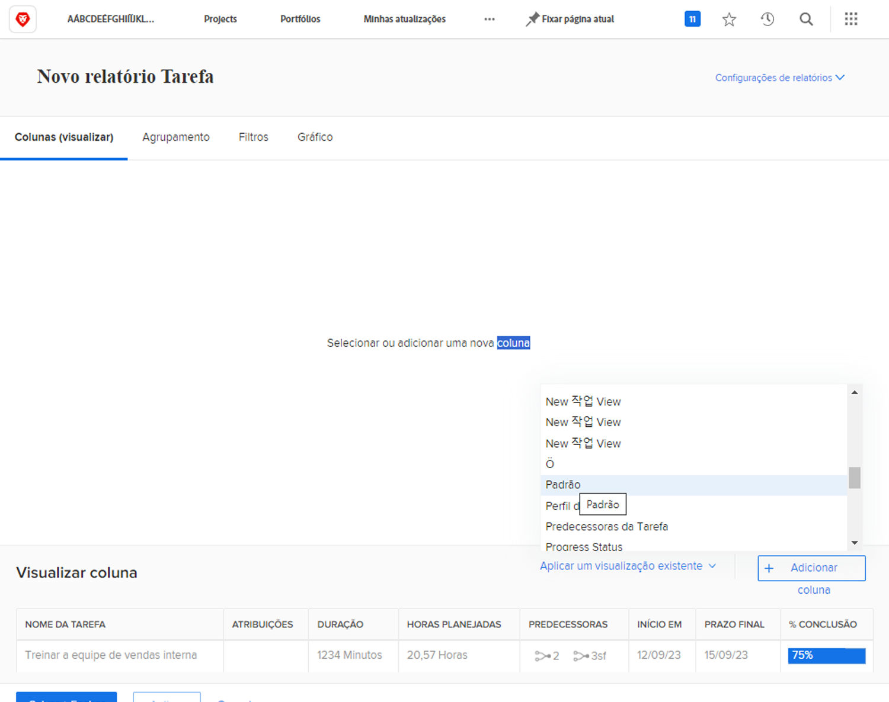
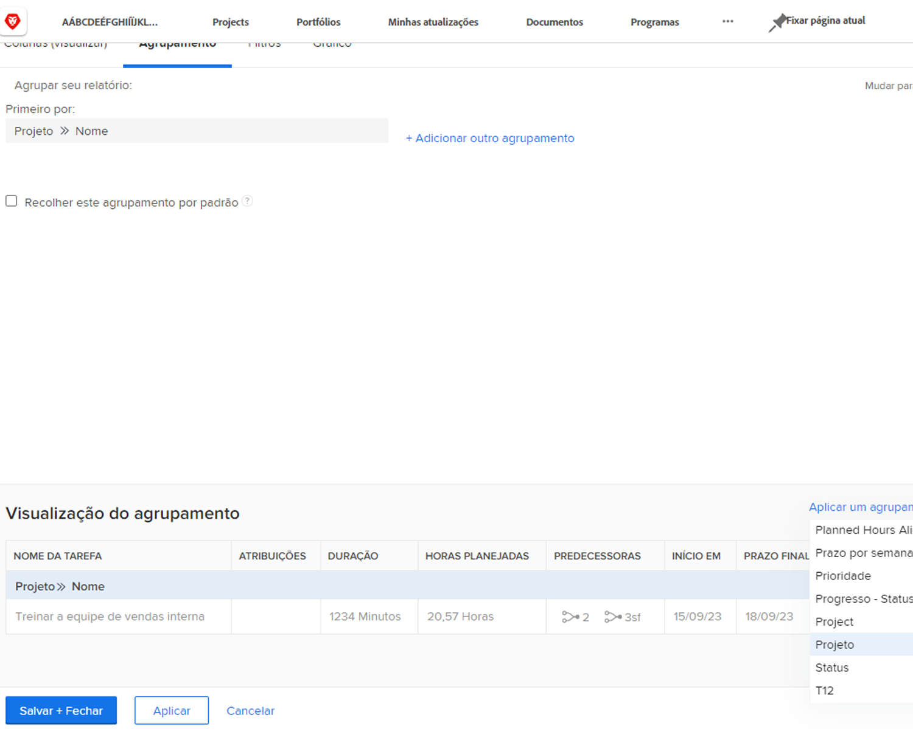
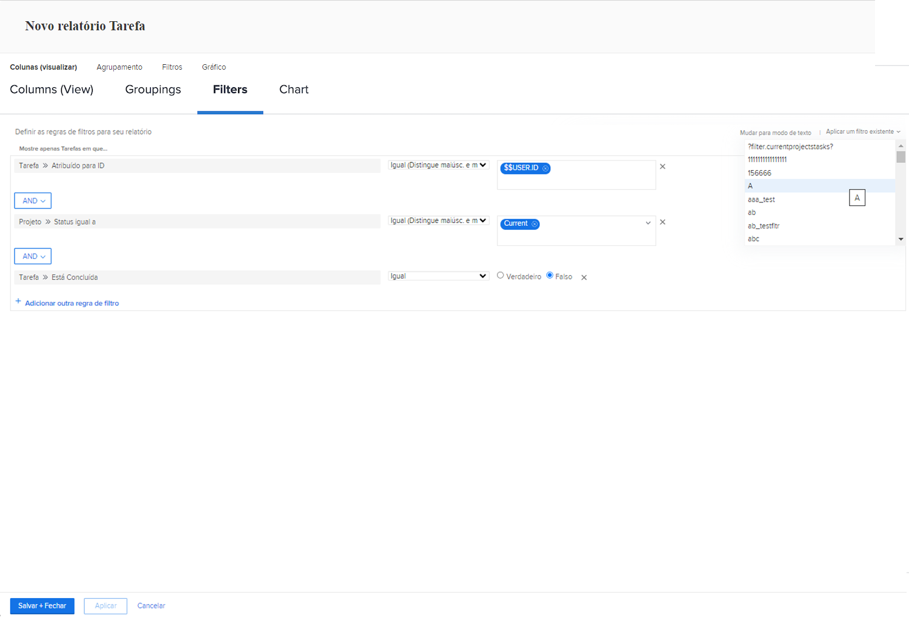
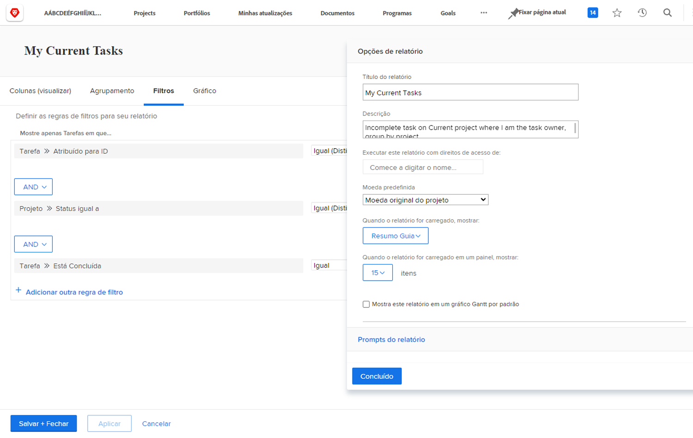

# Criar um relatório simples

Neste vídeo, você aprenderá a:

* Criar um relatório simples usando um filtro, uma visualização e um agrupamento existentes

>[!VIDEO](https://video.tv.adobe.com/v/335153/?quality=12&learn=on)

## Atividade: criar um relatório de tarefas simples

Você deseja rastrear todas as suas tarefas ativas em um único relatório. Crie um relatório de Tarefa chamado &quot;Minhas tarefas atuais&quot; usando o seguinte:

* Colunas (Exibir) = Padrão
* Agrupamentos = Projeto
* Filtro = Minhas tarefas atuais
* Descrição = Tarefas incompletas nos projetos atuais em que sou o proprietário da tarefa, agrupadas por projeto.

## Resposta

1. Vá para a **[!UICONTROL Menu principal]** e selecione **[!UICONTROL Relatórios]**.
1. Clique em **[!UICONTROL Novo Relatório]** e selecione **[!UICONTROL Relatório de Tarefa]**.
1. Entrada [!UICONTROL Colunas (Exibir)], clique no link **[!UICONTROL Aplicar uma visualização existente]** e selecione **[!UICONTROL Padrão]**.

   

1. No **[!UICONTROL Agrupamentos]** clique na guia **[!UICONTROL Aplicar um agrupamento existente]** e selecione **[!UICONTROL Projeto]**.

   

1. No **[!UICONTROL Filtros]** clique na guia **[!UICONTROL Aplicar um filtro existente]** e selecione Minhas tarefas atuais.

   

1. Abertura **[!UICONTROL Configurações do relatório]** e nomeie o relatório como &quot;Minhas tarefas atuais&quot;.
1. No campo Descrição, digite &quot;Tarefas incompletas nos projetos atuais em que sou o proprietário da tarefa, agrupadas por projeto&quot;.

   

1. Salve e feche o relatório.
