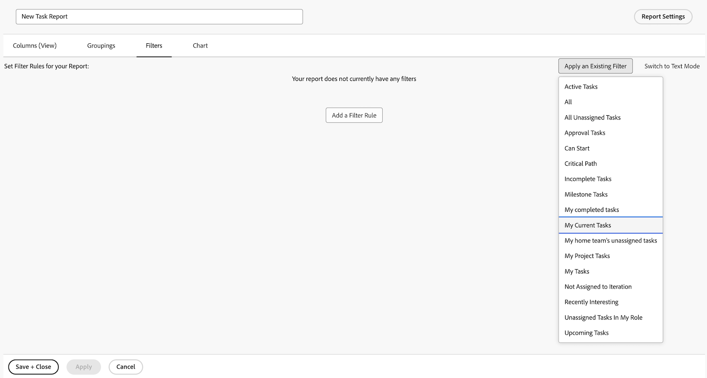

# Crie um relatório simples

Este vídeo explica como criar e personalizar relatórios de projeto para analisar dados com eficiência. &#x200B; Ela começa destacando a importância dos relatórios no rastreamento do progresso do projeto, da conclusão da tarefa, da adesão ao orçamento e na identificação de problemas. O vídeo mostra como começar com um relatório de lista de projetos, ajustar filtros, visualizações e agrupamentos e criar um relatório personalizado para conveniência. &#x200B; &#x200B;

O vídeo enfatiza que os relatórios personalizados mantêm as configurações padrão, mas alterações temporárias podem ser feitas ao visualizá-los. &#x200B; Os relatórios são armazenados na seção &quot;Meus relatórios&quot;, enquanto os relatórios compartilhados aparecem em &quot;Compartilhado comigo&quot; &#x200B; Os relatórios usados com frequência podem ser fixados ou marcados como favoritos para facilitar o acesso. &#x200B;

>[!VIDEO](https://video.tv.adobe.com/v/335153/?quality=12&learn=on&enablevpops=0)

## Principais conclusões

* **Finalidade dos relatórios**: os relatórios ajudam a monitorar o progresso do projeto, a conclusão da tarefa, a adesão ao orçamento e a identificar problemas, tornando-os essenciais para um gerenciamento eficaz de projetos.
* **Criação de relatórios personalizados**: os relatórios personalizados permitem salvar filtros, visualizações e agrupamentos específicos para facilitar o acesso, eliminando a necessidade de ajustar as configurações repetidamente. &#x200B;
* **Etapas para criar um relatório:** selecione o tipo de objeto apropriado, nomeie o relatório, aplique filtros, exibições e agrupamentos, personalize colunas e salve o relatório. &#x200B;
* **Configurações Padrão vs. Temporárias&#x200B;** Enquanto os visualizadores podem alterar temporariamente filtros, visualizações e agrupamentos, o relatório sempre reverterá para suas configurações padrão após a reabertura. &#x200B;
* **Organização de relatórios**: os relatórios personalizados são armazenados em &quot;Meus relatórios&quot;, os relatórios compartilhados em &quot;Compartilhado comigo&quot; e os relatórios usados com frequência podem ser fixados ou marcados como favoritos para acesso rápido. &#x200B;

## Atividades “Criar um relatório simples”

### Atividade 1: criar um relatório de tarefas simples

Você deseja acompanhar todas as suas tarefas ativas em um único relatório. Crie um relatório de tarefas chamado “Minhas tarefas atuais” usando o seguinte:

* Colunas (Exibir) = Padrão
* Agrupamentos = Projeto
* Filtro = Minhas tarefas atuais
* Descrição = Tarefas incompletas nos projetos atuais em que sou o proprietário da tarefa, agrupadas por projeto.

### Resposta 1

1. Vá para o **[!UICONTROL Menu principal]** e selecione **[!UICONTROL Relatórios]**.
1. Clique em **[!UICONTROL Novo Relatório]** e selecione **[!UICONTROL Relatório de Tarefa]**.
1. Em [!UICONTROL Colunas (Exibir)], clique no menu **[!UICONTROL Aplicar uma visualização existente]** e selecione **[!UICONTROL Padrão]**.

   

1. Na guia **[!UICONTROL Agrupamentos]**, clique no menu **[!UICONTROL Aplicar um agrupamento existente]** e selecione **[!UICONTROL Projeto]**.

   

1. Na guia **[!UICONTROL Filtros]**, clique no menu **[!UICONTROL Aplicar um filtro existente]** e selecione Minhas tarefas atuais.

   

1. Abra as **[!UICONTROL Configurações de relatório]** e nomeie o relatório como “Minhas tarefas atuais”.
1. No campo Descrição, insira “Tarefas
incompletas nos projetos atuais em que sou proprietário(a) da tarefa,
agrupadas por projeto”.

   

1. Salve e feche o relatório.
