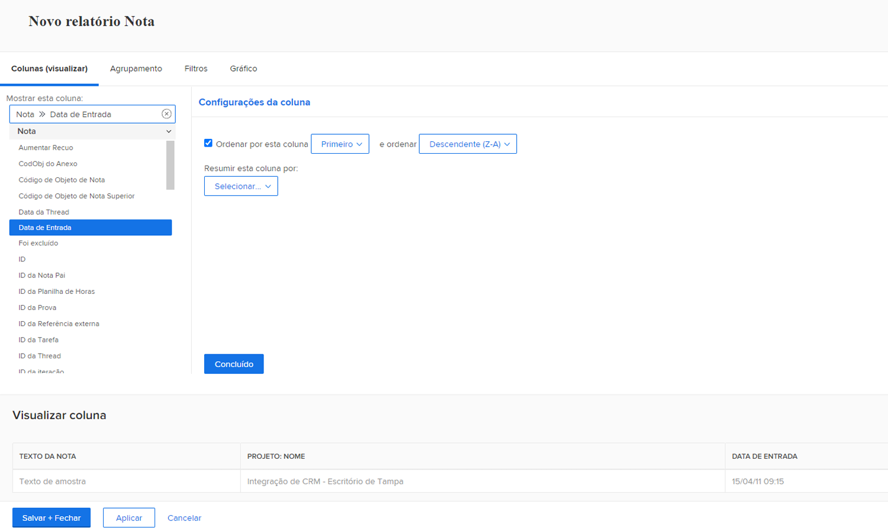
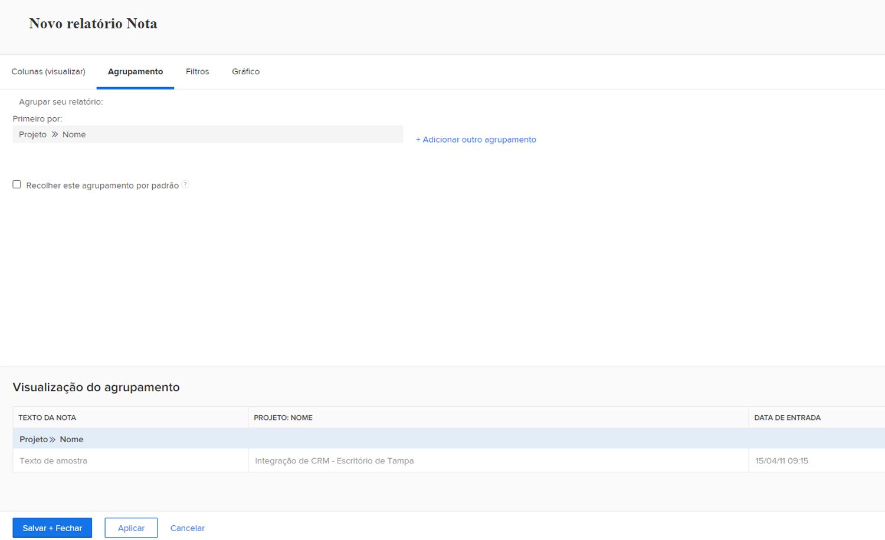
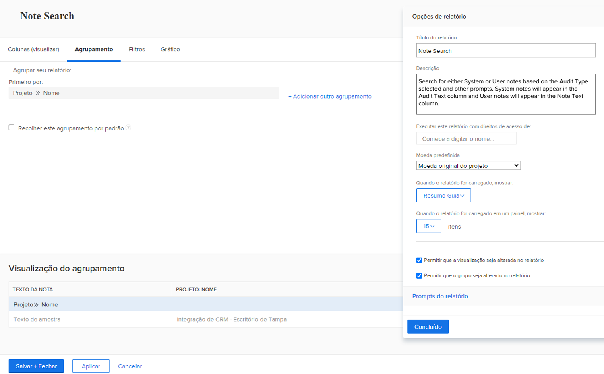
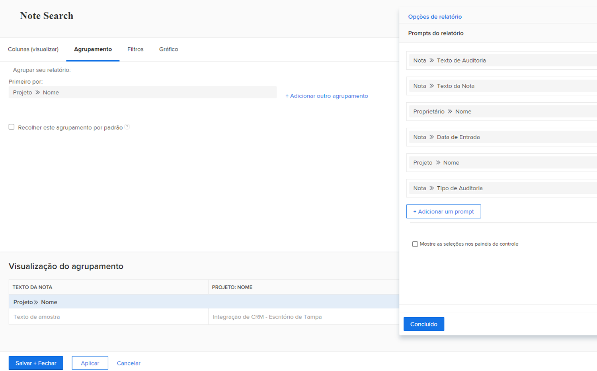

# Criar um relatório de tarefa

Neste vídeo, você aprenderá:

* Como criar um relatório de tarefa com um filtro complexo
* Como encontrar os relatórios que você cria

>[!VIDEO](https://video.tv.adobe.com/v/335154/?quality=12)

## Atividade: Criar um relatório de observação com prompts

Crie um relatório de Nota que você pode usar para pesquisar notas do usuário (ou seja, comentários ou atualizações) ou notas do sistema com base no conteúdo da nota, no autor, na data de entrada, no nome do projeto ou no tipo de auditoria. Nomeie o relatório como &quot;Pesquisa de notas&quot;.

Ao usar o prompt Texto da nota, esse relatório pesquisará em threads de atualização para extrair rapidamente qualquer item que atenda aos critérios especificados nos prompts. Ao executar o relatório, não é necessário preencher todos os prompts, apenas aqueles com os quais você se importa. Os em branco são automaticamente ignorados.

A exibição deve incluir colunas para:

* Texto da Nota
* Texto de Auditoria
* Data de Entrada
* Proprietário: Nome
* Tipo de Auditoria
* Nome da tarefa
* Nome do Problema

Deixe a guia filter em branco.

Grupo no Nome do Projeto.

Inclua prompts para o seguinte:

* Texto de Auditoria
* Texto da Nota
* Nome do proprietário
* Data de Entrada
* Nome do Projeto
* Tipo de Auditoria

## Resposta

1. Selecionar **[!UICONTROL Relatórios]** do **[!UICONTROL Menu principal]**.
1. Clique no botão **[!UICONTROL Novo relatório]** e selecione **[!UICONTROL Observação]**.
1. Em **[!UICONTROL Colunas (Exibir)]** configure suas colunas para incluir:

   

   * [!UICONTROL Observação] > [!UICONTROL Texto da nota]
   * [!UICONTROL Observação] > [!UICONTROL Texto de auditoria]
   * [!UICONTROL Observação] > [!UICONTROL Data de entrada]
   * [!UICONTROL Proprietário] > [!UICONTROL Nome]
   * [!UICONTROL Observação] > [!UICONTROL Tipo de auditoria]
   * [!UICONTROL Tarefa] > [!UICONTROL Nome]
   * [!UICONTROL Problema] > [!UICONTROL Nome]

1. Selecione o **[!UICONTROL Data de entrada]** e altere a **[!UICONTROL Classificar para decrescente]**.
1. No **[!UICONTROL Agrupamentos]** , defina o relatório como agrupar por [!UICONTROL Projeto] > [!UICONTROL Nome].

   

1. Sair [!UICONTROL Filtros] em branco.
1. Abrir **[!UICONTROL Configurações do relatório]** e nomeie o relatório como &quot;Pesquisa de notas&quot;.
1. No [!UICONTROL Descrição] , coloque algo como &quot;Procurar notas do sistema ou do usuário com base no Tipo de auditoria selecionado e outros prompts. As notas do sistema são exibidas na coluna Texto de auditoria e as notas do usuário são exibidas na coluna Texto da nota.&quot;

   

1. Selecionar **[!UICONTROL Guia Detalhes]** para ser exibido quando o relatório for carregado.
1. Defina o relatório para mostrar 200 itens quando o relatório for incluído em um painel.
1. Clique em **[!UICONTROL Avisos de Relatório]** e adicionar:

   

   * [!UICONTROL Observação] > [!UICONTROL Texto de auditoria]
   * [!UICONTROL Observação] > [!UICONTROL Texto da nota]
   * [!UICONTROL Proprietário] > [!UICONTROL Nome]
   * [!UICONTROL Observação] > [!UICONTROL Data de entrada]
   * [!UICONTROL Projeto] > [!UICONTROL Nome]
   * [!UICONTROL Observação] > [!UICONTROL Tipo de auditoria]

1. Marque a caixa para **[!UICONTROL Mostrar avisos nos painéis]**.
1. Salve e feche seu relatório.
