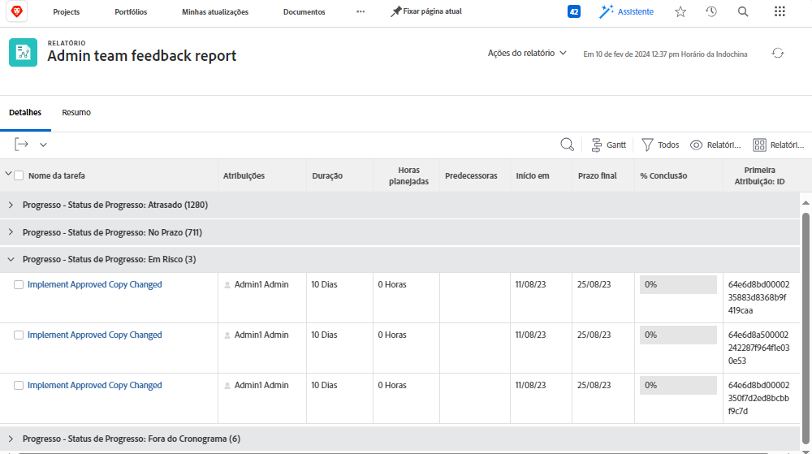
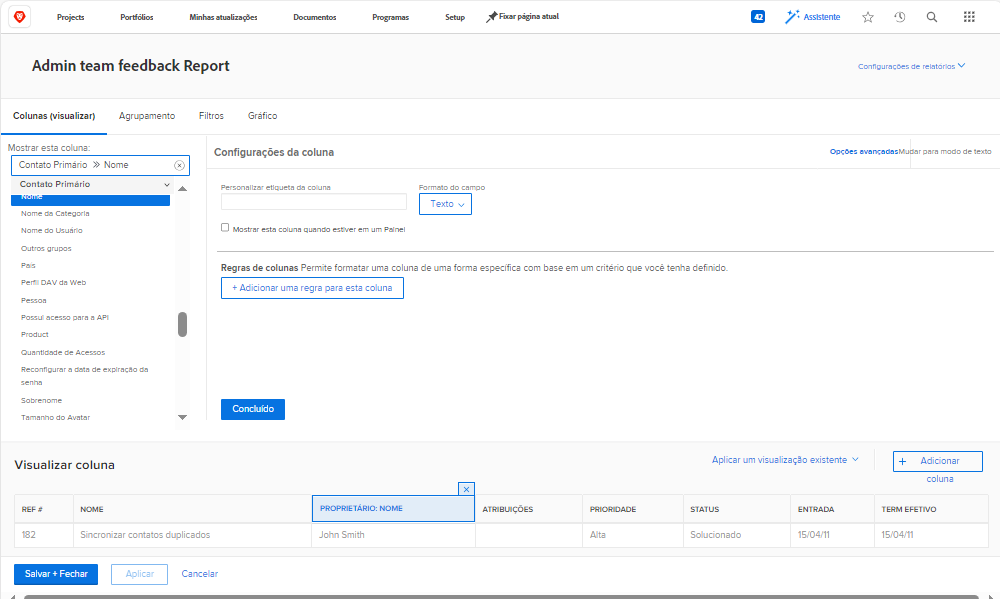
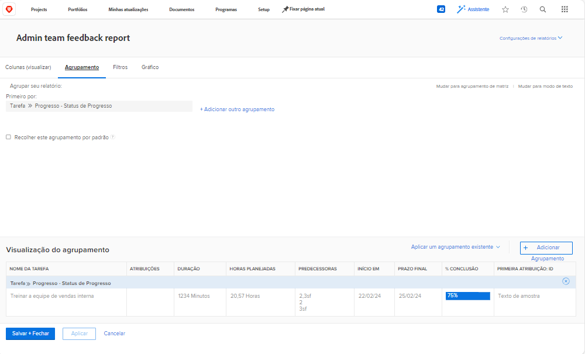
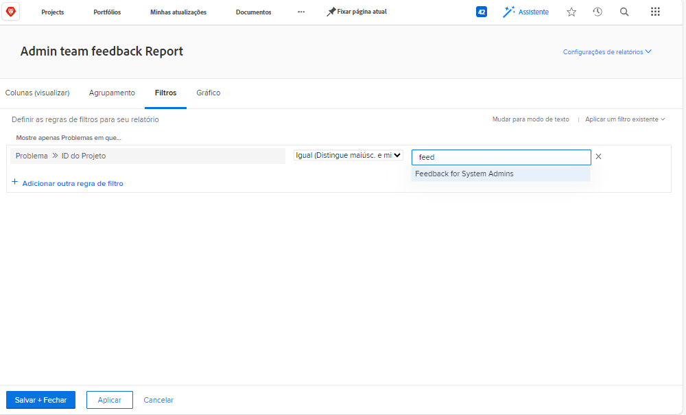

# Criar um relatório de tarefas para atribuições atrasadas

O vídeo fornece um guia passo a passo sobre como criar um relatório personalizado para rastrear tarefas atrasadas atribuídas ao usuário conectado. Ele começa explicando a necessidade de relatórios personalizados quando os filtros, as exibições ou os relatórios internos existentes não atendem aos requisitos específicos. &#x200B; O relatório é chamado de &quot;Tarefas atrasadas atribuídas a mim&quot;, com uma descrição adicionada para maior clareza. &#x200B;

O relatório resultante ajuda os usuários a se concentrarem em tarefas atrasadas, fornece insights sobre dependências e simplifica a navegação para os projetos de host. &#x200B;

>[!VIDEO](https://video.tv.adobe.com/v/335154/?quality=12&learn=on&enablevpops=0)

## Principais conclusões

* **Criação de relatório personalizado**: quando os filtros existentes e os relatórios internos não atenderem às suas necessidades, você poderá criar um relatório personalizado do zero para se concentrar em dados específicos, como tarefas atrasadas atribuídas a você. &#x200B;
* **Configuração de Filtro:** Use filtros para definir critérios de relatório, incluindo tarefas atrasadas, tarefas incompletas, projetos atuais e tarefas atribuídas ao usuário conectado. &#x200B;
* **Colunas para Contexto:** adicione colunas como &quot;Pode Iniciar&quot; para identificar problemas de dependência e &quot;Nome do Projeto&quot; com hiperlinks para facilitar a navegação para projetos relacionados. &#x200B;
* **Classificação por Prioridade:** Classifique tarefas pela coluna &quot;Concluído em&quot; em ordem crescente para priorizar as tarefas mais atrasadas na parte superior do relatório. &#x200B;
* **Acessibilidade:** Salve o relatório, marque-o ou marque-o como favorito para acesso rápido, garantindo um rastreamento e gerenciamento eficiente de tarefas atrasadas.

## Atividades “Criar um relatório de tarefa”

>[!TIP]
>
>Pegue suas espátulas e tigelas e prepare-se para experimentar as “receitas” em nosso [Livro de receitas de relatórios do cliente do Adobe Workfront](/help/assets/workfront-customer-reporting-cookbook.pdf). Lá dentro, você encontrará instruções passo a passo para 10 relatórios, prontos para você preparar em seu ambiente hoje mesmo.
>Reunimos os relatórios favoritos dos clientes e os compilamos em um livro de receitas rápidas e de fácil digestão, para você levá-las e testá-las em sua própria cozinha do Workfront.
>Esses 10 relatórios vêm de clientes que são exatamente como você. Espalhados por setores, departamentos, equipes, posições e todos em diferentes empresas, devemos um enorme agradecimento aos incríveis clientes que compartilharam um de seus relatórios favoritos. Alguns relatórios são simples (mas incrivelmente úteis), e outros são mais complexos para elevar o nível dos seus relatórios.

### Atividade 1: criar um relatório de notas com solicitações

Crie um relatório de notas que você pode usar para pesquisar notas do usuário (ou seja, comentários ou atualizações) ou notas do sistema com base no conteúdo da nota, no autor, na data de entrada, no nome do projeto ou no tipo de auditoria. Nomeie o relatório como “Pesquisa de notas”.

Ao usar o prompt de texto da nota, este relatório pesquisará nas threads de atualização para extrair rapidamente qualquer um que atenda aos critérios especificados nos prompts. Ao executar o relatório, você não precisa preencher todas as solicitações, apenas as de seu interesse. Os que estão branco são automaticamente ignorados.

A visualização deve incluir colunas para:

* Texto da Nota
* Texto de Auditoria
* Data de Entrada
* Proprietário: nome
* Tipo de Auditoria
* Nome da tarefa
* Nome do Problema

Deixe a guia do filtro em branco.

Grupo no nome do projeto.

Inclua prompts para o seguinte:

* Texto de Auditoria
* Texto da Nota
* Nome do proprietário
* Data de Entrada
* Nome do Projeto
* Tipo de Auditoria

### Resposta 1

1. Selecione **[!UICONTROL Relatórios]** no **[!UICONTROL Menu principal]**.
1. Clique no menu **[!UICONTROL Novo relatório]** e selecione **[!UICONTROL Nota]**.
1. Em **[!UICONTROL Colunas (Visualização)]** configure as colunas para incluir:

   

   * [!UICONTROL Nota] > [!UICONTROL Texto da Nota]
   * [!UICONTROL Nota] > [!UICONTROL Texto de auditoria]
   * [!UICONTROL Nota] > [!UICONTROL Data de entrada]
   * [!UICONTROL Proprietário] > [!UICONTROL Nome]
   * [!UICONTROL Nota] > [!UICONTROL &#x200B; Tipo de auditoria]
   * [!UICONTROL Tarefa] > [!UICONTROL Nome]
   * [!UICONTROL Problema] > [!UICONTROL Nome]

1. Selecione a coluna **[!UICONTROL Data de entrada]** e altere **[!UICONTROL Classificar para decrescente]**.
1. Na guia **[!UICONTROL Agrupamentos]**, configure o relatório para agrupar por [!UICONTROL Projeto] > [!UICONTROL Nome].

   

1. Deixe [!UICONTROL Filtros] em branco.
1. Abra as **[!UICONTROL Configurações de relatório]** e nomeie o relatório como “Pesquisa de notas”.
1. No campo [!UICONTROL Descrição], coloque algo como “Pesquisar notas do sistema ou do usuário com base no tipo de auditoria selecionado e outras solicitações. As notas do sistema são exibidas na coluna Texto da auditoria e as do usuário na coluna Texto da nota.”

   

1. Selecione a **[!UICONTROL Guia Detalhes]** para exibição quando o relatório for carregado.
1. Defina o relatório para mostrar 200 itens quando ele for incluído em um painel.
1. Clique em **[!UICONTROL Prompts do relatório]** e adicione:

   

   * [!UICONTROL Nota] > [!UICONTROL Texto de auditoria]
   * [!UICONTROL Nota] > [!UICONTROL Texto da Nota]
   * [!UICONTROL Proprietário] > [!UICONTROL Nome]
   * [!UICONTROL Nota] > [!UICONTROL Data de entrada]
   * [!UICONTROL Projeto] > [!UICONTROL Nome]
   * [!UICONTROL Nota] > [!UICONTROL &#x200B; Tipo de auditoria]

1. Marque a caixa para **[!UICONTROL Mostrar prompts em painéis]**.
1. Salve e feche o relatório.

### Atividade 2: criar um relatório de feedback de equipe administrativa

Este é um relatório que exibe todos os problemas de uma fila de solicitações de feedback criada para admins de sistema. Você pode ver como criar essa fila de solicitações no tutorial [Criar uma fila de solicitações de feedback para admins de sistema](https://experienceleague.adobe.com/docs/workfront-learn/tutorials-workfront/manage-work/request-queues/create-a-system-admin-feedback-request-queue.html?lang=pt-BR).

Esse relatório também usa um formulário personalizado. Para saber como criar um formulário personalizado, consulte o tutorial [Criar e compartilhar um formulário personalizado](https://experienceleague.adobe.com/docs/workfront-learn/tutorials-workfront/custom-data/custom-forms/custom-forms-creating-and-sharing-a-custom-form.html?lang=pt-BR).

Este formulário personalizado deve usar tipos de objeto Projeto e Problema e deve ser criado da seguinte maneira:

Nome: feedback do processo administrativo

1. Tipo de processo (campo suspenso de seleção única)
   * níveis de acesso
   * processo de aprovação (somente global)
   * notificações de email
   * modelo de Layout
   * caminho de marcos
   * modelo de projeto
   * notificações de lembrete
   * fila de solicitações
1. Nome do processo (campo de texto de linha única)
1. Nível do processo (campo suspenso de seleção única)
   * 1 - totalmente inútil
   * 2 - não muito útil
   * 3 - bom, mas poderia ser melhor
   * 4 - excelente
1. Problema ou boas notícias (campo de texto de parágrafo)

Crie um relatório de problemas chamado **Relatório de feedback da equipe administrativa**.

A visualização deve ter as seguintes colunas:

* Problema: nome
* Contato principal: nome
* Problema: tipo de processo
* Problema: nome do processo
* Problema: grau do processo
* Problema: problema ou boas notícias
* Problema: data de entrada
* Problema: idade
* Problema: atribuições
* Problema: status

Tipo de grupo do processo.

Filtre a ID do projeto da fila de solicitações que contém os problemas de feedback.

### Resposta 2

1. Selecione **[!UICONTROL Relatórios]** no **[!UICONTROL Menu principal]**.
1. Clique no menu **[!UICONTROL Novo relatório]** e selecione **[!UICONTROL Problema]**.
1. Em **[!UICONTROL Colunas (Visualização)]** configure as colunas para incluir:

   

   * [!UICONTROL Problema] > [!UICONTROL Nome]
   * [!UICONTROL Contato principal] > [!UICONTROL Nome]
      * Observação: ele aparece com &quot;Proprietário:Name&quot; como o rótulo da coluna. Você pode alterar isso para “Relatado por” clicando em Opções avançadas e digitando “Relatado por” no campo **Rótulo de coluna personalizado**.
   * [!UICONTROL Problema] > [!UICONTROL Tipo de processo]
   * [!UICONTROL Problema] > [!UICONTROL Nome do processo]
   * [!UICONTROL Problema] > [!UICONTROL Grau do processo]
   * [!UICONTROL Problema] > [!UICONTROL Problema ou boas notícias]
   * [!UICONTROL Problema] > [!UICONTROL Data de entrada]
   * [!UICONTROL Problema] > [!UICONTROL Idade]
   * [!UICONTROL Problema] > [!UICONTROL Atribuições]
   * [!UICONTROL Problema] > [!UICONTROL Status]

1. Selecione a coluna **[!UICONTROL Data de entrada]** e altere **[!UICONTROL Classificar para decrescente]**.
1. Na guia **[!UICONTROL Agrupamentos]**, defina o agrupamento do relatório como **[!UICONTROL Problema] > [!UICONTROL Tipo de processo]**.

   

1. Na guia **[!UICONTROL Filtros]**, adicione um filtro de **[!UICONTROL Problema] > [!UICONTROL ID do projeto]** igual ao do projeto da fila de solicitações que contém os problemas de feedback.

   

1. Salve e feche o relatório.
